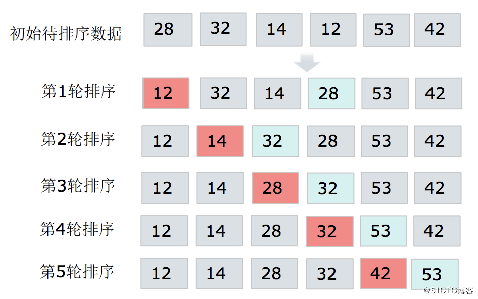

目录

[1.Java基础 1](#1java基础)

[1.1.java基础 1](#11java基础)

[1.1.1：java基本数据类型及包装类？ 1](#111java基本数据类型及包装类)

[1.1.2：重载和重写的区别？ 1](#112重载和重写的区别)

[1.1.3：String 和 StringBuffer、StringBuilder的区别？ 1](#113string-和-stringbufferstringbuilder的区别)

[1.1.4：== 和equals？ 2](#114-和equals)

[1.1.5：final、finally、finalize 的区别? 2](#115finalfinallyfinalize-的区别)

[1.1.6：抽象类和接口的区别？ 2](#116抽象类和接口的区别)

[1.1.7: java类加载机制 3](#117-java类加载机制)

[1.1.8：面向对象的特征有哪些方面？ 3](#118面向对象的特征有哪些方面)

[1.1.9：在Java 中，如何跳出当前的多重嵌套循环？ 4](#119在java-中如何跳出当前的多重嵌套循环)

[1.1.10：java 的类加载顺序？ 4](#1110java-的类加载顺序)

[1.1.11：什么是反射？ 4](#1111什么是反射)

[1.2.集合相关 5](#12集合相关)

[1.2.1：java中的集合有哪些？详细说明 5](#121java中的集合有哪些详细说明)

[1.2.2：HashMap底层原理？ 6](#122hashmap底层原理)

[1.2.3：常用排序算法有什么？手写冒泡和选择排序 6](#123常用排序算法有什么手写冒泡和选择排序)

[1.2.4：hashmap和hashtable的区别？ 7](#124hashmap和hashtable的区别)

[1.2.5：List和map set的区别？ 7](#125list和map-set的区别)

[1.2.6：集合的线程安全如何理解？ 8](#126集合的线程安全如何理解)

[1.2.7: 如何保证java 集合的线程安全？ 8](#127-如何保证java-集合的线程安全)

[1.2.8: Java中ArrayList和Linkedlist区别？ 8](#128-java中arraylist和linkedlist区别)

[1.3.异常处理 8](#13异常处理)

[1.3.1 : java中异常分为那些种类？ 8](#131--java中异常分为那些种类)

[1.3.2：error 和exception的区别？ 9](#132error-和exception的区别)

[1.3.3：java的异常处理机制是什么？ 9](#133java的异常处理机制是什么)

[1.3.4：throw和throws的区别？ 9](#134throw和throws的区别)

[1.3.5：开发中常见的运行时异常信息有那些，列举5个？ 10](#135开发中常见的运行时异常信息有那些列举5个)

[1.3.6：final 、finally 、finalize 的区别？ 10](#136final-finally-finalize-的区别)

[1.4.jvm相关 11](#14jvm相关)

[1.4.1：jvm虚拟机的内存分配模型都有什么？分别都存放那些数据？ 11](#141jvm虚拟机的内存分配模型都有什么分别都存放那些数据)

[1.4.2：jvm虚拟机的垃圾回收机制？ 12](#142jvm虚拟机的垃圾回收机制)

[1.4.3：Jvm内存优化有那些？ 12](#143jvm内存优化有那些)

[1.4.4：垃圾回收相关的jvm 参数有那些？ 13](#144垃圾回收相关的jvm-参数有那些)

[1.4.5：GC分代收集算法和分区收集算法有什么区别？ 14](#145gc分代收集算法和分区收集算法有什么区别)

[1.4.6：jvm调优工具有那些？该如何调优？ 14](#146jvm调优工具有那些该如何调优)

[1.4.7：谈一下如果内存泄漏该怎样排查？ 14](#147谈一下如果内存泄漏该怎样排查)

[1.4.8：java 的GC 什么时候回收垃圾？ 15](#148java-的gc-什么时候回收垃圾)

[1.5.排序算法及设计模式 15](#15排序算法及设计模式)

[1.5.1：你了解的排序算法有那些，列举一下？ 15](#151你了解的排序算法有那些列举一下)

[1.5.2：选择排序和快速排序的底层实现思路有什么区别？ 15](#152选择排序和快速排序的底层实现思路有什么区别)

[1.5.3：列举你所知道的设计模式有那些？ 16](#153列举你所知道的设计模式有那些)

[1.5.4：单例设计模式？ 17](#154单例设计模式)

[1.5.5：工厂设计模式？ 18](#155工厂设计模式)

[1.5.6：适配器设计模式？ 20](#156适配器设计模式)

[1.6.jdk8新特性 22](#16jdk8新特性)

[1.6.1：JDK1.7和1.8 hashmap数据存储有什么变化？ 22](#161jdk17和18-hashmap数据存储有什么变化)

[1.6.2：ConcurrentHashMap jdk1.8有什么优化？ 25](#162concurrenthashmap-jdk18有什么优化)

[1.6.3：谈谈你对Lambda表达式的理解及你项目中使用到了那些特性？ 26](#163谈谈你对lambda表达式的理解及你项目中使用到了那些特性)

[1.6.4：jdk8中并行流是怎么回事？ 27](#164jdk8中并行流是怎么回事)

[1.6.5：谈谈 jdk8中的Optional类？ 27](#165谈谈-jdk8中的optional类)

[1.7.多线程 28](#17多线程)

[1.7.1：并发编程的三要素是那些？你是怎么理解的？ 28](#171并发编程的三要素是那些你是怎么理解的)

[1.7.2：实现可见性的方法有哪些？ 28](#172实现可见性的方法有哪些)

[1.7.3：创建线程的有哪些方式？ 28](#173创建线程的有哪些方式)

[1.7.4：Runnable和Callable的区别？ 28](#174runnable和callable的区别)

[1.7.5：Java线程具有五中基本状态是那些？ 29](#175java线程具有五中基本状态是那些)

[1.7.6：什么是线程池？有哪几种创建方式？ 29](#176什么是线程池有哪几种创建方式)

[1.7.7：CyclicBarrier和CountDownLatch的区别？ 30](#177cyclicbarrier和countdownlatch的区别)

[1.7.8：synchronized的作用是什么？volatile关键字的作用是什么？ 30](#178synchronized的作用是什么volatile关键字的作用是什么)

[1.7.9: synchronized和ReentrantLock的区别? 30](#179-synchronized和reentrantlock的区别)

[1.7.10: 什么是乐观锁和悲观锁? 31](#1710-什么是乐观锁和悲观锁)

[1.7.11: sleep方法和wait方法有什么区别? 31](#1711-sleep方法和wait方法有什么区别)

[1.7.12: ThreadLocal是什么？有什么用？ 31](#1712-threadlocal是什么有什么用)

[1.7.13: Linux环境下如何查找哪个线程使用CPU最长? 31](#1713-linux环境下如何查找哪个线程使用cpu最长)

[1.7.14: 为什么wait()方法和notify()/notifyAll()方法要在同步块中被调用? 32](#1714-为什么wait方法和notifynotifyall方法要在同步块中被调用)

[1.7.15 : 单例模式的线程安全性? 32](#1715--单例模式的线程安全性)

[2.Java 框架 32](#2java-框架)

[2.1.Spring框架 32](#21spring框架)

[2.1.1: 谈谈你对Spring的理解？ 32](#211-谈谈你对spring的理解)

[2.1.2：Spring中的设计模式有那些？ 32](#212spring中的设计模式有那些)

[2.1.3：Spring中常用注解有那些？ 33](#213spring中常用注解有那些)

[2.1.4：简单介绍一下Spring bean 的生命周期？ 33](#214简单介绍一下spring-bean-的生命周期)

[2.1.5：Spring的结构图？ 34](#215spring的结构图)

[2.1.6：请描述一下Spring的事务？ 34](#216请描述一下spring的事务)

[2.1.7：什么是Spring IOC容器？优点是什么？ 35](#217什么是spring-ioc容器优点是什么)

[2.1.8：什么是Spring的依赖注入？有哪些不同类型的注入方式？ 36](#218什么是spring的依赖注入有哪些不同类型的注入方式)

[2.1.9：谈谈什么是aop，应用场景有那些？ 36](#219谈谈什么是aop应用场景有那些)

[2.1.10：SpringBean的作用域分别有那些？ 37](#2110spring中bean的作用域分别有那些)

[2.1.11：什么是bean的自动装配？ 37](#singleton使用该属性定义bean时ioc容器仅创建一个bean实例ioc容器每次返回的是同一个bean实例)

[2.1.12: 怎么样把ModelMap里面的数据放入session里面？ 37](#2112-怎么样把modelmap里面的数据放入session里面)

[2.1.13：在SpringAOP中，关注点和横切关注的区别是什么？ 38](#2113在springaop中关注点和横切关注的区别是什么)

[2.2.SpringMVC框架 38](#22springmvc框架)

[2.2.1：SpringMVC的执行流程？ 38](#221springmvc的执行流程)

[2.2.2：SpringMVC的常用注解有那些分别是什么作用？ 38](#222springmvc的常用注解有那些分别是什么作用)

[2.2.3：SpringMVC和struts2的区别是什么？ 39](#1controller控制器是通过服务接口定义的提供访问应用程序的一种行为它解释用户的输入将其转换成一个模型然后将试图呈献给用)

[2.2.4：SpringMVC线程安全的吗？ 39](#224springmvc线程安全的吗)

[2.2.5：如何解决get和post请求中的乱码问题？ 39](#225如何解决get和post请求中的乱码问题)

[2.2.6：详细说一下什么是Spring MVC模式？ 40](#226详细说一下什么是spring-mvc模式)

[2.2.7：SpringMVC有哪些优点？ 40](#227springmvc有哪些优点)

[2.2.8：SpringMVC怎么样设定重定向和请求转发？ 40](#228springmvc怎么样设定重定向和请求转发)

[2.2.9：Spring MVC的异常处理？ 40](#229spring-mvc的异常处理)

[2.2.10：SpringMvc的控制器是不是单例模式,如果是,有什么问题,怎么解决？ 40](#2210springmvc的控制器是不是单例模式如果是有什么问题怎么解决)

[2.2.11：SpringMVC用什么对象从后台向前台传递数据的？ 41](#2211springmvc用什么对象从后台向前台传递数据的)

[2.3.Mybatis框架 41](#23mybatis框架)

[2.3.1: 介绍一下mybatis，说一下它的优点和缺点是什么？ 41](#231-介绍一下mybatis说一下它的优点和缺点是什么)

[2.3.2 : MyBatis与Hibernate有哪些不同？ 41](#232--mybatis与hibernate有哪些不同)

[2.3.3: \#{}和\${}的区别是什么？ 42](#233-和的区别是什么)

[2.3.4 : 当实体类中的属性名和表中的字段名不一样 ，怎么办 ？ 42](#234--当实体类中的属性名和表中的字段名不一样-怎么办-)

[2.3.5: 通常一个Xml映射文件，都会写一个Dao接口与之对应，这个Dao接口的工作原理是什么？Dao接口里的方法，参数不同时，方法能重载吗？ 42](#235-通常一个xml映射文件都会写一个dao接口与之对应这个dao接口的工作原理是什么dao接口里的方法参数不同时方法能重载吗)

[2.3.6: mybatis 如何执行批量插入? 42](#236-mybatis-如何执行批量插入)

[2.3.7: 在mapper中如何传递多个参数? 43](#237-在mapper中如何传递多个参数)

[2.3.8: Mybatis有哪些动态sql？ 43](#238-mybatis有哪些动态sql)

[2.3.9: Xml映射文件中，除了常见的select\|insert\|updae\|delete标签之外，还有哪些标签？ 44](#239-xml映射文件中除了常见的selectinsertupdaedelete标签之外还有哪些标签)

[2.3.10: Mybatis的Xml映射文件中，不同的Xml映射文件，id是否可以重复？ 44](#2310-mybatis的xml映射文件中不同的xml映射文件id是否可以重复)

[2.3.11 : 谈谈Mybatis的一级、二级缓存？ 44](#2311--谈谈mybatis的一级二级缓存)

[2.3.12 ：mybatis plus 了解过么？和mybatis有啥区别？ 44](#2312-mybatis-plus-了解过么和mybatis有啥区别)

[2.3.13 ：MyBatis框架及原理？ 45](#2313-mybatis框架及原理)

[2.4.Shiro+SpringSecurity框架 45](#24shirospringsecurity框架)

[2.4.1 : Shiro的核心概念Subject、SecurityManager、Realm? 45](#241--shiro的核心概念subjectsecuritymanagerrealm)

[2.4.2: 谈谈Authorization 授权流程？ 46](#242-谈谈authorization-授权流程)

[2.4.3：shiro 注解注解了解哪些？ 46](#243shiro-注解注解了解哪些)

[2.4.4：谈谈shiro的优点？ 47](#244谈谈shiro的优点)

[2.4.5：shiro是什么？在项目中如何使用的，说一下大概使用流程？ 47](#245shiro是什么在项目中如何使用的说一下大概使用流程)

[2.4.6: spring security执行原理流程? 48](#246-spring-security执行原理流程)

[2.4.7: 项目中spring security是怎么集成的？ 48](#247-项目中spring-security是怎么集成的)

[2.4.8：shiro 和 spring security 有什么区别？ 48](#248shiro-和-spring-security-有什么区别)

[2.5.Struts2框架 49](#25struts2框架)

[2.5.1：什么是struts2？ 49](#251什么是struts2)

[2.5.2：Struts2的核心组件是什么？ 50](#252struts2的核心组件是什么)

[2.5.3：什么是Struts2中的拦截器？ 51](#253什么是struts2中的拦截器)

[2.5.4：Struts2拦截器实现了哪种设计模式？ 51](#254struts2拦截器实现了哪种设计模式)

[2.5.5：Struts2动作和拦截器是否是线程安全的？ 51](#255struts2动作和拦截器是否是线程安全的)

[2.5.6：Struts2中拦截器有哪些好处？ 51](#256struts2中拦截器有哪些好处)

[2.5.7：Struts2操作URI的默认后缀是什么？我们如何更改它？ 51](#257struts2操作uri的默认后缀是什么我们如何更改它)

[2.6. Hibernate框架 51](#26-hibernate框架)

[2.6.1：简述hibernate运行原理或者工作原理？ 51](#261简述hibernate运行原理或者工作原理)

[2.6.2：简述hibernate的缓存机制？ 52](#262简述hibernate的缓存机制)

[2.6.3：简述hibernate的乐观锁和悲观锁？ 52](#263简述hibernate的乐观锁和悲观锁)

[2.6.4：简述hibernate的懒加载机制？ 52](#264简述hibernate的懒加载机制)

[2.6.5：简述hibernate的事务机制？ 53](#265简述hibernate的事务机制)

[2.6.6：说一下hibernate数据的三种状态 53](#266说一下hibernate数据的三种状态)

[2.7.Quartz 定时任务调度框架 53](#27quartz-定时任务调度框架)

[2.7.1：Quartz是做什么用的？Quartz框架主要核心组件包括那几部分，分别作用是什么？ 53](#271quartz是做什么用的quartz框架主要核心组件包括那几部分分别作用是什么)

[2.7.2：Cron表达式详解？ 54](#272cron表达式详解)

[2.7.3：如何监控Quartz的job执行状态：运行中，暂停中，等待中？ 56](#273如何监控quartz的job执行状态运行中暂停中等待中)

[2.7.4：你还了解过其他的定时任务框架吗？ 56](#274你还了解过其他的定时任务框架吗)

[2.8.SpringBoot系列 56](#28springboot系列)

[2.8.1：为什么要用 Spring Boot？优点都有那些？ 56](#281为什么要用-spring-boot优点都有那些)

[2.8.2：SpringBoot的核心注解是哪个？它主要由哪几个注解组成的？ 57](#282springboot的核心注解是哪个它主要由哪几个注解组成的)

[2.8.3：运行SpringBoot有哪几种方式？ 57](#283运行springboot有哪几种方式)

[2.8.4：Spring Boot 自动配置原理是什么？ 57](#284spring-boot-自动配置原理是什么)

[2.8.5：springboot 运行原理是什么？ 58](#285springboot-运行原理是什么)

[2.8.6：你如何理解 Spring Boot 中的 Starters？ 58](#286你如何理解-spring-boot-中的-starters)

[2.8.7：Spring Boot 有哪几种读取配置的方式？ 58](#287spring-boot-有哪几种读取配置的方式)

[2.8.8：Spring Boot 的配置文件有哪几种格式？它们有什么区别？ 58](#288spring-boot-的配置文件有哪几种格式它们有什么区别)

[2.9 SpringCloud系列 59](#29-springcloud系列)

[2.9.1：什么是springcloud？谈一下你对springcloud的认识？ 59](#291什么是springcloud谈一下你对springcloud的认识)

[2.9.2：你项目总spring cloud 的核心组件用到哪些？详细说一下他们各自的作用及请求的流程？ 59](#292你项目总spring-cloud-的核心组件用到哪些详细说一下他们各自的作用及请求的流程)

[2.9.3：SpringCloud和Dubbo比较，谈谈个人看法？ 60](#293springcloud和dubbo比较谈谈个人看法)

[2.9.4：Eureka和ZooKeeper都可以提供服务注册与发现的功能,请说说两个的区别？ 61](#dubbo关注的领域是spring-cloud的一个子集dubbo专注于服务治理其在服务治理灰度发布流量分发方面比spring-cloud更全面spring-cloud覆盖整个微服务架构领域)

[2.9.5：eureka自我保护机制是什么? 61](#295eureka自我保护机制是什么)

[2.9.6：什么是feigin？它的优点是什么？ 61](#296什么是feigin它的优点是什么)

[2.9.7：什么是Hystrix?它的作用是什么？ 61](#297什么是hystrix它的作用是什么)

[2.9.8：说说spring、springMVC、springboot、springcloud 的区别与联系？ 62](#298说说springspringmvcspringbootspringcloud-的区别与联系)

[3.数据库 62](#3数据库)

[3.1.Mysql 62](#31mysql)

[3.1.1 ：mysql索引都有哪些？如何创建索引？ 62](#311-mysql索引都有哪些如何创建索引)

[3.1.2：使用索引查询的优缺点？ 63](#312使用索引查询的优缺点)

[3.1.3：mysql搜索引擎知道哪些？有什么区别？默认搜索引擎是什么？ 63](#313mysql搜索引擎知道哪些有什么区别默认搜索引擎是什么)

[3.1.4：mysql如何查看索引是否生效？ 64](#314mysql如何查看索引是否生效)

[3.1.5：数据库中count(\*)和count(1)有什么区别, 关于count（\*）查询百万数据量速度慢如何优化？ 64](#315数据库中count和count1有什么区别-关于count查询百万数据量速度慢如何优化)

[3.1.6：mysql查询语句的优化？ 65](#316mysql查询语句的优化)

[3.1.7：mysql批量插入5000条数据如何优化？ 65](#317mysql批量插入5000条数据如何优化)

[3.1.8：mysql查询重复数据？ 66](#318mysql查询重复数据)

[3.1.9：mybatis执行原理，或者dao层如何解析sql得到结果集？ 66](#319mybatis执行原理或者dao层如何解析sql得到结果集)

[3.1.10：mysql存储过程和视图？ 66](#3110mysql存储过程和视图)

[3.1.11：主键索引和唯一索引有啥区别？ 67](#3111主键索引和唯一索引有啥区别)

[3.1.12：mysql行转列与列转行？ 68](#3112mysql行转列与列转行)

[3.2.Oracle 68](#_Toc57135261)

[3.2.1：ORACLE中左连接与右连接？ 68](#321oracle中左连接与右连接)

[3.2.2：什么是反射、序列化、反序列化？事务有几种级别？ 69](#322什么是反射序列化反序列化事务有几种级别)

[3.2.3：什么时候会用到触发器？ 69](#323什么时候会用到触发器)

[3.2.4：如何实现数据库的优化？ 70](#324如何实现数据库的优化)

[3.2.5：oracle数据库中的高级函数有那些？ 70](#325oracle数据库中的高级函数有那些)

[3.2.6：什么是数据库的映射？ 71](#326什么是数据库的映射)

[3.3.mycat插件分库分表读写分离 71](#33mycat插件分库分表读写分离)

[3.3.1：Mycat是什么？它的原理是什么？ 71](#331mycat是什么它的原理是什么)

[3.3.2：搭建mycat的核心配置文件有哪些？ 71](#332搭建mycat的核心配置文件有哪些)

[3.3.3：在项目组中，切分后的库从哪里而来？ 71](#333在项目组中切分后的库从哪里而来)

[3.3.4：什么叫垂直切分？什么叫混合切分？项目中有没有可能只用水平切分？ 72](#334什么叫垂直切分什么叫混合切分项目中有没有可能只用水平切分)

[3.3.5：分库分表中解释一下垂直和水平2种不同的拆分？ 72](#335分库分表中解释一下垂直和水平2种不同的拆分)

[3.3.6：分库分表中垂直分库方案会带来哪些问题？ 72](#336分库分表中垂直分库方案会带来哪些问题)

[3.3.7：分布式数据存储中间件如mycat的核心流程是什么？ 72](#337分布式数据存储中间件如mycat的核心流程是什么)

[3.3.8：解释一下全局表，ER表，分片表？ 72](#338解释一下全局表er表分片表)

[4.中间件 73](#4中间件)

[4.1缓存redis 73](#41缓存redis)

[4.1.1：Redis 持久化机制? 73](#411redis-持久化机制)

[4.1.2：缓存雪崩、缓存穿透、缓存预热、缓存更新、缓存降级等问题？ 73](#412缓存雪崩缓存穿透缓存预热缓存更新缓存降级等问题)

[4.1.3：Memcache与Redis、的区别都有哪些？ 75](#413memcache与redis的区别都有哪些)

[4.1.4：redis的数据类型，以及每种数据类型的使用场景？ 75](#414redis的数据类型以及每种数据类型的使用场景)

[4.1.5：redis过期策略？ 76](#415redis过期策略)

[4.1.6：redis的集群方案？ 76](#416redis的集群方案)

[4.1.7：redis中常用到的类型有那些？ 77](#417redis中常用到的类型有那些)

[4.1.8：redis是单线程的么？线程安全么？ 77](#418redis是单线程的么线程安全么)

[4.1.9：谈谈你对redis锁机制的理解？ 77](#419谈谈你对redis锁机制的理解)

[4.2.消息队列MQ 78](#42消息队列mq)

[4.2.1：MQ消息中间件的作用？为什么要用消息中间件？ 78](#421mq消息中间件的作用为什么要用消息中间件)

[4.2.2：如何保证MQ消息不丢失？如何解决数据丢失的问题？ 78](#422如何保证mq消息不丢失如何解决数据丢失的问题)

[4.2.3：如何确保消息正确的发送到MQ?如何确保消息接收方消费了消息？ 79](#423如何确保消息正确的发送到mq如何确保消息接收方消费了消息)

[4.2.4：如何避免消息重复投递或重复消费？ 79](#424如何避免消息重复投递或重复消费)

[4.2.5：使用MQ的优点和缺点是什么？ 79](#425使用mq的优点和缺点是什么)

[4.2.6：使用MQ的场景能举例说一些么？ 79](#426使用mq的场景能举例说一些么)

[4.2.7：MQ消息如何路由？ 81](#427mq消息如何路由)

[4.2.8：rabbitmq 消息类型有那些？ 81](#428rabbitmq-消息类型有那些)

[4.2.9：activeMQ和rabbitMQ有什么区别？ 82](#429activemq和rabbitmq有什么区别)

[4.3.Nginx 82](#43nginx)

[4.3.1：请解释一下什么是Nginx? 82](#431请解释一下什么是nginx)

[4.3.2：请列举Nginx的一些特性？ 82](#432请列举nginx的一些特性)

[4.3.3：请解释Nginx如何处理HTTP请求？ 83](#433请解释nginx如何处理http请求)

[4.3.4：在Nginx中，如何使用未定义的服务器名称来阻止处理请求? 83](#434在nginx中如何使用未定义的服务器名称来阻止处理请求)

[4.3.5：使用“反向代理服务器”的优点是什么? 83](#435使用反向代理服务器的优点是什么)

[4.3.6：请解释代理设计中的正向代理和反向代理? 83](#436请解释代理设计中的正向代理和反向代理)

[4.3.7：Nginx是否支持将请求压缩到上游? 84](#437nginx是否支持将请求压缩到上游)

[4.3.8：Nginx 常用命令？ 84](#438nginx-常用命令)

[4.3.9：列举 Nginx 和 Apache 之间的不同点？ 84](#439列举-nginx-和-apache-之间的不同点)

[4.3.10：Nginx 是如何实现高并发的？ 85](#4310nginx-是如何实现高并发的)

[4.4.Elasticsearch 86](#44elasticsearch)

[4.4.1：为什么要使用Elasticsearch? 86](#441为什么要使用elasticsearch)

[4.4.2：详细描述一下Elasticsearch索引文档的过程？ 86](#442详细描述一下elasticsearch索引文档的过程)

[4.4.3：描述一下Elasticsearch更新和删除文档的过程？ 86](#443描述一下elasticsearch更新和删除文档的过程)

[4.4.4：详细描述一下Elasticsearch搜索的过程？ 86](#444详细描述一下elasticsearch搜索的过程)

[4.4.5：Elasticsearch对于大数据量（上亿量级）的聚合如何实现？ 87](#445elasticsearch对于大数据量上亿量级的聚合如何实现)

[4.4.6：在并发情况下，Elasticsearch如果保证读写一致？ 87](#446在并发情况下elasticsearch如果保证读写一致)

[4.4.7：ElasticSearch中的集群、节点、索引、文档、类型是什么？ 88](#447elasticsearch中的集群节点索引文档类型是什么)

[4.4.8：ElasticSearch中的分片是什么? 88](#448elasticsearch中的分片是什么)

[4.4.9：Elasticsearch是如何实现Master选举的？ 88](#449elasticsearch是如何实现master选举的)

[4.5. Docker 89](#45-docker)

[4.5.1：什么Docker，你是怎么理解的？ 89](#451什么docker你是怎么理解的)

[4.5.2：Docker与虚拟机的不同点在哪里？ 89](#452docker与虚拟机的不同点在哪里)

[4.5.3：Docker容器有几种状态？ 90](#453docker容器有几种状态)

[4.5.4：Dockerfile中最常见的指令是什么？ 90](#454dockerfile中最常见的指令是什么)

[4.5.5：Dockerfile中的命令COPY和ADD命令有什么区别？ 91](#455dockerfile中的命令copy和add命令有什么区别)

[4.5.6：什么是Docker镜像？ 91](#456什么是docker镜像)

[4.5.7：解释基本的Docker使用工作流程是怎样的？ 92](#457解释基本的docker使用工作流程是怎样的)

[4.5.8：如何在生产中监控Docker？ 92](#458如何在生产中监控docker)

[4.5.9：Docker如何在非Linux系统中运行容器？ 92](#459docker如何在非linux系统中运行容器)

[4.5.10：什么类型的应用程序无状态或有状态更适合Docker容器？ 93](#4510什么类型的应用程序无状态或有状态更适合docker容器)

[4.5.11：解释一下dockerfile的ONBUILD指令？ 93](#4511解释一下dockerfile的onbuild指令)

[4.6.MongoDB 93](#46mongodb)

[4.6.1：MongoDB有什么优点？ 93](#461mongodb有什么优点)

[4.6.2：MongoDB和redis 有什么区别？ 93](#462mongodb和redis-有什么区别)

[4.6.3：有哪些场景可以使用MongoDB数据库？ 94](#463有哪些场景可以使用mongodb数据库)

[4.6.4：MongoDB支持存储过程吗？如果支持的话，怎么用？ 94](#464mongodb支持存储过程吗如果支持的话怎么用)

[4.6.7：MongoDB如何执行事务/加锁? 96](#467mongodb如何执行事务加锁)

[4.6.8 : MySQL与MongoDB之间最基本的差别是什么? 96](#468--mysql与mongodb之间最基本的差别是什么)

[5.项目管理及服务器 97](#5项目管理及服务器)

[5.1.maven 97](#51maven)

[5.1.1：Maven有哪些优点和缺点？ 97](#511maven有哪些优点和缺点)

[5.1.2：Maven常见的依赖范围有哪些? 98](#512maven常见的依赖范围有哪些)

[5.1.3：Maven的生命周期？ 100](#513maven的生命周期)

[5.1.4：我们经常使用“Mvn Clean Package”命令进行项目打包，请问该命令执行了哪些动作来完成该任务？ 101](#514我们经常使用mvn-clean-package命令进行项目打包请问该命令执行了哪些动作来完成该任务)

[5.1.5：多模块如何聚合？ 101](#515多模块如何聚合)

[5.1.6：对于一个多模块项目，如果管理项目依赖的版本？ 101](#516对于一个多模块项目如果管理项目依赖的版本)

[5.1.7：项目为什么选用 Maven 进行构建？ 102](#517项目为什么选用-maven-进行构建)

[5.1.8：Maven常用命令有哪些？分别作用是什么？ 102](#518maven常用命令有哪些分别作用是什么)

[5.2.svn & git 102](#52svn--git)

[5.2.1：svn的更新会对自己造成哪些结果，提交和删除要注意什么，怎么填写日志？ 102](#521svn的更新会对自己造成哪些结果提交和删除要注意什么怎么填写日志)

[5.2.2：svn树冲突是怎么产生的，如何解决？ 103](#522svn树冲突是怎么产生的如何解决)

[5.2.3：分支与主干都是什么，如何合并分支到主干？ 103](#523分支与主干都是什么如何合并分支到主干)

[5.2.4：svn什么情况下必须执行清理？ 103](#524svn什么情况下必须执行清理)

[5.2.5：svn和git 的区别？ 103](#525svn和git-的区别)

[5.2.6：在 Git 中提交的命令是什么？ 104](#526在-git-中提交的命令是什么)

[5.2.7：在Git中，你如何还原已经 push 并公开的提交？ 104](#527在git中你如何还原已经-push-并公开的提交)

[5.2.8：git 如何解决冲突？ 104](#528git-如何解决冲突)

[5.2.9：git pull 和 git fetch 有什么区别？ 105](#529git-pull-和-git-fetch-有什么区别)

[5.2.10：描述一下你项目中所使用的git或svn分支策略？ 105](#5210描述一下你项目中所使用的git或svn分支策略)

[5.3.linux服务器部署 105](#53linux服务器部署)

[5.3.1：linux常用命令列举10个？ 105](#531linux常用命令列举10个)

[5.3.2：服务器CPU一直100%，如何定位问题谈谈你能想到的思路？ 106](#532服务器cpu一直100如何定位问题谈谈你能想到的思路)

[5.3.3：linux中如何在系统中管理服务？ 107](#533linux中如何在系统中管理服务)

[5.3.4：如何查看一些你不太熟悉的命令？ 107](#534如何查看一些你不太熟悉的命令)

[5.3.5：项目如何部署到linux服务器上，说一下操作步骤？ 107](#535项目如何部署到linux服务器上说一下操作步骤)

[5.3.6：如何快速定位查看业务系统的日志并快速定位问题？ 108](#536如何快速定位查看业务系统的日志并快速定位问题)

[6.前端问题 108](#6前端问题)

[6.1：javaScript 108](#61javascript)

[6.1.1：javascript的typeof返回哪些数据类型？ 108](#611javascript的typeof返回哪些数据类型)

[6.1.2：js中三种定义变量的方式const， var， let的区别？ 108](#612js中三种定义变量的方式const-var-let的区别)

[6.1.3：js中split() join() 的区别？ 108](#613js中split-join-的区别)

[6.1.4：js中如何获取元素的值及如何为元素赋值？ 109](#614js中如何获取元素的值及如何为元素赋值)

[6.1.5：document load 和document ready的区别？ 109](#615document-load-和document-ready的区别)

[6.1.6：”==”和“===”的不同？ 109](#616和的不同)

[6.2：jquery 109](#62jquery)

[6.2.1 ：jQuery 库中的 \$() 是什么？ 109](#621-jquery-库中的--是什么)

[6.2.2：网页上有 5 个 \<div\> 元素，如何使用 jQuery来选择它们？ 109](#622网页上有-5-个-div-元素如何使用-jquery来选择它们)

[6.2.3：jQuery 里的 ID 选择器和 class 选择器有何不同？ 110](#623jquery-里的-id-选择器和-class-选择器有何不同)

[6.2.4：\$(document).ready() 是个什么函数？为什么要用它？ 110](#624documentready-是个什么函数为什么要用它)

[6.2.5：JavaScript window.onload 事件和 jQuery ready 函数有何不同？ 110](#625javascript-windowonload-事件和-jquery-ready-函数有何不同)

[6.3：vue 110](#63vue)

[6.3.1：对于MVVM的理解？ 110](#631对于mvvm的理解)

[6.3.2：Vue的生命周期？ 110](#632vue的生命周期)

[6.3.3：vue中钩子函数的作用及用到的函数有哪些？ 113](#633vue中钩子函数的作用及用到的函数有哪些)

[6.3.4：Vue与Angular以及React的区别？ 113](#634vue与angular以及react的区别)

[6.4：前端框架 113](#64前端框架)

[6.4.1：bootstrap？ 113](#641bootstrap)

[6.4.2：谈谈easyUI前端框架？ 113](#642谈谈easyui前端框架)

[6.4.3：layui中的常用组件及使用方式？ 114](#643layui中的常用组件及使用方式)

[6.4.4：element ui？ 115](#644element-ui)

[6.4.5：vuetify框架，和element ui对比？ 115](#645vuetify框架和element-ui对比)

[7.人资问题 115](#7人资问题)

[7.1：关于社保公积金的问题 115](#71关于社保公积金的问题)

[7.1.1：你上家公司给你做减员了么？社保公积金基数是按什么缴纳的？ 115](#711你上家公司给你做减员了么社保公积金基数是按什么缴纳的)

[7.1.2：上家公司薪资多少？税前税后是多少呀？ 116](#712上家公司薪资多少税前税后是多少呀)

[7.1.3：银行流水社保记录可以提供吗？ 116](#713银行流水社保记录可以提供吗)

[7.1.4：你上家公司的薪资结构是什么样的？ 116](#714你上家公司的薪资结构是什么样的)

[7.2：关于你的期望值的问题 116](#72关于你的期望值的问题)

[7.2.1：你的期望待遇多少？ 116](#721你的期望待遇多少)

[7.2.2：你这边有什么问题要问的吗？ 116](#722你这边有什么问题要问的吗)

[7.3：关于你从事该职位资格的问题 117](#73关于你从事该职位资格的问题)

[7.3.1：你期望从工作中获得最重要的回报是什么？ 117](#731你期望从工作中获得最重要的回报是什么)

[7.3.2：你能够接受末尾淘汰制，你怎么看待？ 117](#732你能够接受末尾淘汰制你怎么看待)

[7.3.3：你是如何理解团队的？ 117](#733你是如何理解团队的)

[7.3.4：如果我们公司和另外一家同事聘用你，你会怎么选择？ 117](#734如果我们公司和另外一家同事聘用你你会怎么选择)

[7.4：关于你包装的问题 118](#74关于你包装的问题)

[7.4.1：你什么时间开始工作的？看你年龄有点小，这是你身份证上年龄吗？ 118](#741你什么时间开始工作的看你年龄有点小这是你身份证上年龄吗)

[7.4.2：你离开上家公司多久了？面试了多长时间？拿过几个offer？ 118](#742你离开上家公司多久了面试了多长时间拿过几个offer)

[7.4.3：学信网可查还是民教网可查？是否方便发个截图？ 118](#743学信网可查还是民教网可查是否方便发个截图)

[8.其他问题 118](#8其他问题)

[8.1：你们项目上线怎么部署的？ 118](#81你们项目上线怎么部署的)

[8.2：你们团队有多少人，具体分工如何？ 120](#82你们团队有多少人具体分工如何)

[8.3：项目开发流程？ 120](#83项目开发流程)

# 1.Java基础

## 1.1.java基础

### 1.1.1：java基本数据类型及包装类？

基本数据类型：

整型：byte short int long

浮点型：float double

字符型：char

逻辑型：boolean

包装类：

Byte Short Integer Long Float Double Character Boolean

### 1.1.2：重载和重写的区别？

**重载**： 发生在同一个类中，方法名必须相同，参数类型、个数、顺序不同，与返回值类型，访问修饰符无关，发生在编译时。

**重写**： 发生在父子类中，方法名、参数列表必须相同，返回值范围小于等于父类，抛出的异常范围小于等于父类， 访问修饰符范围大于等于父类；如果父类方法访问修饰符为 private 则子类就不能重写该方法。

### 1.1.3：String 和 StringBuffer、StringBuilder的区别？

**可变性**：String底层使用final修饰了，所以是不可变的；StringBuilder 与 StringBuffer是可变的字符串;

**安全性**：String 中的对象是不可变的，也就可以理解为常量，线程安全。StringBuffer 对方法加了同步锁或者对调用的方法加了同步锁，所以是线程安全的。StringBuilder 并没有对方法进行加同步锁，所以是不线程安全的。

性能：每次对 String 类型进行改变的时候，都会生成一个新的 String 对象，然后将指针指向新的String 对象，修改内容时性能低。StringBuffer、StringBuilder 每次都会对对象本身进行操作，而不是生成新的对象并改变对象引用；StirngBuilder的效率会高一些，而StringBuffer的底层加了同步的关键字，性能会有所下降

所以呢，一般我们操作少量的字符串的时候用String ，在单线程环境下操作大量数据时使用StringBuilder，在多线程操作大量数据使用StringBuffer。

### 1.1.4：== 和equals？

==：判断两个对象是不是内存中同一个对象。但如果有基本数据类型参与比较，无论是基本数据类型相互比较，还是基本数据和他们的封装类比较，都比较的是值，引用数据类型之间==比较的是内存地址。

equals()：作用也是判断两个对象是否相等。但它一般有两种使用情况，一种这个类没有重写equals() 方法。则通过 equals() 比较该类的两个对象时，等价于通过“==”比较这两个对象。

另一种就是类重写了 equals() 方法，重写了之后就按照重写的逻辑来判断了。

一般，我们都覆盖 equals() 方法来比较两个对象的内容相等； 若它们的内容相等，就认为两个对象是相等的。

### 1.1.5：final、finally、finalize 的区别?

final是一个安全修饰符,就是用final修饰的类不能被继承,用final声明的方法不能被重写,使用final声明的变量就相当于常量,不能被修改。

finally是在异常里经常用到的，就是try和cach里的代码执行完以后，必须要执行的方法，我们经常在finally里写一些关闭资源的方法，关闭IO流什么的，就算是try和catch里有return代码，也会执行finally里的内容的。

finalize是Object类的一个方法，在垃圾收集器执行的时候会调用被回收对象的此方法，可以被垃圾回收。

### 1.1.6：抽象类和接口的区别？

相同点：都不能被实例化，都可以定义抽象方法

不同点：

-   接口使用iterface声明，抽象类使用abstract class 声明。
-   jdk1.7之前接口中声明的所有方法都是public 的抽象方法（没有方法体）；jdk1.8后接口中可以声明默认/静态方法； 抽象类中不仅可以声明抽象方法还可以声明普通方法（带有方法体）
-   接口里定义的变量只能是公共的静态的常量，抽象类中可以声明常量跟变量
-   接口中不能声明构造器，抽象类中可以声明构造器（用于被子类调用）

    从设计层面来说，抽象是对类的抽象，是一种模板设计（抽象类型），接口是行为的抽象，是一种行为的规范（抽象功能）。

### 1.1.7: java类加载机制

类加载是JVM将.class文件加载到内存（类信息放到运行时数据区的方法区内，堆区创建一个java.lang.Class对象，用来封装类在方法区内的数据结构），并对数据进行校验、转换和初始化以形成可使用Java类的机制。

举例：

### 1.1.8：面向对象的特征有哪些方面？

**抽象**：抽象是将一类对象的共同特征总结出来构造类的过程，包括数据抽象和行为抽象两

方面。抽象只关注对象有哪些属性和行为，并不关注这些行为的细节是什么。

**封装**：通常认为封装是把数据和操作数据的方法绑定起来，对数据的访问只能通过已定义

的接口。面向对象的本质就是将现实世界描绘成一系列完全自治、封闭的对象。我们在类中编写的方法就是对实现细节的一种封装；我们编写一个类就是对数据和数据操作的封装。可以说，封装就是隐藏一切可隐藏的东西，只向外界提供最简单的编程接口（可以想想普通洗衣机和全自动洗衣机的差别，明显全自动洗衣机封装更好因此操作起来更简单；我们现在使用的智能手机也是封装得足够好的，因为几个按键就搞定了所有的事情）。

**继承**：继承是从已有类得到继承信息创建新类的过程。提供继承信息的类被称为父类（超

类、基类）；得到继承信息的类被称为子类（派生类）。继承让变化中的软件系统有了一定的延续性，同时继承也是封装程序中可变因素的重要手段。

**多态性**：多态性是指允许不同子类型的对象对同一消息作出不同的响应。简单的说就是用同样的对象引用调用同样的方法但是做了不同的事情。多态性分为编译时的多态性和运行时的多态性。如果将对象的方法视为对象向外界提供的服务，那么运行时的多态性可以解释为：当 A 系统访问 B 系统提供的服务时，B 系统有多种提供服务的方式，但一切对 A 系统来说都是透明的（就像电动剃须刀是 A 系统，它的供电系统是 B 系统，B 系统可以使用电池供电或者用交流电，甚至还有可能是太阳能，A 系统只会通过 B 类对象调用供电的方法，但并不知道供电系统的底层实现是什么，究竟通过何种方式获得了动力）。方法重载（overload）实现的是编译时的多态性（也称为前绑定），而方法重写（override）实现的是运行时的多态性（也称为后绑定）。

### 1.1.9：在Java 中，如何跳出当前的多重嵌套循环？

要想跳出多重循环，可以在外面的循环语句前定义一个标号，然后在里层循环体的代码中使用带有标号的的break语句，即可跳出。

举例：

| ok: for(int i=0;i\<10;i++){  for(int j=0;j\<10;j++){  system.out.println("i="+i+",j="+j);  if(j==5) break ok;  } } |
|--------------------------------------------------------------------------------------------------------------------|

### 1.1.10：java 的类加载顺序？

第一，所有的类都会优先加载基类；

第二，静态成员的初始化优先；

第三，成员初始化后，才会执行构造方法；

静态成员的初始化与静态块的执行，发生在类加载的时候；成员加载在对象创建时；类对象的以及静态块的访问，都会触发类的加载。

### 1.1.11：什么是反射？

反射是指在运行状态中，可以获取任意一个类或一个对象的所有信息（类中声明的方法、属性、构造器）以及动态调用对象中方法、构造器的机制。

一般都是使用Class clazz=Class.forName("类的全路径")这个方法，获取到class对象，然后通过该class对象获取到类中所有的method方法、属性，调用Method的invoke方法就可以执行该方法，但是如果是私有方法的话，必须通过getDeclaredMethod获取，还需要调用方法的setAccessible设置为true才可以执行。

## 1.2.集合相关

### 1.2.1：java中的集合有哪些？详细说明

java 中的集合分为单列集合和双列集合，单列集合顶级接口为 Collection,双列集合顶级

接口为 Map。

Collection 的子接口有两个：List 和 Set。

-   List 接口的特点：元素可重复，有序(存取顺序)。 list 接口的实现类如下：
-   ArrayList:底层实现是数组，查询快，增删慢，线程不安全，效率高；
-   Vector:底层实现是数组，查询快，增删慢，线程安全，效率低；【废弃】
-   LinkedList:底层实现是链表，增删快，查询慢，线程不安全，效率高；
-   Set 接口的特点：元素唯一，不可重复，无序。 Set 接口实现类如下：
-   HashSet:底层实现 hashMap，数组+链表实现，不允许元素重复，无序。
-   TreeSet:底层实现红黑二叉树，实现元素排序
-   Map 接口的特点：key-value 键值对形式存储数据 Map 接口实现类如下：
-   HashMap：底层数组+链表实现，线程不安全效率高；
-   TreeMap：底层红黑二叉树实现，可实现元素的排序；
-   LinkedHashMap：底层hashmap+linkedList 实现，通过 hashmap 实现 key-value 键值对存储，通过链表实现元素有序。

### 1.2.2：HashMap底层原理？

1、HashMap 底层是数组+链表(LinkedList)实现,hashMap 默认初始化容量为 16，也就

是说数组索引值为 0-15，每个数组中存储一个链表。

2、当 hashmap 空间使用达到 0.75 后，会对数组进行扩容，新建数组，然后将元素拷

贝到新的数组中，每次扩容翻倍。

3、存储元素时，存储对象为 Map.Entry,entry 对象包含四个信息，key、value、hash 值、

链表地址值，因为存储元素时，会根据 hash 值%16 计算，元素存储数组中的索引位置。

4、但是有可能发生 hash 碰撞现象，即两个元素不相同，却有一样的 hash 值，这样的

话，就将元素在数组中存入链表中，以链表的形式进行元素的存储，第一个 entry 存在链表顶端，再有 hash 值一致的 entry 存入，则链接在第一个元素之后。

5、put()方法存储元素时，根据 hash 值定位数组，在链表中通过 HashCode()和 equals()

方法，定位元素的 key，若没有一致的 entry，则在链表中添加 entry 对象，若找到一样的 entry，则将 oldValue返回，将新的 value 存入到 entry 中。

### 1.2.3：常用排序算法有什么？手写冒泡和选择排序

冒泡排序、快速排序、选择排序、插入排序

| //冒泡排序 public void bubbleSort(int []a){  int len=a.length;  for(int i=0;i\<len;i++){  for(int j=0;j\<len-i-1;j++){  if(a[j]\>a[j+1]){  int temp=a[j];  a[j]=a[j+1];  a[j+1]=temp;  }  }  }  }  //选择排序 public void selectSort(int[]a){  int len=a.length;  for(int i=0;i\<len;i++){//循环次数  int value=a[i];  int position=i;  for(int j=i+1;j\<len;j++){//找到最小的值和位置  if(a[j]\<value){  value=a[j];  position=j;  }  }  a[position]=a[i];//进行交换  a[i]=value;  }  } |
|------------------------------------------------------------------------------------------------------------------------------------------------------------------------------------------------------------------------------------------------------------------------------------------------------------------------------------------------------------------------------------------------------------------------------------------------------------------------------------------|

### 1.2.4：hashmap和hashtable的区别？

**相同点**：

1、二者都是 key-value 的双列集合；

2、底层都是通过数组+链表方式实现数据的存储；

**不同点**：

1、继承的父类不同

Hashtable 继承自 Dictionary 类，而 HashMap 继承自 AbstractMap 类。但二者都

实现了 Map 接口。

2、线程安全性不同

Hashtable 中的方法是 Synchronize 的，而 HashMap 中的方法在缺省情况下是非

Synchronize 的。在多线程并发

的环境下，可以直接使用 Hashtable，不需要自己为它的方法实现同步，但使用 HashMap

时就必须要自己增加同

步处理。

3、hashMap 允许 null 键和 null 值，只能有一个，但是 hashtable 不允许。

4、HashMap 是 java 开发中常用的类，但是 Hashtable 和 vector 一样成为了废弃类，

不推荐使用，因为有其他高效的方式可以实现线程安全，比如 ConcurrentHashMap。

### 1.2.5：List和map set的区别？

1、List、Set都是继承自Collection接口，Map则不是。

2、List特点：元素有放入顺序，元素可重复 ，Set特点：元素无放入顺序，元素不可重复，重复元素会覆盖掉，（注意：元素虽然无放入顺序，但是元素在set中的位置是有该元素的HashCode决定的，其位置其实是固定的，加入Set 的Object必须定义equals()方法 ，另外list支持for循环，也就是通过下标来遍历，也可以用迭代器，但是set只能用迭代，因为他无序，无法用下标来取得想要的值。）

3、Set和List对比：

Set：检索元素效率低下，删除和插入效率高，插入和删除不会引起元素位置改变。

List：和数组类似，List可以动态增长，查找元素效率高，插入删除元素效率低，因为会引起其他元素位置改变。

4、Map适合储存键值对的数据

5、线程安全集合类与非线程安全集合类 :

LinkedList、ArrayList、HashSet是非线程安全的，Vector是线程安全的;

HashMap是非线程安全的，HashTable是线程安全的;

StringBuilder是非线程安全的，StringBuffer是线程安全的。

### 1.2.6：集合的线程安全如何理解？

[线程安全](https://wenwen.sogou.com/s/?w=%E7%BA%BF%E7%A8%8B%E5%AE%89%E5%85%A8&ch=ww.xqy.chain)，就是集合里面的元素可以随便任意多个人同时读写，不会出问题；线程不安全就是不能多个人随便一起操作，否则数据会有问题。

1:大部分在java.util包下的实现类都没有保证线程安全为了保证性能的优越，除了Vector和Hashtable以外。

2:通过Collection可以创建线程安全类，但是他们的性能都比较差。

3:同步集合既保证线程安全也在给予不同的算法上保证了性能，他们都在java.util.concurrent包中。

### 1.2.7: 如何保证java 集合的线程安全？

1、在传统的集合框架中，解决线程安全问题，都是通过同步方法，方法的操作加上

"synchronized"。这就导致了所有的并发操作都在竞争同一把锁，一个线程在进行同步操作时，其他线程只能等待，大大降低了并发执行的效率（同步线程开销较大，不推荐使用）。

2、通过调用 Collections 工具类提供的包装类。来构造线程安全的同步包装容器

3、并发包。在工作中，我们更加普遍的是选择利用并发包提供，适合在高度并发的环境下使用线程安全容器类只要是按照并发包的标准创建的集合，都是线程安全的。如 ConcurrentHashMap，CopyWriteArrayList，ArrayBlockingQueue 等

### 1.2.8: Java中ArrayList和Linkedlist区别？

相同点：

1、二者都是 List 接口的实现类，具有元素可重复，有序(存取顺序)特点；

2、二者都是线程不安全，效率高；

不同点：

1、数据结构：ArrayList底层数据结构是动态数组，LinkedList底层数据结构是双向链表；

2、随机访问效率：ArrayList 比 LinkedList 在随机访问的时候效率要高，因为 LinkedList 是线性的数据存储方式，所以需要移动指针从前往后依次查找。

3、增加和删除效率：在非首尾的增加和删除操作，LinkedList 要比 ArrayList 效率要高，

因为 ArrayList 增删操作要影响数组内的其他数据的下标。

综合来说，在需要频繁读取集合中的元素时，更推荐使用 ArrayList，而在插入和删除操作较多时，更推荐使用 LinkedList。

## 1.3.异常处理

### 1.3.1 : java中异常分为那些种类？

Throwable：

\|--Error:重大的问题，我们处理不了。也不需要编写代码处理。比如说内存溢出。

\|--Exception:一般性的错误，是需要我们编写代码进行处理的。

\|--RuntimeException:运行时异常。

\|-- NullPointerException 空指针异常，最常遇到

\|-- ArrayIndexOutOfBoundsException 下标越界异常

\|-- IndexOutOfBoundsException 索引越界异常。当访问某个序列的索引值小于0或大于等于序列大小时，抛出该异常。

\|-- SQLException sql异常 非常熟悉的错误信息就是Unknown column xxx，这种错误的话，就是列名错了，还有就是 You have an error in your SQL syntax,check xxxx near xxx，这个错误就是sql语法错误，异常信息会指出来错误的具体地方

\|-检查异常/编译异常 ： 对于检查的异常必须处理，可以采用捕获或抛出式解决

\|-- ClassNotFoundException 类找不到异常

\|-- FileNotFound 文件找不到异常，在文件操作的时候，一不小心路径写错了，或者是windows切换linux的时候，因为路径格式不一致，经常会有这个错误

\|--ParseException 解析异常，一般当日期字符串解析时与指定格式不一致就是出现这个问题

### 1.3.2：error 和exception的区别？

Error:重大的问题，我们处理不了。也不需要编写代码处理。比如说内存溢出。

Exception:一般性的错误，是需要我们编写代码进行处理的。

### 1.3.3：java的异常处理机制是什么？

一共有三种： 抛出式，捕获式，声明式

### 1.3.4：throw和throws的区别？

Throw：

1.  作用在方法内，表示抛出具体异常，由方法体内的语句处理。
2.  具体向外抛出的动作，所以它抛出的是一个异常实体类。若执行了Throw一定是抛出了某种异常。

Throws：

1.  作用在方法的声明上，表示如果抛出异常，则由该方法的调用者来进行异常处理。
2.  主要的声明这个方法会抛出会抛出某种类型的异常，让它的使用者知道捕获异常的类型。
3.  出现异常是一种可能性，但不一定会发生异常。

### 1.3.5：开发中常见的运行时异常信息有那些，列举5个？

NullPointerException - 空指针引用异常

ClassCastException - 类型强制转换异常。

IllegalArgumentException - 传递非法参数异常。

ArithmeticException - 算术运算异常

ArrayStoreException - 向数组中存放与声明类型不兼容对象异常

IndexOutOfBoundsException - 下标越界异常

NegativeArraySizeException - 创建一个大小为负数的数组错误异常

NumberFormatException - 数字格式异常

SecurityException - 安全异常

UnsupportedOperationException - 不支持的操作异常

### 1.3.6：final 、finally 、finalize 的区别？

final：是修饰符，如果修饰类，此类不能被继承；修饰方法，方法不能被重写；修饰变量，变量为常量，只能赋值一次。

finally：是 try{} catch{} finally{} 最后一部分，表示不论发生任何情况都会执行，finally 部分可以省略，但如果finally 部分存在，则一定会执行 finally 里面的代码。

finalize： 是 Object 类的一个方法，在垃圾收集器执行的时候会调用被回收对象的此方

法。

## 1.4.jvm相关

### 1.4.1：jvm虚拟机的内存分配模型都有什么？分别都存放那些数据？

方法区和堆是所有线程共享的内存区域；而java栈、本地方法栈和程序员计数器是运行是线程私有的内存区域。

**Java堆（Heap）**,是Java虚拟机所管理的内存中最大的一块。Java堆是被所有线程共享的一块内存区域，在虚拟机启动时创建。此内存区域的唯一目的就是存放**对象实例**，几乎所有的对象实例都在这里分配内存。

**方法区（Method Area）**,方法区（Method Area）与Java堆一样，是各个线程共享的内存区域，它用于存储已被虚拟机加载的**类信息、常量、静态变量**、即时编译器编译后的代码等数据。

**程序计数器（Program Counter Register）**,程序计数器（Program Counter Register）是一块较小的内存空间，它的作用可以看做是当前线程所执行的字节码的**行号指示器**。

**JVM栈（JVM Stacks）**,与程序计数器一样，Java虚拟机栈（Java Virtual Machine Stacks）也是线程私有的，它的生命周期与线程相同。虚拟机栈描述的是Java方法执行的内存模型：每个方法被执行的时候都会同时创建一个栈帧（Stack Frame）用于存储局部变量表、操作栈、动态链接、方法出口等信息。每一个方法被调用直至执行完成的过程，就对应着一个栈帧在虚拟机栈中从入栈到出栈的过程。

**本地方法栈（Native Method Stacks**）,本地方法栈（Native Method Stacks）与虚拟机栈所发挥的作用是非常相似的，其区别不过是虚拟机栈为虚拟机执行Java方法（也就是字节码）服务，而本地方法栈则是为虚拟机使用到的Native方法服务。

### 1.4.2：jvm虚拟机的垃圾回收机制？

Java垃圾回收机制是JVM提供的，自动回收垃圾内存的机制，JVM在做垃圾回收的时候，会检查堆中的所有对象是否会被这些根集对象引用，不能够被引用的对象就会被垃圾收集器回收。一般回收算法也有如下几种：

**1.标记-清除（Mark-sweep）**

算法和名字一样，分为两个阶段：标记和清除。标记所有需要回收的对象，然后统一回收。这是最基础的算法，后续的收集算法都是基于这个算法扩展的。

不足：效率低；标记清除之后会产生大量碎片。效果图如下：

**2.复制（Copying）**

此算法把内存空间划为两个相等的区域，每次只使用其中一个区域。垃圾回收时，遍历当前使用区域，把正在使用中的对象复制到另外一个区域中。此算法每次只处理正在使用中的对象，因此复制成本比较小，同时复制过去以后还能进行相应的内存整理，不会出现“碎片”问题。当然，此算法的缺点也是很明显的，就是需要两倍内存空间。效果图如下：

**3.标记-整理（Mark-Compact）**

此算法结合了“标记-清除”和“复制”两个算法的优点。也是分两阶段，第一阶段从根节点开始标记所有被引用对象，第二阶段遍历整个堆，把清除未标记对象并且把存活对象“压缩”到堆的其中一块，按顺序排放。此算法避免了“标记-清除”的碎片问题，同时也避免了“复制”算法的空间问题。效果图如下：

**4.分代收集算法**

这是当前商业虚拟机常用的垃圾收集算法。分代的垃圾回收策略，是基于这样一个事实：不同的对象的生命周期是不一样的。因此，不同生命周期的对象可以采取不同的收集方式，以便提高回收效率。

如何划分？将对象按其生命周期的不同划分成：年轻代(Young Generation)、年老代(Old Generation)、持久代(Permanent Generation)。其中持久代主要存放的是类信息，所以与java对象的回收关系不大，与回收息息相关的是年轻代和年老代。这里有个比喻很形象

“假设你是一个普通的 Java 对象，你出生在 Eden 区，在 Eden 区有许多和你差不多的小兄弟、小姐妹，可以把 Eden 区当成幼儿园，在这个幼儿园里大家玩了很长时间。Eden 区不能无休止地放你们在里面，所以当年纪稍大，你就要被送到学校去上学，这里假设从小学到高中都称为 Survivor 区。开始的时候你在 Survivor 区里面划分出来的的“From”区，读到高年级了，就进了 Survivor 区的“To”区，中间由于学习成绩不稳定，还经常来回折腾。直到你 18 岁的时候，高中毕业了，该去社会上闯闯了。于是你就去了年老代，年老代里面人也很多。在年老代里，你生活了 20 年 (每次 GC 加一岁)，最后寿终正寝，被 GC 回收。有一点没有提，你在年老代遇到了一个同学，他的名字叫爱德华 (慕光之城里的帅哥吸血鬼)，他以及他的家族永远不会死，那么他们就生活在永生代。”

### 1.4.3：Jvm内存优化有那些？

1、堆大小设置。

2、回收器选择。

1、在对JVM内存调优的时候不能只看操作系统级别Java进程所占用的内存，这个数值不能准确的反应堆内存的真实占用情况，因为GC过后这个值是不会变化的，因此内存调优的时候要更多地使用JDK提供的内存查看工具，比如JConsole和Java VisualVM。

2、对JVM内存的系统级的调优主要的目的是减少GC的频率和Full GC的次数，过多的GC和Full GC是会占用很多的系统资源（主要是CPU），影响系统的吞吐量。特别要关注Full GC，因为它会对整个堆进行整理，导致Full GC一般由于以下几种情况：

1、旧生代空间不足

调优时尽量让对象在新生代GC时被回收、让对象在新生代多存活一段时间和不要创建过大的对象及数组避免直接在旧生代创建对象

2、Pemanet Generation空间不足

增大Perm Gen空间，避免太多静态对象

统计得到的GC后晋升到旧生代的平均大小大于旧生代剩余空间

控制好新生代和旧生代的比例

3、System.gc()被显示调用

垃圾回收不要手动触发，尽量依靠JVM自身的机制

主要的调优手段

调优手段主要是通过控制堆内存的各个部分的比例和GC策略来实现，内存比例不良设置会导致一下不良后果：

1). 新生代设置过小

一是新生代GC次数非常频繁，增大系统消耗；二是导致大对象直接进入旧生代，占据了旧生代剩余空间，诱发Full GC

2). 新生代设置过大

一是新生代设置过大会导致旧生代过小（堆总量一定），从而诱发Full GC；二是新生代GC耗时大幅度增加

一般说来新生代占整个堆1/3比较合适

3). Survivor设置过小

导致对象从eden直接到达旧生代，降低了在新生代的存活时间

4). Survivor设置过大

导致eden过小，增加了GC频率。

另外，通过-XX:MaxTenuringThreshold=n来控制新生代存活时间，尽量让对象在新生代被回收

### 1.4.4：垃圾回收相关的jvm 参数有那些？

与垃圾回收相关的JVM参数：

\-Xms / -Xmx — 堆的初始大小 / 堆的最大大小

\-Xmn — 堆中年轻代的大小

\-XX:-DisableExplicitGC — 让System.gc()不产生任何作用

\-XX:+PrintGCDetails — 打印GC的细节

\-XX:+PrintGCDateStamps — 打印GC操作的时间戳

\-XX:NewSize / XX:MaxNewSize — 设置新生代大小/新生代最大大小

\-XX:NewRatio — 可以设置老生代和新生代的比例

\-XX:PrintTenuringDistribution —设置每次新生代GC后输出幸存者乐园中对象年龄的分布

\-XX:InitialTenuringThreshold / -XX:MaxTenuringThreshold：设置老年代阀值的初始值和最

大值

\-XX:TargetSurvivorRatio：设置幸存区的目标使用率

### 1.4.5：GC分代收集算法和分区收集算法有什么区别？

分代收集算法

根据对象存活周期的不同将内存划分为几块，如JVM中的新生代，老年代，永久代，这样就可以根据各年代特点分别采用最适当的GC算法

1.1在新生代使用复制算法: 因为新生代每次垃圾收集都能发现大批的对象已死，只有少量存活，因此选用复制算法，只需要付出少量存活对象的复制成本就可以完成收集

1.2在老年代使用标记整理算法:因为对象存活率高，没有额外空间对它进行分配担保，就必须采用”标记-清理“或者”标记-整理“算法来进行回收，不必进行内存复制，直接腾出空闲内存

分区收集算法

分区算法则将整个堆空间划分为连续的不同小区间, 每个小区间独立使用, 独立回收。

这样可以控制一次回收多少个小区间 , 根据目标停顿时间, 每次合理地回收若干个小区间(而不是整个堆), 从而减少一次GC 所产生的停顿。

### 1.4.6：jvm调优工具有那些？该如何调优？

JVM调优是占用较小内存来获得较高吞吐量和较低延迟的策略。

调优工具：JConsole，JProfiler，VisualVM

### 1.4.7：谈一下如果内存泄漏该怎样排查？

内存泄漏叫memory leak:是指程序在申请内存后，无法释放已申请的内存空间，一次内存泄漏似乎不会有大的影响，但内存泄漏堆积后的后果就是内存溢出。

**抛出OOM异常**

当程序抛出OutOfMemoryError，如果你自认不是太抠，给了这个程序足够的空间，那么可以怀疑有内存泄漏

**内存持续上升**

一个健康的程序应该有平稳的新陈代谢，内存占用应该维持在一定范围。但如果内存持续飙升，甚至到达了一个危险的值，那么可以怀疑有内存泄漏。

**查看GC情况**

首先获取到应用的pid，可以使用java的jps命令，或者ps -ef\|grep 应用名关键词

**查看存活对象**

根据存活对象的不正常增长情况，分析程序中哪些地方用到了这种对象，也可以大致推断出可能的内存泄漏处。

### 1.4.8：java 的GC 什么时候回收垃圾？

1.  执行 system.gc()的时候
2.  新生代对象晋升到老年代的时候，老年代剩余空间低于新生代对象晋升为老年代的速率，会触发老年代回收
3.  new 一个大对象，新生代放不下，直接到老年代，空间不够，触发Full GC

## 1.5.排序算法及设计模式

### 1.5.1：你了解的排序算法有那些，列举一下？

**冒泡排序（Bubble Sort）**，是一种计算机科学领域的较简单的排序du算法。

它重复地走访过要zhi排序的数列，一次比较两个dao元素，如果他们的顺序错误就把他们交换过来。走访数列的工作是重复地进行直到没有再需要交换，也就是说该数列已经排序完成。

**插入排序** 将一个记录插入到已排序好的有序表中，从而得到一个新，记录数增1的有序表。即：先将序列的第1个记录看成是一个有序的子序列，然后从第2个记录逐个进行插入，直至整个序列有序为止。

**选择排序** 在要排序的一组数中，选出最小（或者最大）的一个数与第1个位置的数交换；然后在剩下的数当中再找最小（或者最大）的与第2个位置的数交换，依次类推，直到第n-1个元素（倒数第二个数）和第n个元素（最后一个数）比较为止。

### 1.5.2：选择排序和快速排序的底层实现思路有什么区别？

选择排序（Select Sort）：

（1）将待排序列表看成是未排序和已排序两部分

（2）每次从未排序列表中找出最小值放到已排序列表末尾

快速排序（QuickSort）：

1.  一次排序按照一个基准值将待排序的列表分隔成两部分，基准值左边是比基准值小的元素，基准值右边是比基准值大的元素
2.  （2）按照上一步的方法对基准值左右两部分数据分别进行快速排序

### 1.5.3：列举你所知道的设计模式有那些？

**单例模式**：单例模式是确保一个类只能创建一个实例的设计模式；单例类必须自己创建自己的唯一实例，给所有其他对象提供这一实例springmvc，servlet，spring，displacedservlet

**工厂模式**：工厂模式是为创建对象提供过渡接口，根据用户需求动态创建实例的设计模式

适配器模式：适配器模式是将一个类的接口转换成客户端所希望的另外一个接口的设计模式。

**代理模式**：代理模式是以扩展目标对象功能为目的、通过代理对象来间接操控目标对象的设计模式。

### 1.5.4：单例设计模式？

单例模式是保证一个类仅有一个实例，并自行提供访问该实例全局访问点的创建型模式。

方式一：懒汉式（线程不安全）

| public class Singleton {   private static Singleton instance; //声明一个自己的实例  private Singleton (){} //写一个私有化构造方法  public static Singleton getInstance() { //写一个获取实例的get方法  if (instance == null) { //判断如果没有实例  instance = new Singleton(); //新建一个实例  }   return instance; //返回实例  }   }  |
|---------------------------------------------------------------------------------------------------------------------------------------------------------------------------------------------------------------------------------------------------------------------------------------------------------------------------------------|

方式二：懒汉式（线程安全）

| public class Singleton {   private static Singleton instance;   private Singleton (){}   public static synchronized Singleton getInstance() {//加线程锁  if (instance == null) { //判断如果没有实例   instance = new Singleton(); //新建一个实例  }   return instance; //返回实例  }  }  |
|------------------------------------------------------------------------------------------------------------------------------------------------------------------------------------------------------------------------------------------------------------------------------------------|

方式三：饿汉

| public class Singleton {   private static Singleton instance = new Singleton();   private Singleton (){}  public static Singleton getInstance() {   return instance;   }   }  |
|-------------------------------------------------------------------------------------------------------------------------------------------------------------------------------|

方式四：双重校验锁

|  public class Singleton {   private volatile static Singleton singleton;   private Singleton (){}   public static Singleton getSingleton() {   if (singleton == null) {   synchronized (Singleton.class) {   if (singleton == null) {   singleton = new Singleton();   }   }   }   return singleton;   }  }  |
|--------------------------------------------------------------------------------------------------------------------------------------------------------------------------------------------------------------------------------------------------------------------------------------------------------------|

### 1.5.5：工厂设计模式？

工厂模式是为创建对象提供过渡接口，根据用户需求动态创建实例的设计模式。

工厂模式有：简单工厂模式、工厂方法模式、抽象工厂模式

接口DataBase：

| public interface DataBase {  public void open();  public void close(); } |
|--------------------------------------------------------------------------|

类Mysql:

| public class Mysql implements DataBase {  @Override  public void open() {  System.out.println("open mysql");   }   @Override  public void close() {  System.out.println("close mysql");    } } |
|------------------------------------------------------------------------------------------------------------------------------------------------------------------------------------------------|

类Oracle:

|  public class Oracle implements DataBase {  @Override  public void open() {  System.out.println("open Oracle");    }  @Override  public void close() {  System.out.println("close Oracle");   } } |
|---------------------------------------------------------------------------------------------------------------------------------------------------------------------------------------------------|

类SQLserver:

| public class SQLServer implements DataBase {  @Override  public void open() {  System.out.println("open SQLServer");   }  @Override  public void close() {  System.out.println("close SQLServer");   } }  |
|-----------------------------------------------------------------------------------------------------------------------------------------------------------------------------------------------------------|

工厂类及测试：

| public class Factory {  public DataBase getDataBase(String Type){  if(Type == null){  return null;  }   if(Type.equalsIgnoreCase("MYSQL")){  return new Mysql();  } else if(Type.equalsIgnoreCase("ORACLE")){  return new Oracle();  } else if(Type.equalsIgnoreCase("SQLSERVER")){  return new SQLServer();  }  return null;  }  @Test  public void test(){  Factory factory = new Factory();   DataBase d1= factory.getDataBase("MYSQL");  d1.open();  DataBase d2= factory.getDataBase("ORACLE");  d2.open();  DataBase d3= factory.getDataBase("SQLSERVER");  d3.open();  }   } |
|-------------------------------------------------------------------------------------------------------------------------------------------------------------------------------------------------------------------------------------------------------------------------------------------------------------------------------------------------------------------------------------------------------------------------------------------------------------------------------------------------------------------------------------------------------------------------------------|

### 1.5.6：适配器设计模式？

适配器模式是将一个类的接口转换成另一个接口，确保接口不兼容的类可以一起工作的结构型模式。

适配器模式有：类适配器、对象适配器、接口适配器

安卓充电：

| /\*\*  \* 安卓充电接口  \*\*/ public interface AndroidCharge {  /\*\*  \* 充电方法  \*/  void androidCharge(); }   /\*\*  \* 安卓充电  \*\*/ public class Android implements AndroidCharge {  @Override  public void androidCharge() {  System.out.println("安卓接口充电");  } } |
|----------------------------------------------------------------------------------------------------------------------------------------------------------------------------------------------------------------------------------------------------------------------------------|

旅馆：

| /\*\*  \* 旅馆，只有Android充电口  \*\*/ public class Hotel {  private AndroidCharge androidCharge;    public Hotel(AndroidCharge androidCharge) {  this.androidCharge = androidCharge;  }    /\*\*  \* 充电接口  \*/  public void charge(){  this.androidCharge.androidCharge();  } } |
|----------------------------------------------------------------------------------------------------------------------------------------------------------------------------------------------------------------------------------------------------------------------------------------|

ios充电：

| /\*\*  \* ios充电  \*\*/ public interface IosCharge {  /\*\*  \* 充电方法  \*/  void iosCharge(); }   /\*\*  \* ios充电口充电  \*\*/ public class Ios implements IosCharge {  @Override  public void iosCharge() {  System.out.println("ios接口充电");  } } |
|-------------------------------------------------------------------------------------------------------------------------------------------------------------------------------------------------------------------------------------------------------------|

适配器：

| /\*\*  \* 适配器接口  \*\*/ public class ChargeAdapter implements AndroidCharge {  private IosCharge ios;  public ChargeAdapter(Ios ios) {  this.ios = ios;  }  @Override  public void androidCharge() {  ios.iosCharge();  } } |
|---------------------------------------------------------------------------------------------------------------------------------------------------------------------------------------------------------------------------------|

测试类：

| /\*\*  \* 适配器测试  \*\*/ public class AdapterTest {  @Test  public void chargeTest() {  // 原本只有Android充电口  Hotel hotel = new Hotel(new Android());  hotel.charge();  System.out.println("\*\*\*\*\*\*\*\*\*\*\*\*\*\*\*\*\*\*\*");  // 使用适配器之后旅馆支持ios充电了  ChargeAdapter chargeAdapter = new ChargeAdapter(new Ios());  hotel = new Hotel(chargeAdapter);  hotel.charge();  } } |
|--------------------------------------------------------------------------------------------------------------------------------------------------------------------------------------------------------------------------------------------------------------------------------------------------------------------------------------------------------------------------------------------------------|

## 1.6.jdk8新特性

### 1.6.1：JDK1.7和1.8 hashmap数据存储有什么变化？

hashmap 是很常用的一种集合框架，其底层实现方式在 jdk1.7和 jdk1.8中却有很大区别，今天我们通过看源码的方式来研究下它们之间的区别。

hashmap 是用来存储数据的，它底层数据结构是数组，数组中元素是链表或红黑树，通过对 key 进行哈希计算等操作后得到数组下标，把 value 等信息放在链表或红黑树存在此位置。如果两个不同的 key 运算后获取的数组下标一致，就出现了哈希冲突。数组默认长度是16，如果实际数组长度超过一定的值，就会进行扩容。在我看来，1.7和1.8主要在处理哈希冲突和扩容问题上区别比较大。

首先看下 jdk1.7存放数据的数组

put 方法源码，我都加了注释

| public V put(K key, V value) {  //数组为空就进行初始化  if (table == EMPTY_TABLE) {  inflateTable(threshold);  }  if (key == null)  return putForNullKey(value);  //key 进行哈希计算  int hash = hash(key);  //获取数组下标  int i = indexFor(hash, table.length);  //如果此下标有值，遍历链表上的元素，key 一致的话就替换 value 的值  for (Entry\<K,V\> e = table[i]; e != null; e = e.next) {  Object k;  if (e.hash == hash && ((k = e.key) == key \|\| key.equals(k))) {  V oldValue = e.value;  e.value = value;  e.recordAccess(this);  return oldValue;  }  }  modCount++;  //新增一个key  addEntry(hash, key, value, i);  return null;  } addEntry源码  void addEntry(int hash, K key, V value, int bucketIndex) {  //数组长度大于阈值且存在哈希冲突（即当前数组下标有元素），就将数组扩容至2倍  if ((size \>= threshold) && (null != table[bucketIndex])) {  resize(2 \* table.length);  hash = (null != key) ? hash(key) : 0;  bucketIndex = indexFor(hash, table.length);  }  createEntry(hash, key, value, bucketIndex);  }   继续看 createEntry 源码 void createEntry(int hash, K key, V value, int bucketIndex) {  //此位置有元素，就在链表头部插入新元素（头插法）  Entry\<K,V\> e = table[bucketIndex];  table[bucketIndex] = new Entry\<\>(hash, key, value, e);  size++;  } |
|-----------------------------------------------------------------------------------------------------------------------------------------------------------------------------------------------------------------------------------------------------------------------------------------------------------------------------------------------------------------------------------------------------------------------------------------------------------------------------------------------------------------------------------------------------------------------------------------------------------------------------------------------------------------------------------------------------------------------------------------------------------------------------------------------------------------------------------------------------------------------------------------------------------------------------------------------------------------------------------------------------------------------------------------------------------------------------------------------------------------------------------------------------------------------------------------------------------------------------------------------------------------------------------------------|

这里可以看到 jdk 1.7扩容的条件是 数组长度大于阈值且存在哈希冲突，由此我们可以想象，默认长度为16的情况下，数组最多可以存27个元素后才扩容，原因是在一个下标存储12个元素后（阈值为12），在剩下的15个下标各存一个元素，最多就可存27个元素，当然这种是很偶然的情况。不过也可以看到 jdk1.7 中，这个阈值的作用并不是特别的大，并不是超过阈值就一定会扩容。

下面来看看 jdk1.8 的源码存放数据的数组

这里 hash算法发生了变化，不过这不是重点，我们继续看下 put 的源码

| public V put(K key, V value) {  return putVal(hash(key), key, value, false, true);  } putVal 源码   final V putVal(int hash, K key, V value, boolean onlyIfAbsent,  boolean evict) {  Node\<K,V\>[] tab; Node\<K,V\> p; int n, i;  //数组为空就初始化  if ((tab = table) == null \|\| (n = tab.length) == 0)  n = (tab = resize()).length;  //当前下标为空，就直接插入  if ((p = tab[i = (n - 1) & hash]) == null)  tab[i] = newNode(hash, key, value, null);  else {  Node\<K,V\> e; K k;  //key 相同就覆盖原来的值  if (p.hash == hash &&  ((k = p.key) == key \|\| (key != null && key.equals(k))))  e = p;  //树节点插入数据  else if (p instanceof TreeNode)  e = ((TreeNode\<K,V\>)p).putTreeVal(this, tab, hash, key, value);  else {  for (int binCount = 0; ; ++binCount) {  //链表，尾插法插入数据  if ((e = p.next) == null) {  p.next = newNode(hash, key, value, null);  //链表长度超过8，就把链表转为红黑树  if (binCount \>= TREEIFY_THRESHOLD - 1) // -1 for 1st  treeifyBin(tab, hash);  break;  }  //key相同就覆盖原来的值  if (e.hash == hash &&  ((k = e.key) == key \|\| (key != null && key.equals(k))))  break;  p = e;  }  }  if (e != null) { // existing mapping for key  V oldValue = e.value;  if (!onlyIfAbsent \|\| oldValue == null)  e.value = value;  afterNodeAccess(e);  return oldValue;  }  }  ++modCount;  //数组长度大于阈值，就扩容  if (++size \> threshold)  resize();  afterNodeInsertion(evict);  return null;  } 继续看下 treeifyBin 的源码 final void treeifyBin(Node\<K,V\>[] tab, int hash) {  int n, index; Node\<K,V\> e;  //链表转为红黑树时，若此时数组长度小于64，扩容数组  if (tab == null \|\| (n = tab.length) \< MIN_TREEIFY_CAPACITY)  resize();  else if ((e = tab[index = (n - 1) & hash]) != null) {  TreeNode\<K,V\> hd = null, tl = null;  //链表转为树结构  do {  TreeNode\<K,V\> p = replacementTreeNode(e, null);  if (tl == null)  hd = p;  else {  p.prev = tl;  tl.next = p;  }  tl = p;  } while ((e = e.next) != null);  if ((tab[index] = hd) != null)  hd.treeify(tab);  }  } |
|--------------------------------------------------------------------------------------------------------------------------------------------------------------------------------------------------------------------------------------------------------------------------------------------------------------------------------------------------------------------------------------------------------------------------------------------------------------------------------------------------------------------------------------------------------------------------------------------------------------------------------------------------------------------------------------------------------------------------------------------------------------------------------------------------------------------------------------------------------------------------------------------------------------------------------------------------------------------------------------------------------------------------------------------------------------------------------------------------------------------------------------------------------------------------------------------------------------------------------------------------------------------------------------------------------------------------------------------------------------------------------------------------------------------------------------------------------------------------------------------------------------------------------------------------------------------------------------------------------------------------------------------------------------------------------------------------------------------------------------------------------------------------------------------------------------------------------------------------------------------------------------------------------------------------------------------------------------------------------------------------------------------------------------------------------|

由此可以看到1.8中，数组有两种情况会发生扩容，一种是超过阈值，一种是链表转为红黑树且数组元素小于64时，由此在jdk1.8中，默认长度为16情况下，要么元素一直放在同一下标，数组长度为9时就会扩容，要么超过阈值12时才会扩容。

通过上面的分析，我们可以看到jdk1.7和1.8情况下 hashmap实现方式的主要区别

1\. 出现哈希冲突时，1.7把数据存放在链表，1.8是先放在链表，链表长度超过8就转成红黑树

2\. 1.7扩容条件是数组长度大于阈值且存在哈希冲突，1.8扩容条件是数组长度大于阈值或链表转为红黑树且数组元素小于64时

这篇文章我只是大概分析下 hashmap 在两个jdk版本中实现方式的差异，很多如链表怎么转红黑树的，怎么扩容的细节没有很清楚的说明，主要这部分也涉及到数据结构的内容，我对这方面了解的还不够透彻。但之所以链表要转成红黑树，还是为了解决存取效率的问题。链表过长，取数据的效率就很慢，红黑树插入比较慢，但取数据还是很快的。

使用 hashmap 时，一开始最好指定下长度，毕竟扩容时，需要重新根据 key 计算数组下标，还是很影响效率的。

### 1.6.2：ConcurrentHashMap jdk1.8有什么优化？

1.  取消segments字段，直接采用transient volatile HashEntry\<K,V\>[] table保存数据，采用table数组元素作为锁，从而实现了对每一行数据进行加锁，进一步减少并发冲突的概率。
2.  将原先table数组＋单向链表的数据结构，变更为table数组＋单向链表＋红黑树的结构。对于hash表来说，最核心的能力在于将key hash之后能均匀的分布在数组中。如果hash之后散列的很均匀，那么table数组中的每个队列长度主要为0或者1。但实际情况并非总是如此理想，虽然ConcurrentHashMap类默认的加载因子为0.75，但是在数据量过大或者运气不佳的情况下，还是会存在一些队列长度过长的情况，如果还是采用单向列表方式，那么查询某个节点的时间复杂度为O(n)；因此，对于个数超过8(默认值)的列表，jdk1.8中采用了红黑树的结构，那么查询的时间复杂度可以降低到O(logN)，可以改进性能。

### 1.6.3：谈谈你对Lambda表达式的理解及你项目中使用到了那些特性？

其实Lambda表达式的本质只是一个"语法糖",由编译器推断并帮你转换包装为常规的代码,因此你可以使用更少的代码来实现同样的功能。本人建议不要乱用,因为这就和某些很高级的黑客写的代码一样,简洁,难懂,难以调试,维护人员想骂娘.)

基本的Lambda例子:

| String[] atp = {"Rafael Nadal", "Novak Djokovic",   "Stanislas Wawrinka",   "David Ferrer","Roger Federer",   "Andy Murray","Tomas Berdych",   "Juan Martin Del Potro"};  List\<String\> players = Arrays.asList(atp);    // 以前的循环方式  for (String player : players) {   System.out.print(player + "; ");  }  // 使用 lambda 表达式以及函数操作(functional operation)  players.forEach((player) -\> System.out.print(player + "; "));  // 在 Java 8 中使用双冒号操作符(double colon operator)  players.forEach(System.out::println); |
|--------------------------------------------------------------------------------------------------------------------------------------------------------------------------------------------------------------------------------------------------------------------------------------------------------------------------------------------------------------------------------------------------------------------------------------------------------------------------------------------------------------------------------------------|

lambda表达式可以将我们的代码缩减到一行。 另一个例子是在图形用户界面程序中,匿名类可以使用lambda表达式来代替。 同样,在实现Runnable接口时也可以这样使用

| // 使用匿名内部类  btn.setOnAction(new EventHandler\<ActionEvent\>() {   @Override   public void handle(ActionEvent event) {   System.out.println("Hello World!");   }   });    // 或者使用 lambda expression  btn.setOnAction(event -\> System.out.println("Hello World!")); |
|-------------------------------------------------------------------------------------------------------------------------------------------------------------------------------------------------------------------------------------------------------------------------------|

### 1.6.4：jdk8中并行流是怎么回事？

为了适应目前多核机器的时代，提高系统CPU、内存的利用率，在jdk1.8新的stream包中针对集合的操作也提供了并行操作流和串行操作流。并行流就是把内容切割成多个数据块，并且使用多个线程分别处理每个数据块的内容。Stream api中声明可以通过parallel()与sequential()方法在并行流和串行流之间进行切换。

jdk1.8并行流使用的是fork/join框架进行并行操作。

注意：

• 使用并行流并不是一定会提高效率，因为jvm对数据进行切片和切换线程也是需要时间的。所以数据量越小，串行操作越快；数据量越大，并行操作效果越好。

### 1.6.5：谈谈 jdk8中的Optional类？

-   Optional 类主要解决的问题是臭名昭著的空指针异常（NullPointerException）。本质上，这是一个包含有可选值的包装类，这意味着 Optional 类既可以含有对象也可以为空。
-   Optional 类是一个可以为null的容器对象。如果值存在则isPresent()方法会返回true，调用get()方法会返回该对象。
-   Optional 是个容器：它可以保存类型T的值，或者仅仅保存null。Optional提供很多有用的方法，这样我们就不用显式进行空值检测。

核心api说明如下：

| **api**     | **说明**                                                                                                                   |
|-------------|----------------------------------------------------------------------------------------------------------------------------|
| of          | 把指定的值封装为Optional对象，如果指定的值为null，则抛出NullPointerException                                               |
| ofNullable  | 把指定的值封装为Optional对象，如果指定的值为null，则创建一个空的Optional对象                                               |
| get         | 如果创建的Optional中有值存在，则返回此值，否则抛出NoSuchElementException                                                   |
| isPresent   | 如果创建的Optional中的值存在，返回true，否则返回false                                                                      |
| ifPresent   | 如果创建的Optional中的值存在，则执行该方法的调用，否则什么也不做                                                           |
| orElse      | 如果创建的Optional中有值存在，则返回此值，否则返回一个默认值                                                               |
| orElseGet   | 如果创建的Optional中有值存在，则返回此值，否则返回一个由Supplier接口生成的值                                               |
| empty       | 创建一个空的Optional对象                                                                                                   |
| orElseThrow | 如果创建的Optional中有值存在，则返回此值，否则抛出一个由指定的Supplier接口生成的异常                                       |
| filter      | 如果创建的Optional中的值满足filter中的条件，则返回包含该值的Optional对象，否则返回一个空的Optional对象                     |
| map         | 如果创建的Optional中的值存在，对该值执行提供的Function函数调用                                                             |
| flagMap     | 如果创建的Optional中的值存在，就对该值执行提供的Function函数调用，返回一个Optional类型的值，否则就返回一个空的Optional对象 |

## 1.7.多线程

### 1.7.1：并发编程的三要素是那些？你是怎么理解的？

1、原子性

原子性指的是一个或者多个操作，要么全部执行并且在执行的过程中不被其他操

作打断，要么就全部都不执行。

2、可见性

可见性指多个线程操作一个共享变量时，其中一个线程对变量进行修改后，其他

线程可以立即看到修改的结果。

3、有序性

有序性，即程序的执行顺序按照代码的先后顺序来执行。

### 1.7.2：实现可见性的方法有哪些？

使用关键字synchronized 或者 Lock：保证同一个时刻只有一个线程获取锁执行代码，锁释放之前把最新的值刷新到主内存，实现可见性。

### 1.7.3：创建线程的有哪些方式？

1、继承 Thread 类

2、实现 Runnable 接口

3、实现 Callable 接口

4、通过线程池获取线程对象，实现多线程

### 1.7.4：Runnable和Callable的区别？

runnable 没有返回值，callable 可以拿到有返回值，callable 可以看作是 runnable 的补充

### 1.7.5：Java线程具有五中基本状态是那些？

**新建状态**:

使用 new 关键字和 Thread 类或其子类建立一个线程对象后，该线程对象就处于新建状态。它保持这个状态直到

程序 start() 这个线程。

**就绪状态**:

当线程对象调用了 start()方法之后，该线程就进入就绪状态。就绪状态的线程处于就绪队列中，要等待 JVM 里线

程调度器的调度。

**运行状态**:

如果就绪状态的线程获取 CPU 资源，就可以执行 run()，此时线程便处于运行状态。处于运行状态的线程最为复

杂，它可以变为阻塞状态、就绪状态和死亡状态。

**阻塞状态**:

如果一个线程执行了 sleep（睡眠）、suspend（挂起）等方法，失去所占用资源之后，该线程就从运行状态进入

阻塞状态。在睡眠时间已到或获得设备资源后可以重新进入就绪状态。

**死亡状态**:

一个运行状态的线程完成任务或者其他终止条件发生时，该线程就切换到终止状态。TERMINATED 执行完成

### 1.7.6：什么是线程池？有哪几种创建方式？

线程池就是提前创建若干个线程，如果有任务需要处理，线程池里的线程就会处 理任务，处理完之后线程并不会被销毁，而是等待下一个任务。由于创建和销毁 线程都是消耗系统资源的，所以当你想要频繁的创建和销毁线程的时候就可以考虑使用线程池来提升系统的性能。

线程池创建有七种方式，最核心的是最后一种：

newSingleThreadExecutor()：它的特点在于工作线程数目被限制为 1，操作一个无界的工作队列，所以它保证了

所有任务的都是被顺序执行，最多会有一个任务处于活动状态，并且不允许使用者改动线程池实例，因此可以避免

其改变线程数目；

newCachedThreadPool()：它是一种用来处理大量短时间工作任务的线程池，具有几个鲜明特点：它会试图缓存线

程并重用，当无缓存线程可用时，就会创建新的工作线程；如果线程闲置的时间超过 60 秒，则被终止并移出缓存；

长时间闲置时，这种线程池，不会消耗什么资源。其内部使用 SynchronousQueue 作为工作队列；

newFixedThreadPool(int nThreads)：重用指定数目（nThreads）的线程，其背后使用的是无界的工作队列，任何

时候最多有 nThreads 个工作线程是活动的。这意味着，如果任务数量超过了活动队列数目，将在工作队列中等待

空闲线程出现；如果有工作线程退出，将会有新的工作线程被创建，以补足指定的数目 nThreads；

newSingleThreadScheduledExecutor()：创建单线程池，返回 ScheduledExecutorService，可以进行定时或周期

性的工作调度；

newScheduledThreadPool(int corePoolSize) ：和 newSingleThreadScheduledExecutor()类似 ，创 建的 是个

ScheduledExecutorService，可以进行定时或周期性的工作调度，区别在于单一工作线程还是多个工作线程；

newWorkStealingPool(int parallelism)：这是一个经常被人忽略的线程池，Java 8 才加入这个创建方法，其内

部会构建 ForkJoinPool，利用 Work-Stealing 算法，并行地处理任务，不保证处理顺序；

ThreadPoolExecutor()：是最原始的线程池创建，上面 1-3 创建方式都是对 ThreadPoolExecutor 的封装。

### 1.7.7：CyclicBarrier和CountDownLatch的区别？

| **CountDownLatch**                                                       | **CyclicBarrier**                                                 |
|--------------------------------------------------------------------------|-------------------------------------------------------------------|
| 减计数方式                                                               | 加计数方式                                                        |
| 计算为0时释放所有等待的线程                                              | 计数达到指定值时释放所有等待线程                                  |
| 计数为0时，无法重置                                                      | 计数达到指定值时，计数置为0重新开始                               |
| 调用countDown()方法计数减一，调用await()方法只进行阻塞，对计数没任何影响 | 调用await()方法计数加1，若加1后的值不等于构造方法的值，则线程阻塞 |
| 不可重复利用                                                             | 可重复利用                                                        |

### 1.7.8：synchronized的作用是什么？volatile关键字的作用是什么？

volatile 是变量修饰符；synchronized 是修饰类、方法、代码段。

volatile 仅能实现变量的修改可见性，不能保证原子性；synchronized 则可以保证变量的修改可见性和原子性。

volatile 不会造成线程的阻塞；synchronized 可能会造成线程的阻塞。

### 1.7.9: synchronized和ReentrantLock的区别?

synchronized 早期的实现比较低效，对比 ReentrantLock，大多数场景性能都相差较大，但是在 Java 6 中对

synchronized 进行了非常多的改进。

主要区别如下：

ReentrantLock 使用起来比较灵活，但是必须有释放锁的配合动作；

ReentrantLock 必须手动获取与释放锁，而 synchronized 不需要手动释放和开启锁；

ReentrantLock 只适用于代码块锁，而 synchronized 可用于修饰方法、代码块等。

volatile 标记的变量不会被编译器优化；synchronized 标记的变量可以被编译器优化。

### 1.7.10: 什么是乐观锁和悲观锁?

**乐观锁**

乐观锁是一种乐观思想，即认为读多写少，遇到并发写的可能性低，每次去拿数据的时候都认为别人不会修改，所以不会上锁，但是在更新的时候会判断一下在此期间别人有没有去更新这个数据，采取在写时先读出当前版本号，然后加锁操作（比较跟上一次的版本号，如果一样则更新），如果失败则要重复读-比较-写的操作。

Java中的乐观锁基本都是通过CAS操作实现的，CAS 是一种更新的原子操作，比较当前值跟传入值是否一样，一样则更新，否则失败。

**悲观锁**

悲观锁是就是悲观思想，即认为写多，遇到并发写的可能性高，每次去拿数据的时候都认为别人会修改，所以每次在读写数据的时候都会上锁，这样别人想读写这个数据就会block直到拿到锁。

Java中的悲观锁就是Synchronized,AQS框架下的锁则是先尝试cas乐观锁去获取锁，获取不到，才会转换为悲观锁，如 RetreenLock。

### 1.7.11: sleep方法和wait方法有什么区别?

类的不同：sleep() 来自 Thread，wait() 来自 Object。

释放锁：sleep() 不释放锁；wait() 释放锁。

用法不同：sleep() 时间到会自动恢复；wait() 可以使用 notify()/notifyAll()直接唤醒。

### 1.7.12: ThreadLocal是什么？有什么用？

ThreadLocal 是一种多线程访问技术，用于隔离多线程。翻译为线程局部变量，即使用 ThreadLocal，它将为每一个线程生成特有的一份线程局部变量，多线程之间是无法相互访问。

### 1.7.13: Linux环境下如何查找哪个线程使用CPU最长?

（1）获取项目的pid，jps或者ps -ef \| grep java

（2）top -H -p pid，顺序不能改变

### 1.7.14: 为什么wait()方法和notify()/notifyAll()方法要在同步块中被调用?

（1）为什么wait()必须在同步（Synchronized）方法/代码块中调用？

答：调用wait()就是释放锁，释放锁的前提是必须要先获得锁，先获得锁才能释放锁。

（2）为什么notify(),notifyAll()必须在同步（Synchronized）方法/代码块中调用？

答：notify(),notifyAll()是将锁交给含有wait()方法的线程，让其继续执行下去，如果自身没有锁，怎么叫把锁交给其他线程呢；（本质是让处于入口队列的线程竞争锁

### 1.7.15 : 单例模式的线程安全性?

单例模式的线程安全意味着：某个类的实例在

多线程环境下只会被创建一次出来。单例模式有很多种的写法：

1、饿汉式单例模式的写法：线程安全

2、懒汉式单例模式的写法：非线程安全

# 2.Java 框架

## 2.1.Spring框架

### 2.1.1: 谈谈你对Spring的理解？

Spring 是一个轻量级的 IoC 和 AOP 容器框架。是为 Java 应用程序提供基础性服务的一套框架，目的是用于简化

企业应用程序的开发，它使得开发者只需要关心业务需求。

常见的配置方式有三种：基于 XML 的配置、基于注解的配置、基于 Java 的配置。

主要由以下几个模块组成：

Spring Core：核心类库，提供 IOC 服务；

Spring Context：提供框架式的 Bean 访问方式，以及企业级功能（JNDI、定时任务等）；

Spring AOP：AOP 服务；

Spring DAO：对 JDBC 的抽象，简化了数据访问异常的处理；

Spring ORM：对现有的 ORM 框架的支持；

Spring Web：提供了基本的面向 Web 的综合特性，例如多方文件上传；

Spring MVC：提供面向 Web 应用的 Model-View-Controller 实现。

### 2.1.2：Spring中的设计模式有那些？

（1）工厂模式：BeanFactory 就是简单工厂模式的体现，用来创建对象的实例；

（2）单例模式：Bean 默认为单例模式。

（3）代理模式：Spring 的 AOP 功能用到了 JDK 的动态代理和 CGLIB 字节码生成技术；

（4）模板方法：用来解决代码重复的问题。比如. RestTemplate, JmsTemplate, JpaTemplate。

（5）观察者模式：定义对象键一种一对多的依赖关系，当一个对象的状态发生改变时，所有依赖于它的对象都

会得到通知被制动更新，如 Spring 中 listener 的实现.

### 2.1.3：Spring中常用注解有那些？

-   **Spring部分：**

    1、声明bean的注解

    @Component 组件，没有明确的角色

    @Service 在业务逻辑层使用（service层）

    @Repository 在数据访问层使用（dao层）

    2、注入bean的注解

    @Autowired：由Spring提供

    @Resource：由JSR-250提供

    3、@Value注解

    @Value 为属性注入值

-   SpringMVC部分

    @Controller 声明该类为SpringMVC中的Controller

    @RequestMapping 用于映射Web请求

    @PathVariable 用于接收路径参数

    @ResponseBody 返回json数据

    @RequestBody 接收ajax请求的json数据

    @RestController 该注解为一个组合注解，相当于@Controller和@ResponseBody的组合

### 2.1.4：简单介绍一下Spring bean 的生命周期？

生命周期这块无非就是从创建到销毁的过程

spring容器可以管理 singleton 作用域 Bean 的生命周期，在此作用域下，Spring 能够精确地知道该 Bean 何时被创建，何时初始化完成，以及何时被销毁。

而对于 prototype 作用域的 Bean，Spring 只负责创建，当容器创建了 Bean 的实例后，Bean 的实例就交给客户端代码管理，Spring 容器将不再跟踪其生命周期。每次客户端请求 prototype 作用域的 Bean 时，Spring 容器都会创建一个新的实例，并且不会管那些被配置成 prototype 作用域的 Bean 的生命周期。

整体来说就4个步骤：实例化bean，属性赋值，初始化bean，销毁bean

• 首先就是实例化bean，容器通过获取BeanDefinition对象中的信息进行实例化

• 然后呢就是属性赋值，利用依赖注入完成 Bean 中所有属性值的配置注入

• 接着就是初始化bean，如果在配置文件中通过 init-method 属性指定了初始化方法，则调用该初始化方法。

• 最后就是销毁bean，和init-method一样，通过给destroy-method指定函数，就可以在bean销毁前执行指定的逻辑

### 2.1.5：Spring的结构图？

### 2.1.6：请描述一下Spring的事务？

关于Spring事务的实现原理，这里需要抓住的就是，其是使用Aop实现的，我们知道，Aop在进行解析的时候，最终会生成一个Adivsor对象，这个Advisor对象中封装了切面织入所需要的所有信息，其中就包括最重要的两个部分就是Pointcut和Adivce属性。这里Pointcut用于判断目标bean是否需要织入当前切面逻辑；Advice则封装了需要织入的切面逻辑。如下是这三个部分的简要关系图：

同样的，对于Spring事务，其既然是使用Spring Aop实现的，那么也同样会有这三个成员。我们这里我们只看到了注册的Advisor和Advice（即BeanFactoryTransactionAttributeSourceAdvisor和TransactionInterceptor），那么Pointcut在哪里呢？这里我们查看BeanFactoryTransactionAttributeSourceAdvisor的源码可以发现，其内部声明了一个TransactionAttributeSourcePointcut类型的属性，并且直接在内部进行了实现，这就是我们需要找的Pointcut。这里这三个对象对应的关系如下：

这样，用于实现Spring事务的Advisor，Pointcut以及Advice都已经找到了。关于这三个类的具体作用，我们这里进行整体的上的讲解，后面我们将会深入其内部讲解其是如何进行bean的过滤以及事务逻辑的织入的。

-   BeanFactoryTransactionAttributeSourceAdvisor：封装了实现事务所需的所有属性，包括Pointcut，Advice，TransactionManager以及一些其他的在Transactional注解中声明的属性；
-   TransactionAttributeSourcePointcut：用于判断哪些bean需要织入当前的事务逻辑。这里可想而知，其判断的基本逻辑就是判断其方法或类声明上有没有使用@Transactional注解，如果使用了就是需要织入事务逻辑的bean;
-   TransactionInterceptor：这个bean本质上是一个Advice，其封装了当前需要织入目标bean的切面逻辑，也就是Spring事务是如果借助于数据库事务来实现对目标方法的环绕的。

### 2.1.7：什么是Spring IOC容器？优点是什么？

IOC 就是控制反转，原来我们需要创建对象的，必须自己 new，但是现在有了 spring 容器，我们不需要再自己 new

了，有两个好处，解耦，因为对象自己 new 完之后，无法更改,如果依赖对象发生异常，则会对我们自己的类造成

影响。

springIOC，用户只需要进行配置，容器会在容器中自动实例化依赖对象，并且是单例模式，直接通过@autowired

直接注入即可。

IOC 主要是通过反射实现，底层原理大概是这样的：

1、项目启动，加载 web.xml；

2、在 web.xml 根据 context-param 通过 contextListener 加载 spring 上下文，

加载 spring 配置文件；

3、我猜，spring 可能通过 dom4j 解析 xml 配置文件；

4、获取 bean 标签，一旦发现 bean 标签，则读取 class 属性；

5、通过反射，Class.forName，获取该类的 class 字节码对象；

6、调用通过 Constructor 的 newInstance()实例化对象；

7、说 IOC 就离不开 DI，所谓 DI 是依赖注入，spring 的依赖注入有两种方式：

构造注入和 setter 注入；

8、所谓构造注入，就是读取\<bean\>标签的\<constract-arg index="" value=""\>,

通过 class 字节码文件对象，获取构造参数；

9、通过 Constructor，直接构造对象，并对依赖对象进行初始化；

10、setter 注入，就是通过反射的\<property name="" value=""\>;

11、通过 Field，设置依赖对象的属性值，dom4j 读取 property 标签的 name 和 value 属性值，

根据 name 获取 Field 成员，一般来说会通过 setAccessible 暴力破解，然后通过 set 方法，

指定 field 的对象和属性值，完成 setter 注入。

总结：以上就是对于 spring 的 IOC 和 DI 的理解，大概就是通过反射和 dom4j 完成控制反转和依赖注入。

Spring 的 IOC 有三种注入方式 ：构造器注入、setter 方法注入、根据注解注入。

### 2.1.8：什么是Spring的依赖注入？有哪些不同类型的注入方式？

控制反转和依赖注入讲的都是一个概念,只不过是站在了不同的角度,所谓的依赖注入:

是指在运行期，由外部容器动态地将依赖对象注入到组件中。当spring容器启动后，spring容器初始化，创建并管理bean对象，以及销毁它。所以我们只需从容器直接获取Bean对象就行，而不用编写一句代码来创建bean对象。这种现象就称作控制反转，即应用本身不负责依赖对象的创建及维护，依赖对象的创建及维护是由外部容器负责的。这样控制权就由应用转移到了外部容器，控制权的转移就是所谓反转。

spring的IOC有三种注入方式 第一是根据属性注入 也叫set方法注入；第二种是根据构造方法进行注入；第三种是根据注解进行注入；

### 2.1.9：谈谈什么是aop，应用场景有那些？

Spring MVC处理异常有3种方式：

-   **使用简单异常处理器SimpleMappingExceptionResolver**

这种方式只需要在 SpringMVC 配置文件中注册这个异常处理器 Bean 就行了。这个Bean 比较特殊，没有 id 属性，无需显式调用或被注入给其它，当异常发生时会自动执行该类。我们可以在配置文件里，写一些自定义异常，然后配置好每个异常对应的异常页面，也可以统一配置异常页面。这种方式可以实现发生指定异常后的跳转。

但若要实现在捕获到指定异常时，执行一些操作的目的，它是完成不了的。如果要实现这样的功能，就需要自定义异常处理器

-   **使用异常处理接口HandlerExceptionResolver 自定义自己的异常处理器**

自定义异常处理器，需要实现HandlerExceptionResolver接口，然后重写resolveException方法，并且该类需要在SpringMVC配置文件中进行注册。

这样的话，只要有异常发生，无论什么异常，都会自动执行resolveException接口方法，这样我们就可以在异常发生之后，执行一些其他操作了

-   **使用@ExceptionHandler注解实现异常处理**

@ExceptionHandler这个注解可以让每个方法都有自己的异常处理方式。可以用在方法上，需要给这个注解传入一个异常处理的类，当这个方法抛出异常的时候，会自动执行传入的这个类的方法，从而可以执行我们想要的业务逻辑。当然也可以用在类上，这个类所有方法抛出异常，都会执行响应的业务逻辑。

不过，一般不这样使用。而是将异常处理方法专门定义在一个 Controller 中，让其它Controller 继承这个 Controller 即可。但是，这种用法的弊端也很明显：Java 是“单继承多实现”的，这个 Controller 的继承将这唯一的一个继承机会使用了，使得若再有其它类需要继承，将无法直接实现。

我们项目中使用的都是第二种，使用**HandlerExceptionResolver** 自定义异常处理器实现的统一异常回复

### 2.1.10：Spring中Bean的作用域分别有那些？

### singleton：使用该属性定义Bean时，IOC容器仅创建一个Bean实例，IOC容器每次返回的是同一个Bean实例。

### Prototype：使用该属性定义Bean时，IOC容器可以创建多个Bean实例，每次返回的都是一个新的实例。

### Request：该属性仅对HTTP请求产生作用，使用该属性定义Bean时，每次HTTP请求都会创建一个新的Bean，适用于WebApplicationContext环境。

### Session：该属性仅用于HTTP Session，同一个Session共享一个Bean实例。不同Session使用不同的实例。

### global-session：该属性仅用于HTTP Session，同session作用域不同的是，所有的Session共享一个Bean实例

第一种：使用Model或者ModelMap对象，model.addAttribute(“user”,”张三”)，前台使用el表达式接收

第二种：使用HttpservletRequest对象，request.setAttribute(“user”,”张三”)；前台使用el表达式接收

第三种：使用Map对象，map.put(“user”,”张三”)；前台使用el表达式接收

### 2.1.12: 怎么样把ModelMap里面的数据放入session里面？

可以在类上面加上@SessionAttributes注解，把想要放入session中的字段传给注解，然后ModelMap中的字段会自动放入session中

### 2.1.13：在SpringAOP中，关注点和横切关注的区别是什么？

关注点是应用中一个模块的行为，一个关注点可能会被定义成一个我们想实现的

一个功能。

横切关注点是一个关注点，此关注点是整个应用都会使用的功能，并影响整个应

用，比如日志，安全和数据传输，几乎应用的每个模块都需要的功能。因此这些

都属于横切关注点。

## 2.2.SpringMVC框架

### 2.2.1：SpringMVC的执行流程？

（1）用户发送请求至前端控制器DispatcherServlet；

（2） DispatcherServlet收到请求后，调用HandlerMapping处理器映射器，请求获取Handle；

（3）处理器映射器根据请求url找到具体的处理器，生成处理器对象及处理器拦截器(如果有则生成)一并返回给DispatcherServlet；

（4）DispatcherServlet 调用 HandlerAdapter处理器适配器；

（5）HandlerAdapter 经过适配调用 具体处理器(Handler，也叫后端控制器)；

（6）Handler执行完成返回ModelAndView；

（7）HandlerAdapter将Handler执行结果ModelAndView返回给DispatcherServlet；

（8）DispatcherServlet将ModelAndView传给ViewResolver视图解析器进行解析；

（9）ViewResolver解析后返回具体View；

（10）DispatcherServlet对View进行渲染视图（即将模型数据填充至视图中）

（11）DispatcherServlet响应用户。

### 2.2.2：SpringMVC的常用注解有那些分别是什么作用？

### （1）@Controller控制器是通过服务接口定义的提供访问应用程序的一种行为，它解释用户的输入，将其转换成一个模型然后将试图呈献给用

### （2）@RequestMapping注解将类似 “/favsoft”这样的URL映射到整个类或特定的处理方法上。

### （3）@PathVariable可以使用 @PathVariable 注解方法参数并将其绑定到URI模板变量的值上。

### （4）@RequestParam将请求的参数绑定到方法中的参数上

### （5）@RequestBody是指方法参数应该被绑定到HTTP请求Body上。

### （6）@ResponseBody与@RequestBody类似，它的作用是将返回类型直接输入到HTTP response body中。

### （7）@ModelAttribute可以作用在方法或方法参数上，当它作用在方法上时，标明该方法的目的是添加一个或多个模型属性（model attributes）。

### 2.2.3：SpringMVC和struts2的区别是什么？

（1）springmvc的入口是一个servlet即前端控制器（DispatchServlet），而struts2入口是一个filter过虑器（StrutsPrepareAndExecuteFilter）。

（2）springmvc是基于方法开发(一个url对应一个方法)，请求参数传递到方法的形参，可以设计为单例或多例(建议单例)，struts2是基于类开发，传递参数是通过类的属性，只能设计为多例。

（3）Struts采用值栈存储请求和响应的数据，通过OGNL存取数据，springmvc通过参数解析器是将request请求内容解析，并给方法形参赋值，将数据和视图封装成ModelAndView对象，最后又将ModelAndView中的模型数据通过reques域传输到页面。Jsp视图解析器默认使用jstl。

### 2.2.4：SpringMVC线程安全的吗？

springmvc是单例模式的框架,但它是线程安全的,因为springmvc没有成员变量,所有参数的封装都是基于方法的,属于当前线程的私有变量. 因此是线程安全的框架.

### 2.2.5：如何解决get和post请求中的乱码问题？

（1）解决post请求乱码问题：

在web.xml中配置一个CharacterEncodingFilter过滤器，设置成utf-8；

| \<filter\>   \<filter-name\>CharacterEncodingFilter\</filter-name\>  \<filter-class\>org.springframework.web.filter.CharacterEncodingFilter\</filter-class\>  \<init-param\>  \<param-name\>encoding\</param-name\>  \<param-value\>utf-8\</param-value\>  \</init-param\> \</filter\> \<filter-mapping\>  \<filter-name\>CharacterEncodingFilter\</filter-name\>  \<url-pattern\>/\*\</url-pattern\> \</filter-mapping\> |
|---------------------------------------------------------------------------------------------------------------------------------------------------------------------------------------------------------------------------------------------------------------------------------------------------------------------------------------------------------------------------------------------------------------------------|

（2）get请求中文参数出现乱码解决方法有两个：

①修改tomcat配置文件添加编码与工程编码一致，如下：

| \<ConnectorURIEncoding="utf-8" connectionTimeout="20000" port="8080" protocol="HTTP/1.1" redirectPort="8443"/\> |
|-----------------------------------------------------------------------------------------------------------------|

②另外一种方法对参数进行重新编码：

| String userName = new String(request.getParamter("userName").getBytes("ISO8859-1"),"utf-8") |
|---------------------------------------------------------------------------------------------|

ISO8859-1是tomcat默认编码，需要将tomcat编码后的内容按utf-8编码。

### 2.2.6：详细说一下什么是Spring MVC模式？

Spring MVC是一个基于Java的实现了MVC设计模式的请求驱动类型的轻量级Web框架，通过把Model，View，Controller分离，将web层进行职责解耦，把复杂的web应用分成逻辑清晰的几部分，简化开发，减少出错，方便组内开发人员之间的配合。

### 2.2.7：SpringMVC有哪些优点？

（1）可以支持各种视图技术,而不仅仅局限于JSP；

（2）与Spring框架集成（如IoC容器、AOP等）；

（3）清晰的角色分配：前端控制器(dispatcherServlet) , 请求到处理器映射（handlerMapping), 处理器适配器（HandlerAdapter), 视图解析器（ViewResolver）。

（4） 支持各种请求资源的映射策略。

### 2.2.8：SpringMVC怎么样设定重定向和请求转发？

（1）转发：在返回值前面加"forward:"，譬如"forward:user.do?name=method4"

（2）重定向：在返回值前面加"redirect:"，譬如"redirect:http://www.baidu.com"

### 2.2.9：Spring MVC的异常处理？

可以将异常抛给Spring框架，由Spring框架来处理；我们只需要配置简单的异常处理器，在异常处理器中添视图页面即可。

Spring MVC处理异常有3种方式：

（1）使用Spring MVC提供的简单异常处理器SimpleMappingExceptionResolver；

（2）实现Spring的异常处理接口HandlerExceptionResolver 自定义自己的异常处理器；

（3）使用@ExceptionHandler注解实现异常处理；

### 2.2.10：SpringMvc的控制器是不是单例模式,如果是,有什么问题,怎么解决？

SpringMVC控制器是单例模式,保证每一个线程保持一个实例，

所以在多线程访问的时候有线程安全问题,不要用同步,会影响性能的,解决方案是在控制器里面不能写字段。

### 2.2.11：SpringMVC用什么对象从后台向前台传递数据的？

通过ModelMap对象,可以在这个对象里面调用put方法,把对象加到里面,前台就可以通过el表达式拿到。

## 2.3.Mybatis框架

### 2.3.1: 介绍一下mybatis，说一下它的优点和缺点是什么？

Mybatis是一个半ORM（对象关系映射）的持久层框架,它内部封装了JDBC，开发时只需要关注SQL语句本身，不需要花费精力去处理加载驱动、创建连接、创建statement等繁杂的过程,使用时直接编写原生态sql。

-   优点：

1：基于SQL语句编程，相当灵活，不会对应用程序或者数据库的现有设计造成任何影响，SQL写在XML里，解除sql与程序代码的耦合，便于统一管理，提供XML标签，支持编写动态SQL语句，并可重用；

2：很好的与各种数据库兼容；

3：提供映射标签，支持对象与数据库的ORM字段关系映射，提供对象关系映射标签，支持对象关系组件维护。

4：与JDBC相比，消除了JDBC大量冗余的代码，不需要手动开关连接，能够与Spring很好的集成

-   缺点：

1：SQL语句的编写工作量较大，尤其当字段多、关联表多时，对开发人员编写SQL语句的功底有一定要求；

2：SQL语句依赖于数据库，导致数据库移植性差，不能随意更换数据库；

### 2.3.2 : **MyBatis与Hibernate有哪些不同**？

首先Hibernate是一个完全面向对象的持久层框架，mybatis是一个半自动化的持久层框架。

开发方面： hibernate开发中，sql语句已经被封装，直接可以使用，加快系统开发， Mybatis 属于半自动化，sql需要手工完成，稍微繁琐，但是如果对于庞大复杂的系统项目来说，复杂的sql语句较多，选择hibernate 就不是一个好方案。

sql优化方面：Hibernate 自动生成sql,有些语句较为繁琐，会多消耗一些性能， Mybatis 手动编写sql，可以避免不需要的查询，提高系统性能；

对象管理方面：Hibernate 是完整的对象-关系映射的框架，开发工程中，无需过多关注底层实现，只要去管理对象即可；Mybatis 需要自行管理 映射关系。

缓存方面：Hibernate的二级缓存配置在SessionFactory生成的配置文件中进行详细配置，然后再在具体的表-对象映射中配置是那种缓存，MyBatis的二级缓存配置都是在每个具体的表-对象映射中进行详细配置，这样针对不同的表可以自定义不同的缓存机制。

总之：Mybatis 小巧、方便、高效、简单、直接、半自动化；Hibernate 强大、方便、高效、复杂、间接、全自动化

### 2.3.3: **\#{}和\${}的区别是什么？**

-   \#{}是预编译处理，\${}是字符串替换。
-   Mybatis在处理\#{}时，会将sql中的\#{}替换为?号，调用PreparedStatement的set方法来赋值；
-   Mybatis在处理\${}时，就是把\${}替换成变量的值。
-   使用\#{}可以有效的防止SQL注入，提高系统安全性。

### 2.3.4 : 当实体类中的属性名和表中的字段名不一样 ，怎么办 ？

第一种方法：通过在查询的sql语句中定义字段名的别名，让字段名的别名和实体类的属性名一致；

第二种方法：通过\<resultMap\>来映射字段名和实体类属性名的一一对应的关系；

第三种方法：在实体类通过@Column注解也可以实现；

### 2.3.5: 通常一个Xml映射文件，都会写一个Dao接口与之对应，这个Dao接口的工作原理是什么？Dao接口里的方法，参数不同时，方法能重载吗？

Dao接口即Mapper接口。接口的全限名，就是映射文件中的namespace的值；接口的方法名，就是映射文件中Mapper的Statement的id值；接口方法内的参数，就是传递给sql的参数。

Mapper接口是没有实现类的，当调用接口方法时，接口全限名+方法名拼接字符串作为key值，可唯一定位一个MapperStatement。在Mybatis中，每一个\`\<select\>、\<insert\>、\<update\>、\<delete\>\`标签，都会被解析为一个MapperStatement对象。

Mapper接口里的方法，是不能重载的，因为是使用 全限名+方法名 的保存和寻找策略。Mapper 接口的工作原理是JDK动态代理，Mybatis运行时会使用JDK动态代理为Mapper接口生成代理对象proxy，代理对象会拦截接口方法，转而执行MapperStatement所代表的sql，然后将sql执行结果返回。

### 2.3.6: mybatis 如何执行批量插入?

有两种方式，第一种就是普通的xml中insert语句可以写成单条插入，在调用方循环N次;第二种是xml中insert语句写成一次性插入一个N条的list，举例下面的list标签

### 2.3.7: 在mapper中如何传递多个参数?

-   第一种：在xml中，使用{0}、{1}的方式取参数
-   第二种： 使用 @param 注解:

### 2.3.8: Mybatis有哪些动态sql？

Mybatis动态sql可以在Xml映射文件内，以标签的形式编写动态sql，执行原理是根据表达式的值 完成逻辑判断并动态拼接sql的功能。

Mybatis提供了9种动态sql标签：

trim、where 、 set 、foreach、if 、choose、when 、otherwise 、bind

### 2.3.9: Xml映射文件中，除了常见的select\|insert\|updae\|delete标签之外，还有哪些标签？

\`\<resultMap\>、\<parameterMap\>、\<sql\>、\<include\>、\<selectKey\>\`，加上动态sql的9个标签，其中\`\<sql\>\`为sql片段标签，通过\`\<include\>\`标签引入sql片段，\`\<selectKey\>\`为不支持自增的主键生成策略标签。

### 2.3.10: Mybatis的Xml映射文件中，不同的Xml映射文件，id是否可以重复？

不同的Xml映射文件，如果配置了namespace，那么id可以重复；如果没有配置namespace，那么id不能重复；

原因就是namespace+id是作为Map\<String, MapperStatement\>的key使用的，如果没有namespace，就剩下id，那么，id重复会导致数据互相覆盖。有了namespace，自然id就可以重复，namespace不同，namespace+id自然也就不同。

但是，在以前的Mybatis版本的namespace是可选的，不过新版本的namespace已经是必须的了。

### 2.3.11 : 谈谈**Mybatis的一级、二级缓存**？

一级缓存: 基于 PerpetualCache 的 HashMap 本地缓存，其存储作用域为 Session，当 Session flush 或 close 之后，该 Session 中的所有 Cache 就将清空，默认打开一级缓存。

二级缓存与一级缓存其机制相同，默认也是采用 PerpetualCache，HashMap 存储，不同在于其存储作用域为 Mapper(Namespace)，并且可自定义存储源，如 Ehcache。默认不打开二级缓存，要开启二级缓存，使用二级缓存属性类需要实现Serializable序列化接口(可用来保存对象的状态),可在它的映射文件中配置\`\<cache/\>\`

对于缓存数据更新机制，当某一个作用域(一级缓存 Session/二级缓存Namespaces)的进行了C/U/D 操作后，默认该作用域下所有 select 中的缓存将被 clear 掉并重新更新，如果开启了二级缓存，则只根据配置判断是否刷新。

### 2.3.12 ：mybatis plus 了解过么？和mybatis有啥区别？

Mybatis-Plus是一个Mybatis的增强工具，它在Mybatis的基础上只做增强，却不做改变。我们在使用Mybatis-Plus之后既可以使用Mybatis-Plus的特有功能，又能够正常使用Mybatis的原生功能。Mybatis-Plus(简称MP)是为简化开发、提高开发效率而生，自带通用mapper的单表操作。

### 2.3.13 ：MyBatis框架及原理？

MyBatis 是支持定制化 SQL、存储过程以及高级映射的优秀的持久层框架，其主要就完成2件事情：

1\. 封装JDBC操作

2\. 利用反射打通Java类与SQL语句之间的相互转换

MyBatis的主要设计目的就是让我们对执行SQL语句时对输入输出的数据管理更加方便，所以方便地写出SQL和方便地获取SQL的执行结果才是MyBatis的核心竞争力；

他的执行流程包括

-   读取配置文件，配置文件包含数据库连接信息和Mapper映射文件或者Mapper包路径。
-   有了这些信息就能创建SqlSessionFactory，SqlSessionFactory的生命周期是程序级,程序运行的时候建立起来,程序结束的时候消亡
-   SqlSessionFactory建立SqlSession,目的执行sql语句，SqlSession是过程级,一个方法中建立,方法结束应该关闭
-   当用户使用mapper.xml文件中配置的的方法时，mybatis首先会解析sql动态标签为对应数据库sql语句的形式，并将其封装进MapperStatement对象，然后通过executor将sql注入数据库执行，并返回结果。
-   将返回的结果通过映射，包装成java对象。

## 2.4.Shiro+SpringSecurity框架

### 2.4.1 : Shiro的核心概念Subject、SecurityManager、Realm?

subject：主体，代表了当前“用户”，所有Subject都绑定到SecurityManager，与Subject的所有交互都会委托给SecurityManager；可以把Subject认为是一个门面；SecurityManager才是实际的执行者

securityManager：安全管理器；即所有与安全有关的操作都会与SecurityManager交互；且它管理着所有Subject；可以看出它是shiro的核心, SecurityManager相当于spring mvc中的dispatcherServlet前端控制器

Realm：相当于datasource数据源，可以是JDBC实现，也可以是LDAP实现，或者内存实现等等，securityManager进行安全认证需要通过Realm获取用户权限数据，比如：如果用户身份数据在数据库那么realm就需要从数据库获取用户身份信息。

注意：Shiro不知道你的用户/权限存储在哪及以何种格式存储；所以我们一般在应用中都需要实现自己的Realm；

### 2.4.2: 谈谈Authorization 授权流程？

大致的思路是，用户访问某一受保护资源，首先会判断时候具备访问权限，如果有，就放行访问，如果没有，就拒绝访问，并提示用户，具体的流程就是：

1、首先调用 Subject.isPermitted\*/hasRole\*接口，其会委托给 SecurityManager，而SecurityManager 接着会委托给 Authorizer；

2、Authorizer 是真正的授权者，如果我们调用如 isPermitted(“user:view”)，其首先会通过PermissionResolver 把字符串转换成相应的 Permission 实例；

3、在进行授权之前，其会调用相应的 Realm 获取 Subject 相应的角色/权限用于匹配传入的角色/权限；

4、Authorizer 会判断 Realm 的角色/权限是否和传入的匹配，如果有多个 Realm，会委托给ModularRealmAuthorizer 进行循环判断，如果匹配如 isPermitted\*/hasRole\*会返回 true，否则返回 false 表示授权失败。

### 2.4.3：shiro 注解注解了解哪些？

-   RequiresAuthentication：使用该注解标注的类，实例，方法在访问或调用时，当前Subject必须在当前session中已经过认证。
-   RequiresGuest：使用该注解标注的类，实例，方法在访问或调用时，当前Subject可以是“gust”身份，不需要经过认证或者在原先的session中存在记录。
-   RequiresPermissions：当前Subject需要拥有某些特定的权限时，才能执行被该注解标注的方法。如果当前Subject不具有这样的权限，则方法不会被执行。

例如：@RequiresPermissions(value = { “user:a”, “user:b” }, logical = Logical.OR)： 表示当前 Subject 需要角色 admin和user

-   RequiresRoles：当前Subject必须拥有所有指定的角色时，才能访问被该注解标注的方法。如果当天Subject不同时拥有所有指定角色，则方法不会执行还会抛出AuthorizationException异常。

例如：@RequiresRoles(value = { “admin”, “user” }, logical = Logical.AND)，

表示当前 Subject 需要权限 user:a 或 user:b

-   RequiresUser：当前Subject必须是应用的用户，才能访问或调用被该注解标注的类，实例，方法。

### 2.4.4：谈谈shiro的优点？

-   简单的身份验证，支持多种数据源
-   对角色的简单授权，支持细粒度的授权（方法）
-   支持一级缓存，以提升应用程序的性能
-   内置基于POJO的企业会话管理，适用于web及非web环境
-   非常简单的API加密
-   不跟任何框架绑定，可以独立运行

### 2.4.5：shiro是什么？在项目中如何使用的，说一下大概使用流程？

Shiro是一个强大易用的java安全框架，提供了认证、授权、加密、会话管理、与web集成、缓存等功能，对于任何一个应用程序，都可以提供全面的安全服务，相比其他安全框架，shiro要简单的多。

在项目中使用的话，那肯定是先引入shiro的依赖，然后加入shiro的过滤器和xml配置文件，里面配置好securityManager（安全管理器）以及我们自定义的realm，还有就是配置一些过滤规则，哪些路径需要过滤，哪些不用过滤的

过滤器我们一般使用的是FormAuthenticationFilter，将用户没有认证时，请求loginurl进行认证，用户身份和用户密码提交数据到loginurl

FormAuthenticationFilter拦截住取出request中的username和password（当然，两个参数名称是可以配置的）

FormAuthenticationFilter调用subject.login(token)方法进行认证，如果查询不到，FormAuthenticationFilter向request域中填充一个异常信息，然后我们可以根据异常信息去做对应的跳转，如果查询到了，那就进行授权操作。

### 2.4.6: spring security执行原理流程?

首先，权限管理离不开登陆验证的，使用众多的拦截器对url拦截，以此来管理权限；这个过程中涉及了许多的拦截器和过滤器和一些其他的组件，主要有AuthenticationProcessingFilter、AbstractSecurityInterceptor、AuthenticationManager、accessDecisionManager等

我给您先大概过一遍整个流程，用户登陆，会被AuthenticationProcessingFilter拦截，调用AuthenticationManager的实现，而且AuthenticationManager会调用ProviderManager来获取用户验证信息，（不同的Provider调用的服务不同，因为这些信息可以是在数据库上，可以是在LDAP服务器上，可以是xml配置文件上等），如果验证通过后会将用户的权限信息封装一个User放到spring的全局缓存SecurityContextHolder中，以备后面访问资源时使用。

访问资源（即授权管理），访问url时，会通过AbstractSecurityInterceptor拦截器拦截，其中会调用FilterInvocationSecurityMetadataSource的方法来获取被拦截url所需的全部权限，在调用授权管理器AccessDecisionManager，这个授权管理器会通过spring的全局缓存SecurityContextHolder获取用户的权限信息，还会获取被拦截的url和被拦截url所需的全部权限，然后根据所配的策略（有：一票决定，一票否定，少数服从多数等），如果权限足够，则返回，权限不够则报错并调用权限不足页面。

### 2.4.7: 项目中spring security是怎么集成的？

这块我们是结合springboot来使用的，首先加入security的依赖，然后我说一下主要配置的逻辑吧

1\. 访问路径URL的授权策略，如登录、Swagger访问免登录认证等

2\. 指定了登录认证流程过滤器 JwtLoginFilter，由它来触发登录认证

3\. 指定了自定义身份认证组件 JwtAuthenticationProvider，并注入 UserDetailsService

4\. 指定了访问控制过滤器 JwtAuthenticationFilter，在授权时解析令牌和设置登录状态

5\. 指定了退出登录处理器，因为是前后端分离，防止内置的登录处理器在后台进行跳转

### 2.4.8：shiro 和 spring security 有什么区别？

-   Spring Security 基于Spring 开发，项目若使用 Spring 作为基础，配合 Spring Security 做权限更加方便，而 Shiro 需要和 Spring 进行整合开发；
-   Spring Security 功能比 Shiro 更加丰富些，例如安全维护方面；
-   Spring Security 社区资源相对比 Shiro 更加丰富；
-   Shiro 的配置和使用比较简单，Spring Security 上手复杂些；
-   Shiro 依赖性低，不需要任何框架和容器，可以独立运行.Spring Security 依赖Spring容器；

shiro 不仅仅可以使用在web中，它可以工作在任何应用环境中。在集群会话时Shiro最重要的一个好处或许就是它的会话是独立于容器的。

## 2.5.Struts2框架

### 2.5.1：什么是struts2？

Struts2是一个用Java构建Web应用程序的视图层框架。为啥叫strus2呢，我从博客里看到过，它从Struts1升级来的，也从strus1中得到了很大的改进，使其更加灵活，易于使用和扩展。

Struts2提供了许多方法来创建Action类并通过struts.xml或注释来配置它们。我们可以为常见任务创建自己的拦截器。Struts2附带了很多标签。我们可以创建自己的类型转换器来渲染结果页面。页面可以是JSP和FreeMarker模板。

不过我在实际项目中没用到过，自己看过博客写了个demo，感觉用起来比较复杂，还得配置各种xml以及action的相关路径，而且还看到了一些关于strust2相关的漏洞挺多的，所以我就没有深入研究过了，不过上手使用没有问题

### 2.5.2：Struts2的核心组件是什么？

 Interceptor(拦截器)：是Struts2的基石，类似于JavaWeb的Filter，拦截器是一些无状态的类，拦截器可以自动拦截Action，可以在请求前后进行一些代码操作，基本和springmvc中的拦截器功能一致

● FilterDispatcher是整个Struts2的调度中心，也就是MVC中的C（控制中心），相当于springMVC的dispatcherServlet

● ActionMapper会判断这个请求是否应该被Struts2处理，如果需要Struts2处理，ActionMapper会返回一个对象来描述请求对应的ActionInvocation的信息。

● ActionProxy会创建一个ActionInvocation实例，位于Action和xwork之间，使得我们在将来有机会引入更多的实现方式，比如通过WebService来实现等。

● ActionInvocation是真正调用并执行Action，它拥有一个Action实例和这个Action所依赖的拦截器实例，会按照指定的顺序去执行这些拦截器、Action以及相应的Result。

● Action：用来处理请求，封装数据。相当于我们的controller

● struts.xml是开发人员必须光顾的地方。是Stuts2的应用配置文件，负责诸如URL与Action之间映射关系的配置、以及执行后页面跳转的Result配置等。

### 2.5.3：什么是Struts2中的拦截器？

拦截器是Struts2的核心。Struts2拦截器负责框架完成的大部分处理，例如将请求参数传递给动作类，使Servlet API请求，响应，会话可用于Action类，验证，i18n支持等。

ActionInvocation负责封装Action类和拦截器并按顺序触发它们。在ActionInvocation中使用的最重要的方法是invoke（）方法，它跟踪拦截器链并调用下一个拦截器或Action

### 2.5.4：Struts2拦截器实现了哪种设计模式？

-   Struts2拦截器基于拦截滤波器设计模式
-   拦截器堆栈中拦截器的调用非常类似于责任链设计模式。

### 2.5.5：Struts2动作和拦截器是否是线程安全的？

Action类是线程安全的，因为对象是为每个处理它的请求实例化的。

拦截器是单例类，并且创建了一个新线程来处理请求，因此它不是线程安全的

### 2.5.6：Struts2中拦截器有哪些好处？

我们可以创建自己的自定义拦截器来执行一些常见任务，例如请求参数记录，身份验证等。这有助于我们降低代码耦合度，从而降低维护成本。

### 2.5.7：Struts2操作URI的默认后缀是什么？我们如何更改它？

Struts2操作的默认URI后缀是.action，在Struts1中，默认后缀为.do。我们可以通过在Struts2配置文件中定义struts.action.extension常量值来更改此后缀：

## 2.6. Hibernate框架

### 2.6.1：简述hibernate运行原理或者工作原理？

hibernate呢是一个持久层框架，类似于mybatis，他里面提供了3个核心接口

Configuration、SessionFactory、Session

1、hibernate启动的时候利用Configuration读取xml配置文件

2、通过配置文件创建SessionFactory对象，初始化hibernate基本信息

3、获取session然后调用CRUD方法进行数据操作，hibernate会把我们的数据进行三种状态的划分（参考：2.6.6题），然后根据状态进行管理我们的数据，对应的发送SQL进行数据操作

4、关闭session，如果有事务的情况下，需要手动获取事务并开启，然后事务结束后提交事务。

5、在提交事务的时候，去验证我们的快照里面的数据和缓存数据是否一致，如果不一致，发送SQL进行修改

### 2.6.2：简述hibernate的缓存机制？

hibernate分为2级缓存

一级缓存又叫session缓存，又叫事务级缓存，生命周期从事务开始到事务结束，一级缓存是hibernate自带的，当我们一创建session就已有这个缓存了。

二级缓存是hibernate提供的一组开放的接口方式实现的，都是通过整合第三方的缓存框架来实现的，二级缓存又叫sessionFactory的缓存，可以跨session访问。常用的EHcache等，这个需要一些配置。

当我们每次 查询数据的时候，首先是到一级缓存查看是否存在该对象，如果有直接返回，如果没有就去二级缓存进行查看，如果有直接返回，如果没有在发送SQL到数据库查询

当发送SQL查询回该数据的时候，hibernate会把该对象以主键为标记的形式存储到二级缓存和一级缓存，如果返回的是集合，会把集合打散然后以主键的形式存储到缓存。一级缓存和二级缓存只针对以ID查询的方式生效，主要方法涉及到get、load方法。

### 2.6.3：简述hibernate的乐观锁和悲观锁？

-   乐观锁：使用版本号或时间戳来检测更新丢失,在映射中设置 optimistic-lock=”all”可以在没有版本或者时间戳属性映射的情况下实现 版本检查，此时Hibernate将比较一行记录的每个字段的状态
-   行级悲观锁：Hibernate总是使用数据库的锁定机制，从不在内存中锁定对象！只要为JDBC连接指定一下隔 离级别，然后让数据库去搞定一切就够了。类LockMode 定义了Hibernate所需的不同的锁定级别就行了

### 2.6.4：简述hibernate的懒加载机制？

其实非常简单，我们只需要设置lazy属性值进行设置是否需要懒加载。

当Hibernate在查询数据的时候，数据并没有存在与内存中，当程序真正对数据的操作时，对象才存在与内存中，就实现了延迟加载，他节省了服务器的内存开销，从而提高了服务器的性能。

### 2.6.5：简述hibernate的事务机制？

Hibernate中的事务隔离依赖于底层数据库提供的事务机制，主要包含三个方面吧

-   事务的性质，即ACID

原子性：原子,不可再分,一个操作不能分为更小的操作,要么全都执行,要么全不执行。

一致性：事务在完成时,必须使得所有的数据保持一致的状态。

隔离性：事务查看数据时数据所处的状态，要么是另一个并发事务修改它之前的状态，要么是另一并发事务修改它之后的状态，事务不会查看中间状态的数据。

持久性：事务完成之后，它对于系统的影响是永久性的

-   事物的隔离级别

脏读：读取了未提交事务中的数据

不可重复读：对于数据库中的某个数据,一个事务范围内多次读取同一个数据,却有不同的值

幻读：一个事务读到另一个事务新增加并提交的数据（insert）。在同一个事务中，对于同一组数据读取到的结果不一致

-   在项目使用中，如何配置事务的隔离级别

读未提交: 最低的隔离级别,最没用(最快)

读已提交: 可避免脏读,不能避免不可重复读

可重复度: 可以避免不可重复读,可以避免脏读(mysql默认)

串行化: 最强大,三种都可以解决(最慢)

### 2.6.6：说一下hibernate数据的三种状态

瞬时的：刚new出来的数据–内存有，数据库没有

持久的：从数据查询的，或者刚保存到数据库，session没关闭的， 数据库有，内存也有

游离的：脱管的（数据库有，内存没有）

## 2.7.Quartz 定时任务调度框架

### 2.7.1：Quartz是做什么用的？Quartz框架主要核心组件包括那几部分，分别作用是什么？

Quartz是一个完全由Java编写的开源任务调度的框架，通过触发器设置job定时运行规则，控制job的运行时间。主要用来执行定时任务，如：定时发送信息、定时生成报表等等。

Quartz框架主要核心组件包括调度器、触发器、作业。调度器作为作业的总指挥，触发器作为作业的操作者，作业为应用的功能模块

● Job：表示一个任务（工作），要执行的具体内容。

● JobDetail：表示一个具体的可执行的调度程序，Job是这个可执行程调度程序所要执行的内容，另外JobDetail还包含了这个任务调度的方案和策略。

● Trigger：代表一个调度参数的配置，什么时候去调。

● Scheduler：代表一个调度容器，一个调度容器中可以注册多个JobDetail和Trigger。当Trigger与JobDetail组合，就可以被Scheduler容器调度了

### 2.7.2：Cron表达式详解？

cron表达式是一个字符串，用来代表什么时候执行定时任务的，例如：”0 0 12 \* \* ?”

分为6或7个域，中间用空格隔开，最后一个可以不写，每一个域代表一个含义如下：

| 字段                     | 允许值                                  | 允许的特殊字符             |
|--------------------------|-----------------------------------------|----------------------------|
| 秒（Seconds）            | 0\~59的整数                             | , - \* / 四个字符          |
| 分（Minutes）            | 0\~59的整数                             | , - \* / 四个字符          |
| 小时（Hours）            | 0\~23的整数                             | , - \* / 四个字符          |
| 日期（DayofMonth）       | 1\~31的整数（但是你需要考虑你月的天数） | ,- \* ? / L W C 八个字符   |
| 月份（Month）            | 1\~12的整数或者 JAN-DEC                 | , - \* / 四个字符          |
| 星期（DayofWeek）        | 1\~7的整数或者 SUN-SAT （1=SUN）        | , - \* ? / L C \# 八个字符 |
| 年(可选，非必填)（Year） | 1970\~2099                              | , - \* / 四个字符          |

其中特殊字符的含义是：

（1）\*：表示匹配该域的任意值。假如在Minutes域使用\*, 即表示每分钟都会触发事件。

（2）?：只能用在DayofMonth和DayofWeek两个域。它也匹配域的任意值，这两个区域不能同时用\*表示

（3）-：表示范围。例如在Minutes域使用5-20，表示从5分到20分钟每分钟触发一次

（4）/：表示起始时间开始触发，然后每隔固定时间触发一次。例如在Minutes域使用5/20,则意味着5分钟触发一次，而25，45等分别触发一次.

（5）,：表示列出枚举值。例如：在Minutes域使用5,20，则意味着在5和20分每分钟触发一次。

（6）L：表示最后，只能出现在DayofWeek和DayofMonth域。如果在DayofWeek域使用5L,意味着在最后的一个星期四触发。

（7）W:表示有效工作日(周一到周五),只能出现在DayofMonth域，系统将在离指定日期的最近的有效工作日触发事件。

（9）\#:用于确定每个月第几个星期几，只能出现在DayofMonth域。例如在4\#2，表示某月的第二个星期三。

常见的cron表达式以及含义：

| 表达式               | 含义                                                           |
|----------------------|----------------------------------------------------------------|
| 0 15 10 \* \* ? \*   | 每天10点15分触发                                               |
| 0 15 10 \* \* ? 2017 | 2017年每天10点15分触发                                         |
| 0 \* 14 \* \* ?      | 每天下午的 2点到2点59分每分触发                                |
| 0 0/5 14 \* \* ?     | 每天下午的 2点到2点59分(整点开始，每隔5分触发)                 |
| 0 0/5 14,18 \* \* ?  | 每天下午的 2点到2点59分、18点到18点59分(整点开始，每隔5分触发) |
| 0 0-5 14 \* \* ?     | 每天下午的 2点到2点05分每分触发                                |
| 0 15 10 ? \* 6L      | 每月最后一周的星期五的10点15分触发                             |
| 0 15 10 ? \* 6\#3    | 每月的第三周的星期五开始触发                                   |

### 2.7.3：如何监控Quartz的job执行状态：运行中，暂停中，等待中？

Quartz提供了getTriggerState方法来获取当前执行状态。我们可以借助数据库来存储每个任务的执行状态，其中返回值分别代表意思如下：

| 状态码         | 值 | 含义     |
|----------------|----|----------|
| STATE_BLOCKED  | 4  | 阻塞     |
| STATE_ERROR    | 3  | 错误     |
| STATE_COMPLETE | 2  | 完成     |
| STATE_PAUSED   | 1  | 暂停     |
| STATE_NONE     | -1 | 不存在   |
| STATE_NORMAL   | 0  | 正常执行 |

### 2.7.4：你还了解过其他的定时任务框架吗？

-   Timer：JDK原生的工具Timer，使用非常简单，不过这个工具功能有限，只能简单的周期性执行任务，而且所有任务都是由一个线程来调度，所有任务都是串行执行的，上一个任务执行情况会影响下一个任务
-   ScheduledExecutorService：定时执行的线程池，也是只能执行一些简单的周期性人物，比如每秒执行一次。通过它每一个被调度的任务都会被线程池中的一个线程去执行，因此任务可以并发执行，而且相互之间不受影响
-   spring-task：还有就是spring3.0之后自带的spring-task，它可以看做是轻量级的Quartz，可以指定cron表达式，也可以固定频率或者固定延迟执行。但是需要用在spring项目中

## 2.8.SpringBoot系列

### 2.8.1：为什么要用 Spring Boot？优点都有那些？

Spring Boot 是 Spring 开源组织下的子项目，是 Spring 组件一站式解决方案，主要是简化了使用 Spring 的难度，简省了繁重的配置，提供了各种启动器，开发者能快速上手。

Spring Boot 主要有如下优点：

1\. 容易上手，提升开发效率，为 Spring 开发提供一个更快、更广泛的入门体验。开箱即用，远离繁琐的配置。

2\. 提供了一系列大型项目通用的非业务性功能，例如：内嵌服务器、安全管理、运行数据监控、运行状况检查和外部化配置等。

3\. 没有代码生成，也不需要XML配置。使用JavaConfig有助于避免使用XML。

4\. 可避免大量的 Maven 导入和各种版本冲突。

5\. 没有单独的Web服务器需要。这意味着你不再需要启动Tomcat，Glassfish或其他任何东西。

6\. 没有单独的Web服务器需要。这意味着你不再需要启动Tomcat，Glassfish或其他任何东西。

7\. 需要更少的配置 因为没有web.xml文件。只需添加用@ Configuration注释的类，然后添加用@Bean注释的方法，Spring将自动加载对象并像以前一样对其进行管理。您甚至可以将@Autowired添加到bean方法中，以使Spring自动装入需要的依赖关系中。

8\. 基于环境的配置 使用这些属性，您可以将您正在使用的环境传递到应用程序：-Dspring.profiles.active = {enviornment}。在加载主应用程序属性文件后，Spring将在（application{environment} .properties）中加载后续的应用程序属性文件。

### 2.8.2：SpringBoot的核心注解是哪个？它主要由哪几个注解组成的？

启动类上面的注解是@SpringBootApplication，它也是 Spring Boot 的核心注解，主要组合包含了以下 3 个注解：

@SpringBootConfiguration：组合了 @Configuration 注解，实现配置文件的功能。

@EnableAutoConfiguration：打开自动配置的功能，也可以关闭某个自动配置的选项，如关闭数据源自动配置功能：@SpringBootApplication(exclude = { DataSourceAutoConfiguration.class })。

@ComponentScan：Spring组件扫描。

### 2.8.3：运行SpringBoot有哪几种方式？

1）打包用命令或者放到容器中运行

2）用 Maven/ Gradle 插件运行

3）直接执行 main 方法运行

### 2.8.4：Spring Boot 自动配置原理是什么？

注解 @EnableAutoConfiguration, @Configuration, @ConditionalOnClass 就是自动配置的核心，

@EnableAutoConfiguration 给容器导入META-INF/spring.factories 里定义的自动配置类。

每一个自动配置类结合对应的 xxxProperties.java 读取配置文件进行自动配置功能

### 2.8.5：springboot 运行原理是什么？

从启动器中的代码分析

1：@SpringbootApplication

首先声明是一个配置类

其次开启自动配置

第三开启组件扫描

2：springApplication.run()方法，扫描包文件判断是什么类型的项目后由spring容器去启动不同的工厂实例去加载.

### 2.8.6：你如何理解 Spring Boot 中的 Starters？

Starters可以理解为启动器，它包含了一系列可以集成到应用里面的依赖包，你可以一站式集成 Spring 及其他技术，而不需要到处找示例代码和依赖包。如你想使用 Spring JPA 访问数据库，只要加入 spring-boot-starter-data-jpa 启动器依赖就能使用了。

Starters包含了许多项目中需要用到的依赖，它们能快速持续的运行，都是一系列得到支持的管理传递性依赖。

### 2.8.7：Spring Boot 有哪几种读取配置的方式？

Spring Boot获取文件总的来说有三种方式，分别是@Value注解，@ConfigurationProperties注解和Environment接口。这三种注解可以配合着@PropertySource来使用，@PropertySource主要是用来指定具体的配置文件。

### 2.8.8：Spring Boot 的配置文件有哪几种格式？它们有什么区别？

.properties 和 .yml，它们的区别主要是书写格式不同。

1).properties

app.user.name = javastack

2).yml

app:

user:

name: javastack

另外，.yml 格式不支持 @PropertySource 注解导入配置。

## 2.9 SpringCloud系列

### 2.9.1：什么是springcloud？谈一下你对springcloud的认识？

为微服务体系开发中的架构问题，提供了一整套的解决方案，它提供了微服务开发所需要的配置管理、服务发现、断路器、智能路由、微代理、控制总线、全局锁、决策竞选、分布式会话和集群状态管理等组件。最重要的是，跟SpringBoot框架一起使用的话，会让开发微服务架构的云服务非常方便。

Spring Cloud是一个基于Spring Boot实现的云应用开发工具；Spring boot专注于快速、方便集成的单个个体，Spring Cloud是关注全局的服务治理框架；spring boot使用了默认大于配置的理念，很多集成方案已经帮你选择好了，能不配置就不配置，Spring Cloud很大的一部分是基于Spring boot来实现。

### 2.9.2：你项目总spring cloud 的核心组件用到哪些？详细说一下他们各自的作用及请求的流程？

（1）Spring Cloud Eureka

Spring Cloud Eureka，我们可以将自己定义的API 接口注册到Spring Cloud Eureka上，Eureka负责服务的注册于发现，如果学习过Zookeeper的话，就可以很好的理解，Eureka的角色和 Zookeeper的角色差不多，都是服务的注册和发现，构成Eureka体系的包括：服务注册中心、服务提供者、服务消费者。

（2）Spring Cloud Ribbon

在上Spring Cloud Eureka描述了服务如何进行注册，注册到哪里，服务消费者如何获取服务生产者的服务信息，但是Eureka只是维护了服务生产者、注册中心、服务消费者三者之间的关系，真正的服务消费者调用服务生产者提供的数据是通过Spring Cloud Ribbon来实现的。

在（1）中提到了服务消费者是将服务从注册中心获取服务生产者的服务列表并维护在本地的，这种客户端发现模式的方式是服务消费者选择合适的节点进行访问服务生产者提供的数据，这种选择合适节点的过程就是Spring Cloud Ribbon完成的。

Spring Cloud Ribbon客户端负载均衡器由此而来。

（3）Spring Cloud Feign

上述（1）、（2）中我们已经使用最简单的方式实现了服务的注册发现和服务的调用操作，如果具体的使用Ribbon调用服务的话，你就可以感受到使用Ribbon的方式还是有一些复杂，因此Spring Cloud Feign应运而生。

Spring Cloud Feign 是一个声明web服务客户端，这使得编写Web服务客户端更容易，使用Feign 创建一个接口并对它进行注解，它具有可插拔的注解支持包括Feign注解与JAX-RS注解，Feign还支持可插拔的编码器与解码器，Spring Cloud 增加了对 Spring MVC的注解，Spring Web 默认使用了HttpMessageConverters, Spring Cloud 集成 Ribbon 和 Eureka 提供的负载均衡的HTTP客户端 Feign。

简单的可以理解为：Spring Cloud Feign 的出现使得Eureka和Ribbon的使用更为简单。

（4）Spring Cloud Hystrix

我们在（1）、（2）、（3）中知道了使用Eureka进行服务的注册和发现，使用Ribbon实现服务的负载均衡调用，还知道了使用Feign可以简化我们的编码。但是，这些还不足以实现一个高可用的微服务架构。

例如：当有一个服务出现了故障，而服务的调用方不知道服务出现故障，若此时调用放的请求不断的增加，最后就会等待出现故障的依赖方 相应形成任务的积压，最终导致自身服务的瘫痪。

Spring Cloud Hystrix正是为了解决这种情况的，防止对某一故障服务持续进行访问。Hystrix的含义是：断路器，断路器本身是一种开关装置，用于我们家庭的电路保护，防止电流的过载，当线路中有电器发生短路的时候，断路器能够及时切换故障的电器，防止发生过载、发热甚至起火等严重后果。

（5）Spring Cloud Config

对于微服务还不是很多的时候，各种服务的配置管理起来还相对简单，但是当成百上千的微服务节点起来的时候，服务配置的管理变得会复杂起来。

分布式系统中，由于服务数量巨多，为了方便服务配置文件统一管理，实时更新，所以需要分布式配置中心组件。在Spring Cloud中，有分布式配置中心组件Spring Cloud Config ，它支持配置服务放在配置服务的内存中（即本地），也支持放在远程Git仓库中。在Cpring Cloud Config 组件中，分两个角色，一是Config Server，二是Config Client。

Config Server用于配置属性的存储，存储的位置可以为Git仓库、SVN仓库、本地文件等，Config Client用于服务属性的读取。

（6）Spring Cloud Zuul

我们使用Spring Cloud Netflix中的Eureka实现了服务注册中心以及服务注册与发现；而服务间通过Ribbon或Feign实现服务的消费以及均衡负载；通过Spring Cloud Config实现了应用多环境的外部化配置以及版本管理。为了使得服务集群更为健壮，使用Hystrix的融断机制来避免在微服务架构中个别服务出现异常时引起的故障蔓延。

（7）Spring Cloud Bus

在（5）Spring Cloud Config中，我们知道的配置文件可以通过Config Server存储到Git等地方，通过Config Client进行读取，但是我们的配置文件不可能是一直不变的，当我们的配置文件放生变化的时候如何进行更新哪？

一种最简单的方式重新一下Config Client进行重新获取，但Spring Cloud绝对不会让你这样做的，Spring Cloud Bus正是提供一种操作使得我们在不关闭服务的情况下更新我们的配置。

Spring Cloud Bus官方意义：消息总线。

当然动态更新服务配置只是消息总线的一个用处，还有很多其他用处。

### 2.9.3：SpringCloud和Dubbo比较，谈谈个人看法？

### Dubbo关注的领域是Spring Cloud的一个子集。Dubbo专注于服务治理，其在服务治理、灰度发布、流量分发方面比Spring Cloud更全面。Spring Cloud覆盖整个微服务架构领域。

### Dubbo使用RPC调用效率高一些，Spring Cloud使用HTTP调用效率低，使用更简单。

### 2.9.4：Eureka和ZooKeeper都可以提供服务注册与发现的功能,请说说两个的区别？

1：ZooKeeper在选举期间注册服务瘫痪,虽然服务最终会恢复,但是选举期间不可用的，

2：Eureka各个节点是平等关系,只要有一台Eureka就可以保证服务可用,但是查询到的数据并不是最新的，因为自我保护机制会导致Eureka不再从注册列表移除因长时间没收到心跳而应该过期的服务，Eureka仍然能够接受新服务的注册和查询请求,但是不会被同步到其他节点，当网络稳定时,当前实例新的注册信息会被同步到其他节点中(最终一致性)，

3：Eureka可以很好的应对因网络故障导致部分节点失去联系的情况,而不会像ZooKeeper一样使得整个注册系统瘫痪，

4：还有 Eureka本质上是一个工程,而ZooKeeper只是一个进程

### 2.9.5：eureka自我保护机制是什么?

当Eureka Server 点在短时间内丢失了过多实例的连接时（比如网络故障或频繁启动关闭客户端）节点会进入自我保护模式，保护注册信息，不再删除注册数据，故障恢复时，自动退出自我保护模式。

### 2.9.6：什么是feigin？它的优点是什么？

Feign是受到Retrofit，JAXRS-2.0和WebSocket启发的java客户端联编程序。Feign的第一个目标是将约束分母的复杂性统一到http apis，而不考虑其稳定性。在employee-consumer的例子中，我们使用了employee-producer使用REST模板公开的REST服务。

但是我们必须编写大量代码才能执行以下步骤

1\. 使用功能区进行负载平衡。

2\. 获取服务实例，然后获取基本URL。

3\. 利用REST模板来使用服务。

### 2.9.7：什么是Hystrix?它的作用是什么？

hystrix是一个处理分布式系统的延迟和容错的开源库,在分布式系统里,许多依赖不可避免的会调用失败,比如超时,异常,hystrix能够保证在一个依赖问题的情况选,不会导致整体服务的失败,避免级联故障,一提高分布式系统的弹性.

"断路器"本身是一种开关装置,当某个服务单元发生故障后,通过断路器的故障监控(类似熔断保险丝),向调用方法返回一个服务预期的,可处理的备选响应,而不是长时间的等待或者抛出调用方法无法处理的异常了.这样就可以保证了服务调用方的线程不会被长时间,不必要的占用,从而避免故障在分布式系统中的蔓延,乃至雪崩.

作用:服务降级,服务熔断,服务限流,接近实时的监控.

### 2.9.8：说说spring、springMVC、springboot、springcloud 的区别与联系？

Spring是一个生态体系（也可以说是一个技术体系）是集大成者，包括Spring Framework、Spring Boot、Spring Cloud等；

Springframework 框架他们的基础都是Spring 的 ioc和 aop， ioc 提供了依赖注入的容器， aop解决了面向横切面的编程（比如日志、事务），然后在此两者的基础上实现了其他延伸产品的高级功能。

Spring 最初利用“工厂模式”（DI）和“代理模式”（AOP）解耦应用组件。大家觉得挺好用，于是按照这种模式搞了一个 MVC框架（一些用Spring 解耦的组件），用来开发 web 应用。然后有发现每次开发都写很多样板代码，为了简化工作流程，于是开发出了一些“懒人整合包”（starter），这就是 SpringBoot，

所以简练的说，spring是一个引擎，springMVC是基于Spring的一个MVC框架，springboot是一套快速开发整合包，Spring Cloud事实上是一整套基于Spring Boot的微服务解决方案。它为开发者提供了很多工具，用于快速构建分布式系统的一些通用模式，例如：注册中心、服务发现、限流、网关、等

spring是一个生态体系，springframework是一个一站式的轻量级的java开发框架，核心是控制反转（IoC）和面向切面（AOP），针对于开发的WEB层(springMVC)、业务层(IoC)、持久层(jdbcTemplate)等都提供了多种配置解决方案

**2.9.9**：**说说RPC和HTTP的区别**

**一、区别：**

**1、传输协议**

RPC，可以基于TCP协议，也可以基于HTTP协议

HTTP，基于HTTP协议

**2、传输效率**

RPC，使⽤用⾃自定义的TCP协议，可以让请求报⽂文体积更更⼩小，或者使⽤用HTTP2协议，也可以很好的减少报⽂文的体积，提⾼高传输效率

HTTP，如果是基于HTTP1.1的协议，请求中会包含很多⽆无⽤用的内容，如果是基于HTTP2.0，那么简单的封装以下是可以作为⼀一个RPC来使⽤用的，这时标准RPC框架更更多的是服务治理理

**3、性能消耗，主要在于序列列化和反序列列化的耗时**

RPC，可以基于thrift实现⾼高效的⼆二进制传输

HTTP，⼤大部分是通过json来实现的，字节⼤大⼩小和序列列化耗时都⽐比thrift要更更消耗性能

**4、负载均衡**

RPC，基本都⾃自带了了负载均衡策略略

HTTP，需要配置Nginx，HAProxy来实现

**5、服务治理（下游服务新增，重启，下线时如何不不影响上游调⽤用者）**

RPC，能做到⾃自动通知，不不影响上游

HTTP，需要事先通知，修改Nginx/HAProxy配置

**二、总结：**

**RPC主要⽤用于公司内部的服务调⽤用，性能消耗低，传输效率⾼高，服务治理理⽅方便便。HTTP主要⽤用于对外的异构环境，浏览器器接⼝口调⽤用，APP接⼝口调⽤用，第三⽅方接⼝口调⽤用等。**

# 3.数据库

## 3.1.Mysql

### 3.1.1 ：mysql索引都有哪些？如何创建索引？

MySQL的索引有两种分类方式：逻辑分类和物理分类。

按照逻辑分类，索引可分为：

主键索引：一张表只能有一个主键索引，不允许重复，不允许为null；

唯一索引：数据列不允许重复，允许为NULL值，一张表可有多个唯一索引，但是一个唯一索引只能包含

一列，比如身份证号码，卡号都可以作为唯一索引；

普通索引：一张表可以创建多个普通索引，一个普通索引可以包含多个字段，允许数据重复，允许NULL值插入；

全文索引：让搜索关键词更高效的一种索引；

按照物理分类，索引可分为：

聚集索引：一般是表中的主键索引，如果表中没有显示指定主键，则会选择表中的第一个不允许为NULL的唯一索引，

如果还是没有的画，就采用Innodb存储引擎为每行数据内置的6字节rowid作为聚集索引。每张表只有一个聚集索引，

因为聚集索引的兼职的逻辑顺序决定了表中相应行的物理顺序。聚集索引在精确查找和范围查找方面有良好的性能表

现（相对于普通索引和全表扫描），聚集索引就显得弥足珍贵，聚集索引选择还是要慎重（一般不会让没有语义的自增

id充当聚集索引）；

非聚集索引：该索引中索引的逻辑顺序与磁盘上行的物理存储顺序不同（非主键的那一列），一个表中可以拥有多个非聚集

索引；

创建主键索引

alter table t add primary key add(\`id\`)

创建唯一索引

alter table t add unique(\`username\`)

创建普通索引

alter table t add index index_name(\`username\`)

创建全文索引

alter table t add fulltext (\`username\`)

### 3.1.2：使用索引查询的优缺点？

使用索引优点第一：可以保证数据库表中每一行的数据的唯一性，第二：可以大大加快数据的索引速度，在使用分组和排序语句

进行数据检索时，同样可以显著减少查询中分组和排序的时间；

缺点：创建索引和维护索引要耗费时间，这种时间随着数据量的增加而增加

### 3.1.3：mysql搜索引擎知道哪些？有什么区别？默认搜索引擎是什么？

我了解到的数据库搜索引擎有MyISAM、InnoDB、BDB、MEMORY等，对于 MySQL 5.5 及更高版本，默认的存储引擎是 InnoDB。在 5.5 版本之前，MySQL 的默认存储引擎是 MyISAM，我主要给您介绍下这两个的区别吧

• InnoDB 存储引擎：

o 支持自增长列（auto_increment），自增长列的值不能为空，如果在使用的时候为空的话就会从现有的最大值自动+1，如果有但是比现在的还大，则就保存这个值。

o 支持外键（foreign key），外键所在的表称为子表而所依赖的表称为父表。

o 支持事务，回滚以及系统崩溃的修复能力，并且支持多版本并发控制的事务安全。

o 支持mvcc（多版本并发控制）的行级锁，就是通过多版本控制来实现的乐观锁

o 索引使用的是B+Tree

优缺点：InnoDB的优势在于提供了良好的事务处理、崩溃修复能力和并发控制。缺点是读写效率较差，占用的数据空间相对较大。

• MyISAM 存储引擎

不支持事务、支持表级锁

支持全文搜索

缓冲池只缓存索引文件，

不缓存数据文件 MyISAM 存储引擎表由 数据文件（MYD）和索引文件（ MYI）组成

我们项目中常用到的是innoDB，InnoDB存储引擎提供了具有提交、回滚和崩溃恢复能力的事务安全，但是对比Myisam的存储引擎InnoDB写的处理效率差一些并且会占用更多的磁盘空间以保留数据和索引。

### 3.1.4：mysql如何查看索引是否生效？

使用 explain 执行计划查看 在sql前面加入关键字explain 查询出的结果查看type类型检查是否有执行索引

举例：EXPLAIN select \* from table where id=2;我们一般优化sql语句的话，type级别都要至少达到ref级别，就是每次查询必须要使用索引

explain之后返回的列 type字段描述

**type类型字段：**

All：最坏的情况,全表扫描

Index：和全表扫描一样。只是扫描表的时候按照索引次序进行而不是行。

主要优点就是避免了排序, 但是开销仍然非常大。

Range：范围扫描，一个有限制的索引扫描。key 列显示使用了哪个索引。

当使用=、 \<\>、\>、\>=、\<、\<=、IS NULL、\<=\>、BETWEEN 或者 IN 操作符,

用常量比较关键字列时,可以使用 range

Ref：一种索引访问，它返回所有匹配某个单个值的行。此类索引访问只有当使用非唯一性索引或唯一性索引非唯一性前缀时才会发生。

### 3.1.5：数据库中count(\*)和count(1)有什么区别, 关于count（\*）查询百万数据量速度慢如何优化？

从执行结果来看count(\*)和count(1)没有区别，因为他们都不过滤空值

从执行效率来看MySQL会对count（\*）做优化

（1）如果列为主键，count(列名)效率优于count(1)

（2）如果列不为主键，count(1)效率优于count(列名)

（3）如果表中存在主键，count(主键列名)效率最优

（4）如果表中只有一列，则count(\*)效率最优

### 3.1.6：mysql查询语句的优化？

• 对查询进行优化，应尽量避免全表扫描，首先应考虑在 where 及 order by 涉及 的列上建立索引。

• 应尽量避免在 where 子句中使用!=或\<\>操作符，否则引擎将放弃使用索引而进行 全表扫描。

• 应尽量避免在 where 子句中对字段进行 null 值判断，否则将导致引擎放弃使用 索引而进行全表扫描，如： select id from t where num is null 可以在 num 上设置默认值 0，确保表中 num 列没有 null 值，然后这样查询:select id from t where num=0

• 应尽量避免在 where 子句中使用 or 来连接条件，否则将导致引擎放弃使用索引 而进行全表扫描，如： select id from t where num=10 or num=20 ，可以使用可以这样查询： select id from t where num=10 union all select id from t where num=20

• 以%开头的模糊查询也会导致全表扫描： select id from t where name like '%abc%'，如果要提高效率的话，可以考虑全文检索来解决。

• in 和 not in 也要慎用，否则会导致全表扫描，如： select id from t where num in(1,2,3) 对于连续的数值，能用 between 就不要用 in 了： select id from t where num between 1 and 3

• 应尽量避免在 where 子句中对字段进行表达式操作，这将导致放弃使用索引 而进行全表扫描。如：select id from t where num/2=100应改为: select id from t where num=100\*2

• 应尽量避免在 where 子句中对字段进行函数操作，这将导致引擎放弃使用索引而 进行全表扫描。

### 3.1.7：mysql批量插入5000条数据如何优化？

• 第一种方法：

合并sql插入语句，合并后日志量减少，降低日志刷盘的数据量和频率，从而提高效率，通过合并SQL语句，

同时也能减少SQL语句解析的次数，减少网络传输的IO

比如：INSERT INTO table(uid,content, type) VALUES ('userid_0', 'content_0', 0);

改为：

INSERT INTO table (uid,content, type) VALUES ('userid_0', 'content_0', 0), ('userid_1','content_1', 1);

• 第二种方法：

在同一个事务中进行插入处理

这是因为进行一个INSERT操作时，MySQL内部会建立一个事务，在事务内才进行真正插入处理操作。通过使用同一个事务可以减少创建事务所消耗的时间，所有插入都在执行后才统一进行提交操作。

### 3.1.8：mysql查询重复数据？

比如A表有字段id，pid，sname，

查询重复数据：select \* from A

where pid in (select pid from A group by pid having count(pid) \> 1);

### 3.1.9：mybatis执行原理，或者dao层如何解析sql得到结果集？

MyBatis 是支持定制化 SQL、存储过程以及高级映射的优秀的持久层框架，其主要就完成2件事情：

1\. 封装JDBC操作

2\. 利用反射打通Java类与SQL语句之间的相互转换

MyBatis的主要设计目的就是让我们对执行SQL语句时对输入输出的数据管理更加方便，所以方便地写出SQL和方便地获取SQL的执行结果才是MyBatis的核心竞争力；

他的执行流程包括

1.读取配置文件，配置文件包含数据库连接信息和Mapper映射文件或者Mapper包路径。

2.有了这些信息就能创建SqlSessionFactory，SqlSessionFactory的生命周期是程序级,程序运行的时候建立起来,程序结束的时候消亡

3.SqlSessionFactory建立SqlSession,目的执行sql语句，SqlSession是过程级,一个方法中建立,方法结束应该关闭

4.当用户使用mapper.xml文件中配置的的方法时，mybatis首先会解析sql动态标签为对应数据库sql语句的形式，并将其封装进MapperStatement对象，然后通过executor将sql注入数据库执行，并返回结果。

5.将返回的结果通过映射，包装成java对象。

### 3.1.10：mysql存储过程和视图？

存储过程：存储程序是被存储在服务器中的组合SQL语句，经编译创建并保存在数据库中，用户可通过存储过程的名字调用执行。存储过程核心思想就是数据库SQL语言层面的封装与重用性。使用存储过程可以较少应用系统的业务复杂性，但是会增加数据库服务器系统的负荷，所以在使用时需要综合业务考虑。

基本语法(了解熟悉一下)：

| -- 创建存储过程 DROP PROCEDURE IF EXISTS p01_discount ; //如果存在先删掉再创建  CREATE PROCEDURE p01_discount(IN consume NUMERIC(5,2),OUT payfee NUMERIC(5,2)) //声明存储过程，in输入参数 out输出参数 BEGIN  -- 判断收费方式  IF(consume\>100.00 AND consume\<=300.00) THEN  SET payfee=consume\*0.8;  ELSEIF (consume\>300.00) THEN   SET payfee=consume\*0.6;  ELSE   SET payfee = consume;  END IF;  SELECT payfee AS result; END ; -- 调用存储过程 CALL p01_discount(100.0,@discount); //对应存储过程的名字使用call调用 ，把对应的参数传递进去，输出参数使用@声明，  |
|--------------------------------------------------------------------------------------------------------------------------------------------------------------------------------------------------------------------------------------------------------------------------------------------------------------------------------------------------------------------------------------------------------------------------------------------------------------------------------------------------------------------------------------------------------------------------|

视图：视图本身是一张虚拟表，不存放任何数据。在使用SQL语句访问视图的时候，获取的数据是MySQL从其它表中生成的，视图和表在同一个命名空间（因为表和视图共享数据库中相同的名称空间，因此，数据库不能包含具有相同名称的表和视图）。视图查询数据相对安全，视图可以隐藏一些数据和结构，只让用户看见权限内的数据，使复杂的查询易于理解和使用。

基本语法：

| -- 创建视图 CREATE OR REPLACE VIEW user_order_view AS  SELECT  t1.id,t1.user_name,t2.order_no,t2.good_id,  t2.good_name,t2.num,t2.total_price FROM v01_user t1 LEFT JOIN v02_order t2 ON t2.user_id = t1.id; -- 视图调用 SELECT \* FROM user_order_view WHERE user_name='Cicada';  |
|------------------------------------------------------------------------------------------------------------------------------------------------------------------------------------------------------------------------------------------------------------------------------------|

### 3.1.11：主键索引和唯一索引有啥区别？

主键是一种约束，唯一索引是一种索引，两者在本质上是不同的。

主键创建后一定包含一个唯一性索引，唯一性索引并不一定就是主键。

唯一性索引列允许空值，而主键列不允许为空值。

主键列在创建时，已经默认为空值 + 唯一索引了。

主键可以被其他表引用为外键，而唯一索引不能。

一个表最多只能创建一个主键，但可以创建多个唯一索引。

主键更适合那些不容易更改的唯一标识，如自动递增列、身份证号等。

在 RBO 模式下，主键的执行计划优先级要高于唯一索引。 两者可以提高查询的速度

### 3.1.12：mysql行转列与列转行？

mysql中行转列我们用的是内部函数实现过，就是cast when then else end 这种

列转行 使用 union 关键字 把多个select语句结果捏合到一个结果来实现

**3.1.13：mysql实现行锁**

简述：InnoDB行锁是通过给索引上的索引项加锁来实现的，这一点MySQL与Oracle不同，后者是通过在数据块中对相应数据行加锁来实现的。InnoDB这种行锁实现特点意味着：只有通过索引条件检索数据，InnoDB才使用行级锁，否则，InnoDB将使用表锁！

## 3.2.Oracle

### 3.2.1：ORACLE中左连接与右连接？

左外连接: 左边为驱动表，驱动表的数据全部显示，匹配表的不匹配的不会显示。

右外连接: 右边为驱动表，驱动表的数据全部显示，匹配表的不匹配的不会显示。

### 3.2.2：什么是反射、序列化、反序列化？事务有几种级别？

**反射,为什么要用反射机制？**

直接创建对象不就可以了吗，这就涉及到了动态与静态的概念，静态编译：在编译时确定类型，绑定对象,即通过。动态编译：运行时确定类型，绑定对象。动态编译最大限度发挥了java的灵活性，体现了多态的应用，有以降低类之间的藕合性。一句话，反射机制的优点就是可以实现动态创建对象和编译，体现出很大的灵活性，特别是在J2EE的开发中它的灵活性就表现的十分明显。比如，一个大型的软件，不可能一次就把把它设计的很完美，当这个程序编译后，发布了，当发现需要更新某些功能时，我们不可能要用户把以前的卸载，再重新安装新的版本，假如这样的话，这个软件肯定是没有多少人用的。采用静态的话，需要把整个程序重新编译一次才可以实现功能的更新，而采用反射机制的话，它就可以不用卸载，只需要在运行时才动态的创建和编译，就可以实现该功能。它的缺点是对性能有影响。使用反射基本上是一种解释操作，我们可以告诉JVM，我们希望做什么并且它满足我们的要求。这类操作总是慢于只直接执行相同的操作。

**利用反射机制能获得什么信息？**

类中有什么信息，它就可以获得什么信息，获得构造函数的方法、获得类中的普通方法和属性

**序列化**

首先要明确序列化的目的：

1.无论何种类型的数据，都是以二进制的形式在网络上传送，为了由一个进程把Java对象发送给另一个进程，需要把其转换为字节序列才能在网络上传送，把Java对象转换为字节序列的过程就称为对象的序列化，将字节序列恢复成Java对象的过程称为对象的反序列化，（然后java.io.ObjectOutPutStream的writeObject(Object obj)的方法就可以 将参数指定的对象进行序列化 并且把得到的字节流写到一个目标输出流上去）【注意是字节序列，不是字符序列】

2.只有实现了 serializable和Externalizable接口的类的对象才能被序列化，后者是前者的子类，实现这个借口的类完全由自身来控制序列化的行为，而仅仅实现前者的类可以采用默认的序列化方式。实现这两个接口 标志着对象可以被序列化了。

简而言之:序列化的作用就是为了不同jvm之间共享实例对象的一种解决方案.由java提供此机制,效率之高,是其他解决方案无法比拟的.

反序列化是用反射实现的。（jdk1.8源码，readObject-\> readObject0 -\> readOrdinaryObject -\> invokeReadResolve

\-\>readResolveMethod.invoke）

### 3.2.3：什么时候会用到触发器？

触发器（trigger）是个特殊的存储过程，它的执行不是由程序调用，也不是手工启动，而是由事件来触发，比如当对一个表进行操作（ insert，delete， update）时就会激活它执行。触发器经常用于加强数据的完整性约束和业务规则等。 触发器可以从 DBA_TRIGGERS ，USER_TRIGGERS 数据字典中查到。

### 3.2.4：如何实现数据库的优化？

**1.SQL语句优化**

1）应尽量避免在 where 子句中使用!=或\<\>操作符，否则将引擎放弃使用索引而进行全表扫描。

2）应尽量避免在 where 子句中对字段进行 null 值判断，否则将导致引擎放弃使用索引而进行全表扫描，如：

select id from t where num is null

可以在num上设置默认值0，确保表中num列没有null值，然后这样查询：

select id from t where num=0

3）很多时候用 exists 代替 in 是一个好的选择

4）用Where子句替换HAVING 子句 因为HAVING 只会在检索出所有记录之后才对结果集进行过滤

**2.索引优化**

看上文索引

3.**数据库结构优化**

1）范式优化： 比如消除冗余（节省空间。。） 2）反范式优化：比如适当加冗余等（减少join） 3）拆分表： 分区将数据在物理上分隔开，不同分区的数据可以制定保存在处于不同磁盘上的数据文件里。这样，当对这个表进行查询时，只需要在表分区中进行扫描，而不必进行全表扫描，明显缩短了查询时间，另外处于不同磁盘的分区也将对这个表的数据传输分散在不同的磁盘I/O，一个精心设置的分区可以将数据传输对磁盘I/O竞争均匀地分散开。对数据量大的时时表可采取此方法。可按月自动建表分区。

4）**拆分其实又分垂直拆分和水平拆分**： 案例： 简单购物系统暂设涉及如下表： 1.产品表（数据量10w，稳定） 2.订单表（数据量200w，且有增长趋势） 3.用户表 （数据量100w，且有增长趋势） 以mysql为例讲述下水平拆分和垂直拆分，mysql能容忍的数量级在百万静态数据可以到千万 垂直拆分： 解决问题：表与表之间的io竞争 不解决问题：单表中数据量增长出现的压力 方案： 把产品表和用户表放到一个server上 订单表单独放到一个server上 水平拆分： 解决问题：单表中数据量增长出现的压力 不解决问题：表与表之间的io争夺

方案： 用户表通过性别拆分为男用户表和女用户表 订单表通过已完成和完成中拆分为已完成订单和未完成订单 产品表 未完成订单放一个server上 已完成订单表盒男用户表放一个server上 女用户表放一个server上(女的爱购物 哈哈)

4.服务器硬件优化

### 3.2.5：oracle数据库中的高级函数有那些？

wm_concat(字段) 内容列显示 变成行显示

substr(字段，number)

trunc(字段，number)number为空截取全部小数，不四舍五入，限定小数的位数

instr(‘abc’,’a’);表示在abc中查找有没有a这个字符。

### 3.2.6：什么是数据库的映射？

数据映射是创建两个不同的数据模型并定义这些模型之间的链接的过程。数据模型可以包括元数据，即在语义上具有精确含义的数据原子单元，该系统使用原子单位系统来测量包含信息的电的属性。数据映射在软件工程中最容易被用。

## 3.3.mycat插件分库分表读写分离

### 3.3.1：Mycat是什么？它的原理是什么？

**MyCat是**一个彻底开源的，面向企业应用开发的大数据库集群

支持事务、ACID、可以替代MySQL的加强版数据库

一个可以视为MySQL集群的企业级数据库，用来替代昂贵的Oracle集群

一个融合内存缓存技术、NoSQL技术、HDFS大数据的新型SQL Server

结合传统数据库和新型分布式数据仓库的新一代企业级数据库产品

一个新颖的数据库中间件产品

### 3.3.2：搭建mycat的核心配置文件有哪些？

schema.xml，配置逻辑库表，分片和读写分离

rule.xml，具体的分片规则和分片算法

server.xml，配置默认的数据库和用户，表权限

### 3.3.3：在项目组中，切分后的库从哪里而来？

在开发中是基于原有库创建出来，并且原有库和切分后的库是数据表的设计是保持一致的。dm_order1,dm_order2,dm_order3这些库是需要和dm_order的设计保持一致的！！！！

附注：所以，切分后的库例如dm_order1,dm_order2,dm_order3这些都是有数据库维护团队创建出来的。

### 3.3.4：什么叫垂直切分？什么叫混合切分？项目中有没有可能只用水平切分？

垂直拆分是将同样的系统按照应用场景(调用方)进行拆分 。

比如一个交易系统的支付模块，上游有用户支付和商家支付两个调用流程。按照垂直拆分的规则就可以将支付模块拆分为用户支付和商家支付。

混合切分：项目组中如果有水平切分，那项目组里的开发方式就叫混合切分。或者项目组里就是单纯的垂直切分。

### 3.3.5：分库分表中解释一下垂直和水平2种不同的拆分？

垂直拆分：是将单表，或者是有关联的表放在一个数据库，把原有的一个数据库拆分成若干个数据库。

水平拆分：是将一个很大的表，通过取模，按照日期范围等等拆分成若干个小表

### 3.3.6：分库分表中垂直分库方案会带来哪些问题？

垂直分库如果没有按照合理的业务逻辑去拆分，后期会带来跨库join，分布式事务等；

跨库join会导致查询性能低下，分布式事务下会导致因数据不一致造成很多脏数据的存在。

### 3.3.7：分布式数据存储中间件如mycat的核心流程是什么？

第一：sql解析

第二：数据源分配

第三：请求响应

第四：结果整合

### 3.3.8：解释一下全局表，ER表，分片表？

全局表：一个字典类数据的表，每个表都有可能用到，在各个数据节点上都会冗余。

分片表：按照一定的规则后，表按照设置的primaryKey来分配到不同的数据节点上。

ER表：和分片表有外键关系的表，也是通过设置的primaryKey即与分片表的外键，和分片表按照一样的规则分配到不同的数据节点上。

# 4.中间件

## 4.1缓存redis

### 4.1.1：Redis 持久化机制?

RDB 和AOF

RDB持久化机制

对Redis中的数据执行周期性的持久化

AOF机制

将每条写命令作为日志，以append-only模式写入一个日志文件，在Redis重启时，通过回放日志中的写入指令来重构整个数据

### 4.1.2：缓存雪崩、缓存穿透、缓存预热、缓存更新、缓存降级等问题？

**缓存穿透**

缓存穿透是指缓存和数据库中都没有的数据，而用户不断发起请求，如发起为id为“-1”的数据或id为特别大不存在的数据。这时的用户很可能是攻击者，攻击会导致数据库压力过大。

解决方案：

接口层增加校验，如用户鉴权校验，id做基础校验，id\<=0的直接拦截；

从缓存取不到的数据，在数据库中也没有取到，这时也可以将key-value对写为key-null，缓存有效时间可以设置短点，如30秒（设置太长会导致正常情况也没法使用）。这样可以防止攻击用户反复用同一个id暴力攻击

**缓存击穿**

缓存击穿是指缓存中没有但数据库中有的数据（一般是缓存时间到期），这时由于并发用户特别多，同时读缓存没读到数据，又同时去数据库去取数据，引起数据库压力瞬间增大，造成过大压力

解决方案：

1\. 设置热点数据永远不过期。

2\. 加互斥锁，互斥锁参考代码如下：

**缓存雪崩：**

缓存雪崩是指缓存中数据大批量到过期时间，而查询数据量巨大，引起数据库压力过大甚至down机。和缓存击穿不同的是，缓存击穿指并发查同一条数据，缓存雪崩是不同数据都过期了，很多数据都查不到从而查数据库。

解决方案:

1\. 缓存数据的过期时间设置随机，防止同一时间大量数据过期现象发生。

2\. 如果缓存数据库是分布式部署，将热点数据均匀分布在不同搞得缓存数据库中。

3\. 设置热点数据永远不过期。

**缓存预热：**

缓存预热就是系统上线后，提前将相关的缓存数据直接加载到缓存系统。避免在用户请求的时候，先查询数据库，然后再将数据缓存的问题！用户直接查询事先被预热的缓存数据！

缓存预热解决方案：

（1）直接写个缓存刷新页面，上线时手工操作下；

（2）数据量不大，可以在项目启动的时候自动进行加载；

（3）定时刷新缓存；

**缓存更新：**

除了缓存服务器自带的缓存失效策略之外（Redis默认的有6中策略可供选择），我们还可以根据具体的业务需求进行自定义的缓存淘汰，常见的策略有两种：

（1）定时去清理过期的缓存；

（2）当有用户请求过来时，再判断这个请求所用到的缓存是否过期，过期的话就去底层系统得到新数据并更新缓存。

两者各有优劣，第一种的缺点是维护大量缓存的key是比较麻烦的，第二种的缺点就是每次用户请求过来都要判断缓存失效，逻辑相对比较复杂！具体用哪种方案，大家可以根据自己的应用场景来权衡

**缓存降级：**

当访问量剧增、服务出现问题（如响应时间慢或不响应）或非核心服务影响到核心流程的性能时，仍然需要保证服务还是可用的，即使是有损服务。系统可以根据一些关键数据进行自动降级，也可以配置开关实现人工降级。

降级的最终目的是保证核心服务可用，即使是有损的。而且有些服务是无法降级的（如加入购物车、结算）。

在进行降级之前要对系统进行梳理，看看系统是不是可以丢卒保帅；从而梳理出哪些必须誓死保护，哪些可降级；比如可以参考日志级别设置预案：

（1）一般：比如有些服务偶尔因为网络抖动或者服务正在上线而超时，可以自动降级；

（2）警告：有些服务在一段时间内成功率有波动（如在95\~100%之间），可以自动降级或人工降级，并发送告警；

（3）错误：比如可用率低于90%，或者数据库连接池被打爆了，或者访问量突然猛增到系统能承受的最大阀值，此时可以根据情况自动降级或者人工降级；

（4）严重错误：比如因为特殊原因数据错误了，此时需要紧急人工降级。

### 4.1.3：Memcache与Redis、的区别都有哪些？

相同点-----Memcache和Redis都支持集群和单机模式

不同点：

1。数据类型，Redis支持的数据类型丰富，而Memcache支持简单的数据类型，复杂的对象需要开发者自己处理

2.持久化：redis支持数据的持久化，可以将数据存储在系统磁盘中，重启的时候可以再次载入使用；Memcahe这个不支持数据持久化，

3.数据一致性：redis是单线程模式，保证了数据按照顺序提交；Memcahe是多核的，需要cas保证数据的一致性。

### 4.1.4：redis的数据类型，以及每种数据类型的使用场景？

1.String

这个没啥好说的，最常规的 set/get 操作，Value 可以是 String 也可以是数字。一般做一些复杂的计数功能的缓存。

2.Hash

这里 Value 存放的是结构化的对象，比较方便的就是操作其中的某个字段。

我在做单点登录的时候，就是用这种数据结构存储用户信息，以 CookieId 作为 Key，设置 30 分钟为缓存过期时间，能很好的模拟出类似 Session 的效果。

3.List

使用 List 的数据结构，可以做简单的消息队列的功能。另外还有一个就是，可以利用 lrange 命令，做基于 Redis 的分页功能，性能极佳，用户体验好。

4.Set

因为 Set 堆放的是一堆不重复值的集合。所以可以做全局去重的功能。为什么不用 JVM 自带的 Set 进行去重？

因为我们的系统一般都是集群部署，使用 JVM 自带的 Set，比较麻烦，难道为了一个做一个全局去重，再起一个公共服务，太麻烦了。

另外，就是利用交集、并集、差集等操作，可以计算共同喜好，全部的喜好，自己独有的喜好等功能。

5.Sorted Set

Sorted Set多了一个权重参数 Score，集合中的元素能够按 Score 进行排列。

可以做排行榜应用，取 TOP N 操作。Sorted Set 可以用来做延时任务。最后一个应用就是可以做范围查找。

### 4.1.5：redis过期策略？

-   定时过期：每个设置过期时间的key都需要创建一个定时器，到过期时间就会立即清除。该策略可以立即清除过期的数据，对内存很友好；但是会占用大量的CPU资源去处理过期的数据，从而影响缓存的响应时间和吞吐量。
-   惰性过期：只有当访问一个key时，才会判断该key是否已过期，过期则清除。该策略可以最大化地节省CPU资源，却对内存非常不友好。极端情况可能出现大量的过期key没有再次被访问，从而不会被清除，占用大量内存。
-   定期过期：每隔一定的时间，会扫描一定数量的数据库的expires字典中一定数量的key，并清除其中已过期的key。该策略是前两者的一个折中方案。通过调整定时扫描的时间间隔和每次扫描的限定耗时，可以在不同情况下使得CPU和内存资源达到最优的平衡效果。

### 4.1.6：redis的集群方案？

主从复制，哨兵模式和集群

1：主从复制

通过持久化功能，Redis保证了即使在服务器重启的情况下也不会损失（或少量损失）数据，因为持久化会把内存中数据保存到硬盘上，重启会从硬盘上加载数据。但是由于数据是存储在一台服务器上的，如果这台服务器出现硬盘故障等问题，也会导致数据丢失。为了避免单点故障，通常的做法是将数据库复制多个副本以部署在不同的服务器上，这样即使有一台服务器出现故障，其他服务器依然可以继续提供服务。为此， Redis 提供了复制功能，可以实现当一台数据库中的数据更新后，自动将更新的数据同步到其他数据库上。

在复制的概念中，数据库分为两类，一类是主数据库（master），另一类是从数据库(slave）。主数据库可以进行读写操作，当写操作导致数据变化时会自动将数据同步给从数据库。而从数据库一般是只读的，并接受主数据库同步过来的数据。一个主数据库可以拥有多个从数据库，而一个从数据库只能拥有一个主数据库。

2：哨兵模式

Redis 2.8中提供了哨兵工具来实现自动化的系统监控和故障恢复功能。

哨兵的作用就是监控redis主、从数据库是否正常运行，主数据库出现故障自动将从数据库转换为主数据库。哨兵起到监控的作用

3：集群

集群至少需要3主3从，且每个实例使用不同的配置文件，主从不用配置，集群会自己选举主数据库和从数据库，为了保证选举过程最后能选出leader，就一定不能出现两台机器得票相同的僵局，所以一般的，要求集群的server数量一定要是奇数，也就是2n+1台，并且，如果集群出现问题，其中存活的机器必须大于n+1台，否则leader无法获得多数server的支持，系统就自动挂掉。所以一般是3个或者3个以上的奇数节点。

### 4.1.7：redis中常用到的类型有那些？

String 一般用于存放键值对，

Hash 一般用户存放对象，

List 类似于双端链表，

Set 无序集合，

SortedSet 有序集合，

还有比较高级的数据类型，比如用于计数的HyperLogLog，用于存储地理位置的Geo

### 4.1.8：redis是单线程的么？线程安全么？

redis是单线程,线程安全。

因为Redis是基于内存的操作，CPU不是Redis的瓶颈，Redis的瓶颈最有可能是机器内存的大小或者网络带宽。既然单线程容易实现，而且CPU不会成为瓶颈，那就顺理成章地采用单线程的方案了。

redis实际上是采用了线程封闭的观念，把任务封闭在一个线程，自然避免了线程安全问题，不过对于需要依赖多个redis操作的复合操作来说，依然需要锁，而且有可能是分布式锁。

### 4.1.9：谈谈你对redis锁机制的理解？

redis的锁分别有INCR、SETNX、SET

a) 语法：INCR key

b) 场景：

1)控制api 1秒内的多次访问 ；

2)记录用户每天访问网站的登录次数 ；

c) 为何我们说这个怎么能算锁呢，当然，单独它肯定是算不了锁的，因为它本身就不断的加1，那我们怎么办呢，来看下面的：

我们如何实现场景1) 呢？

2) 我们如何实现场景2) 呢？

INCR key

然后我们在使用INCR的时候，一般都是要借助EXPIRE这个命令来结合使用：(我始终觉得这种使用的场景太局限了，也就一秒，而且也只能+1，在增 1 就会不行，实际上我们也就控制数量为 1 而已了，保证只能为 1)

## 4.2.消息队列MQ

### 4.2.1：MQ消息中间件的作用？为什么要用消息中间件？

1、异步处理

有些业务不想也不需要立即处理消息。消息队列提供了异步处理机制，允许用户把一个消息放入队列，但并不立即处理它。想向队列中放入多少消息就放多少，然后在需要的时候再去处理它们。

2、应用解耦

降低工程间的强依赖程度，针对异构系统进行适配。在项目启动之初来预测将来项目会碰到什么需求，是极其困难的。通过消息系统在处理过程中间插入了一个隐含的、基于数据的接口层，两边的处理过程都要实现这一接口，当应用发生变化时，可以独立的扩展或修改两边的处理过程，只要确保它们遵守同样的接口约束。

3、流量削峰

流量削峰一般在秒杀活动中应用广泛。

场景:秒杀活动，一般会因为流量过大，导致应用挂掉,为了解决这个问题，一般在应用前端加入消息队列。

### 4.2.2：如何保证MQ消息不丢失？如何解决数据丢失的问题？

1.消息持久化： Exchange 设置持久化 Queue 设置持久化 Message持久化发送：发送消息设置发送模式deliveryMode=2，代表持久化消息

2.ACK确认机制

多个消费者同时收取消息，比如消息接收到一半的时候，一个消费者死掉了(逻辑复杂时间太长，超时了或者消费被停机或者网络断开链接)，如何保证消息不丢？

这个使用就要使用Message acknowledgment 机制，就是消费端消费完成要通知服务端，服务端才把消息从内存删除。

这样就解决了，及时一个消费者出了问题，没有同步消息给服务端，还有其他的消费端去消费，保证了消息不丢的case。

3.设置集群镜像模式

4.消息补偿机制

为什么还要消息补偿机制呢？难道消息还会丢失，没错，系统是在一个复杂的环境，不要想的太简单了，虽然以上的三种方案，基本可以保证消息的高可用不丢失的问题，

但是作为有追求的程序员来讲，要绝对保证我的系统的稳定性，有一种危机意识。

比如：持久化的消息，保存到硬盘过程中，当前队列节点挂了，存储节点硬盘又坏了，消息丢了，怎么办？

产线网络环境太复杂，所以不知数太多，消息补偿机制需要建立在消息要写入DB日志，发送日志，接受日志，两者的状态必须记录。

然后根据DB日志记录check 消息发送消费是否成功，不成功，进行消息补偿措施，重新发送消息处理。

### 4.2.3：如何确保消息正确的发送到MQ?如何确保消息接收方消费了消息？

将信道设置成 confirm 模式（发送方确认模式），则所有在信道上发布的消息都会被指派一个唯一的 ID。

一旦消息被投递到目的队列后，或者消息被写入磁盘后（可持久化的消息），信道会发送一个确认给生产者（包含消息唯一 ID）。

如果 RabbitMQ 发生内部错误从而导致消息丢失，会发送一条 nack（notacknowledged，未确认）消息。

发送方确认模式是异步的，生产者应用程序在等待确认的同时，可以继续发送消息。当确认消息到达生产者应用程序，生产者应用程序的回调方法就会被触发来处理确认消息。

### 4.2.4：如何避免消息重复投递或重复消费？

在消息生产时，MQ 内部针对每条生产者发送的消息生成一个 inner-msg-id，作为去重的依据（消息投递失败并重传），避免重复的消息进入队列；在消息消费时，要求消息体中必须要有一个 bizId（对于同一业务全局唯一，如支付 ID、订单 ID、帖子 ID 等）作为去重的依据，避免同一条消息被重复消费。

### 4.2.5：使用MQ的优点和缺点是什么？

优点： 解耦、异步、削峰

缺点：

1.系统可用性降低：MQ若是挂了，容易引起整个服务挂掉

2.系统复杂性增加：要考虑多方面的问题，比如一致性问题，如何让保证消息不被重复消费，如何保证消息可靠传输

### 4.2.6：使用MQ的场景能举例说一些么？

（1）通过异步的方式，对系统进行解耦

**以用户注册为例，一般情况下：**

分下一下，上面过程存在的一些问题：

1：注册过程会调用4个服务（注册服务、邮件服务、短信服务、积分服务），服务之间依赖性太强，任何一个服务不可用，直接影响整个注册业务

2：接口耗时太长，每个服务耗时100ms，注册流程耗时400ms

3：对用户来说，用户信息入库是主要的业务流程，其他并不是响应用户过程中直接关注的逻辑，可以异步进行处理

**采用mq的方式实现：**

****

过程：

-   调用注册服务，注册信息入库，耗时100ms
-   投递注册消息到mq
-   返回注册成功
-   对于用户来说耗时200ms
-   其他3个操作（发邮件、发短信、增加积分）从消息队列中拉取消息进行处理，对于主流程来说是异步操作

将依赖于3个服务转换为只依赖于mq服务，只需要保证注册服务、mq服务高可用，即可以保证注册服务的高可用，相比保证其他3个服务高可用上容易了许多。

（2）增加系统的并发处理能力

以电商中的秒杀场景为例，采用同步处理：

-   用户点击秒杀
-   调用订单服务，验证库存、锁定库存
-   跳转到支付页面进行支付

**分析一下，存在的问题：**

-   验证库存、锁定库存会访问数据库
-   秒杀场景，商品数量有限，请求量非常大，每个请求来了都做以上处理，直接会把数据库压垮，导致数据库无法对外提供服务，数据库的不可用直接导致整个业务的不可用，秒杀活动打水漂。
-   大量请求会同时到达，同时去访问数据库，数据库连接有限，导致很多请求会处于等待状态，导致并发性能急剧下降
-   大量用户同时操作库存，存在争抢数据库锁的情况，容易导致死锁
-   秒杀中数量一般是有限，大量用户抢购，其实最终只有很少的用户能够抢购到

大家都有在银行办理业务的经验，银行处理业务的流程：领号、排队、等待叫号办理业务。

**秒杀中我们也可以参考银行办理业务的流程：**

-   用户点击描述
-   系统接受到用户请求后，生成一个唯一的编号，然后投递一条消息（秒杀下单）到mq
-   响应用户：秒杀正在处理中
-   秒杀系统从mq中拉取消息进行处理，处理完成之后告知用户，这步操作对于用户来说是异步处理的过程

从上面可以看出，从接受用户请求到响应用户请求，未访问数据库，只有生成编号和发送消息的操作，这部分处理速度是非常快的，不存在性能的问题，数据库也不存在压力的问题了，所有用户的请求都被作为一条消息投递到mq进行异步处理；从而解决了秒杀中同步处理遇到的各种问题。

（3）其他一些使用场景

系统日志的处理

1.系统手机日志，异步发送到mq，日志服务队从mq中拉取消息进行各种处理，关于这个以后我们会专门讨论。

2.通过事件驱动的一些业务，也可以使用mq实现

### 4.2.7：MQ消息如何路由？

消息提供方-\>路由-\>一至多个队列消息发布到交换器时，消息将拥有一个路由键（routing key），在消息创建时设定。通过队列路由键，可以把队列绑定到交换器上。消息到达交换器后，RabbitMQ 会将消息的路由键与队列的路由键进行匹配（针对不同的交换器有不同的路由规则）；

常用的交换器主要分为一下三种：

fanout：如果交换器收到消息，将会广播到所有绑定的队列上

direct：如果路由键完全匹配，消息就被投递到相应的队列

topic：可以使来自不同源头的消息能够到达同一个队列。使用 topic 交换器时，可以使用通配符

### 4.2.8：rabbitmq 消息类型有那些？

简单模式、工作模式、广播模式、路由模式、通配符模式

### 4.2.9：activeMQ和rabbitMQ有什么区别？

ActiveMQ基于jms协议，java开发，强在MQ领域所有想要的功能，基本都有，开箱即用。

rabbitMQ基于AMQP协议开发的，使用erlang语言开发，重在基于内存，性能很高。

## 4.3.Nginx

### 4.3.1：请解释一下什么是Nginx?

Nginx是一个http服务器（web服务器）。是一个使用c语言开发的高性能的http服务器及反向代理服务器。Nginx是一款高性能的http服务器/反向代理服务器及电子邮件（IMAP/POP3）代理服务器。cpu、内存等资源消耗却非常低，运行非常稳定。

nginx应用场景

1、 http服务器。Nginx是一个http服务可以独立提供http服务。可以做网页静态服务器。

2、 虚拟主机。可以实现在一台服务器虚拟出多个网站。例如个人网站使用的虚拟主机。

基于端口的，不同的端口

基于域名的，不同域名

3、 反向代理，负载均衡。当网站的访问量达到一定程度后，单台服务器不能满足用户的请求时，需要用多台服务器集群可以使用nginx做反向代理。并且多台服务器可以平均分担负载，不会因为某台服务器负载高宕机而某台服务器闲置的情况。

### 4.3.2：请列举Nginx的一些特性？

**1.动静分离**

Nginx是一种轻量级，高性能，多进程的Web服务器，非常适合作为静态资源的服务器使用，而动态的访问操作可以使用稳定的Apache、Tomcat及IIS等来实现，

这里就以Nginx作为代理服务器的同时，也使用其作为静态资源的服务器。

静态资源通过绝对路径去访问，放在nginx服务器当中。

动态资源通过url拼接字符串的方式去访问例如tomcat服务器

**2.负载均衡**

举个例子来说就是在配置三台nginx服务器，当在客户端访问nginx是刷新页面会出现三个不同的页面。

（1）Nginx的upstream目前支持以下几种方式的分配

1、轮询（默认）

每个请求按时间顺序逐一分配到不同的后端服务器，如果后端服务器down掉，能自动剔除。

2、weight

指定轮询几率，weight和访问比率成正比，用于后端服务器性能不均的情况。

2、ip_hash

每个请求按访问ip的hash结果分配，这样每个访客固定访问一个后端服务器，可以解决session的问题。

3、fair（第三方）

按后端服务器的响应时间来分配请求，响应时间短的优先分配。

4、url_hash（第三方）

按访问url的hash结果来分配请求，使每个url定向到同一个后端服务器，后端服务器为缓存时比较有效。

### 4.3.3：请解释Nginx如何处理HTTP请求？

Nginx使用反应器模式；

主事件循环等待操作系统发出准备事件的信号，这样数据就可以从套接字读取，在该实例中，读取到缓冲区并进行处理。单个线程可以处理数万个并发连接。

### 4.3.4：在Nginx中，如何使用未定义的服务器名称来阻止处理请求?

Server{

listen:80;

server_name:"";

return 444;

}服务器名被保留为一个空字符串，它将在没有“主机”头字段的情况下匹配请求，而一个特殊的Nginx的非标准代码444被返回，从而终止连接

### 4.3.5：使用“反向代理服务器”的优点是什么?

（1）提高访问速度

由于目标主机返回的数据会存在代理服务器的硬盘中，因此下一次客户再访问相同的站 点数据时，会直接从代理服务器的硬盘中读取，起到了缓存的作用，尤其对于热门站点 能明显提高请求速度。

（2）防火墙作用

由于所有的客户机请求都必须通过代理服务器访问远程站点，因此可在代理服务器上设 限，过滤某些不安全信息。

（3）通过代理服务器访问不能访问的目标站点

互联网上有许多开发的代理服务器，客户机可访问受限时，可通过不受限的代理服务器 访问目标站点，通俗说，我们使用的翻墙浏览器就是利用了代理服务器，可直接访问外网。

### 4.3.6：请解释代理设计中的正向代理和反向代理?

**正向代理**

代理客户;

隐藏真实的客户，为客户端收发请求，使真实客户端对服务器不可见;

一个局域网内的所有用户可能被一台服务器做了正向代理，由该台服务器负责 HTTP 请求;

意味着同服务器做通信的是正向代理服务器;

**反向代理**

代理服务器;

隐藏了真实的服务器，为服务器收发请求，使真实服务器对客户端不可见;

负载均衡服务器，将用户的请求分发到空闲的服务器上;

意味着用户和负载均衡服务器直接通信，即用户解析服务器域名时得到的是负载均衡服务器的 IP ;

**共同点**

都是做为服务器和客户端的中间层

都可以加强内网的安全性，阻止 web 攻击

都可以做缓存机制，提高访问速度

**区别**

正向代理其实是客户端的代理,反向代理则是服务器的代理。

正向代理中，服务器并不知道真正的客户端到底是谁；而在反向代理中，客户端也不知道真正的服务器是谁。

作用不同。正向代理主要是用来解决访问限制问题；而反向代理则是提供负载均衡、安全防护等作用。

### 4.3.7：Nginx是否支持将请求压缩到上游?

可以使用Nginx模块gunzip将请求压缩到上游。gunzip模块是一个过滤器，它可以对不支持“gzip”编码方法的客户机或服务器使用“内容编码:gzip”来解压缩响应。

### 4.3.8：Nginx 常用命令？

nginx -s stop 快速关闭Nginx，可能不保存相关信息，并迅速终止web服务。

nginx -s quit 平稳关闭Nginx，保存相关信息，有安排的结束web服务。

nginx -s reload 因改变了Nginx相关配置，需要重新加载配置而重载。

nginx -s reopen 重新打开日志文件。

nginx -c filename 为 Nginx 指定一个配置文件，来代替缺省的。

nginx -t 不运行，而仅仅测试配置文件。nginx 将检查配置文件

的语法的正确性，并尝试打开配置文件中所引用到的文件。

nginx -v 显示 nginx 的版本。

nginx -v 显示 nginx 的版本，编译器版本和配置参数。

### 4.3.9：列举 Nginx 和 Apache 之间的不同点？

**nginx相对于apache的优点:**

1：轻量级，同样起web 服务，比apache 占用更少的内存及资源

2：nginx采用epoll IO复用模型；异步处理请求；线程与请求是一对多关系。

3：抗并发，nginx以epoll and kueue作为开发模型，处理请求是异步非阻塞的，负载能力比apache高很多，而apache 则是阻塞型的。在高并发下nginx 能保持低资源低消耗高性能 ，而apache在php处理慢或者前端压力很大的情况下，很容易出现进程飙升，从而拒绝服务。

4：nginx处理静态文件好，静态处理性能比apache高三倍以上，Apache 对 PHP 支持比较简单，Nginx 需要配合其他后端用

5：高度模块化的设计，编写模块相对简单，

6：nginx配置简洁，正则配置使很多配置变的简单，并且配置完成可以使用-t进行检测配置有没有问题，而apache配置复杂，拥有多个配置文件，没有配置文件检测

7：社区活跃，各种高性能模块出品迅速啊

8：可以做反向代理服务器、负载均衡服务器，支持七层负载均衡

9：可以7\*24不间断运行，还能够在不间断服务的情况下进行平滑升级

**apache相对于nginx的优点:**

1：rewrite 能力比nginx强大

2：模块超多，比如ssl 的模块就比前者好

3：稳定性更高

4：nginx几乎没有处理动态请求的能力，apache相对于nginx而言在处理动态请求时，有优势

**总结：**

apache稳定、对动态请求处理强，但同时高并发时性能较弱，耗费资源多；nginx高并发处理能力强、擅长处理静态请求、反向代理、均衡负载。需要性能的web服务,用nginx 。如果不需要性能只求稳定,那就apache。

nginx+apache结合使用。nginx做前端负责进行抗并发、负载均衡、做静态文件缓存，后端采用apache处理动态请求。

大部分情况下nginx都优于APACHE，比如说静态文件处理、PHP-CGI的支持、反向代理功能、前端Cache、维持连接等等。在Apache+PHP（prefork）模式下，如果PHP处理慢或者前端压力很大的情况下，很容易出现Apache进程数飙升，从而拒绝服务的现象。apache的缺陷，抗压不行，且由于线程数飙升，资源需求量也是极大。

### 4.3.10：Nginx 是如何实现高并发的？

异步，非阻塞，使用了epoll 和大量的底层代码优化。

举例：

如果一个server采用一个进程负责一个request的方式，那么进程数就是并发数。正常情况下，会有很多进程一直在等待中。而nginx采用一个master进程，多个woker进程的模式。

master进程主要负责收集、分发请求。每当一个请求过来时，master就拉起一个worker进程负责处理这个请求。

同时master进程也负责监控woker的状态，保证高可靠性

woker进程一般设置为跟cpu核心数一致。nginx的woker进程在同一时间可以处理的请求数只受内存限制，可以处理多个请求。

Nginx 的异步非阻塞工作方式正把当中的等待时间利用起来了。在需要等待的时候，这些进程就空闲出来待命了，因此表现为少数几个进程就解决了大量的并发问题。

## 4.4.Elasticsearch

### 4.4.1：为什么要使用Elasticsearch?

1.横向可扩展性：只需要增加一台服务器，做一点儿配置，启动一下ES进程就可以并入集群；

2.分片机制提供更好的分布性：同一个索引分成多个分片（sharding），这点类似于HDFS的块机制；分而治之的方式来提升处理效率，相信大家都不会陌生；

3.扩展性很强，各种规模的公司都可以选用，根据自己的数据规模选择集群的大小，并且有合理的分布式架构，单个计算节点宕机不会造成整体系统的崩溃

4.可以根据不同的需求方便地定制各类查询，使用简单或者高级的ranking策略；

5.es整个生态圈的发展状态很好,整合了众多外围辅助的系统（监控marvel，分析logstash，安全shield等）。

### 4.4.2：详细描述一下Elasticsearch索引文档的过程？

第一步：客户写集群某节点写入数据，发送请求。（如果没有指定路由/协调节点，

请求的节点扮演路由节点的角色。）

第二步：节点 1 接受到请求后，使用文档_id 来确定文档属于分片 0。请求会被转

到另外的节点，假定节点 3。因此分片 0 的主分片分配到节点 3 上。

第三步：节点 3 在主分片上执行写操作，如果成功，则将请求并行转发到节点 1

和节点 2 的副本分片上，等待结果返回。所有的副本分片都报告成功，节点 3 将

向协调节点（节点 1）报告成功，节点 1 向请求客户端报告写入成功。

如果面试官再问：第二步中的文档获取分片的过程？

回答：借助路由算法获取，路由算法就是根据路由和文档 id 计算目标的分片 id 的过程。

### 4.4.3：描述一下Elasticsearch更新和删除文档的过程？

1、删除和更新也都是写操作，但是 Elasticsearch 中的文档是不可变的，因此不

能被删除或者改动以展示其变更；

2、磁盘上的每个段都有一个相应的.del 文件。当删除请求发送后，文档并没有真

的被删除，而是在.del 文件中被标记为删除。该文档依然能匹配查询，但是会在

结果中被过滤掉。当段合并时，在.del 文件中被标记为删除的文档将不会被写入

新段。

3、在新的文档被创建时，Elasticsearch 会为该文档指定一个版本号，当执行更新

时，旧版本的文档在.del 文件中被标记为删除，新版本的文档被索引到一个新段。

旧版本的文档依然能匹配查询，但是会在结果中被过滤掉。

### 4.4.4：详细描述一下Elasticsearch搜索的过程？

1、搜索被执行成一个两阶段过程，我们称之为 Query Then Fetch；

2、在初始查询阶段时，查询会广播到索引中每一个分片拷贝（主分片或者副本分

片）。 每个分片在本地执行搜索并构建一个匹配文档的大小为 from + size 的

优先队列。

PS：在搜索的时候是会查询 Filesystem Cache 的，但是有部分数据还在 Memory

Buffer，所以搜索是近实时的。

3、每个分片返回各自优先队列中 所有文档的 ID 和排序值 给协调节点，它合并

这些值到自己的优先队列中来产生一个全局排序后的结果列表。

4、接下来就是 取回阶段，协调节点辨别出哪些文档需要被取回并向相关的分片

提交多个 GET 请求。每个分片加载并 丰富 文档，如果有需要的话，接着返回

文档给协调节点。一旦所有的文档都被取回了，协调节点返回结果给客户端。

5、补充：Query Then Fetch 的搜索类型在文档相关性打分的时候参考的是本分

片的数据，这样在文档数量较少的时候可能不够准确，DFS Query Then Fetch 增

加了一个预查询的处理，询问 Term 和 Document frequency，这个评分更准确，

但是性能会变差。

### 4.4.5：Elasticsearch对于大数据量（上亿量级）的聚合如何实现？

Elasticsearch 提供的首个近似聚合是 cardinality 度量。它提供一个字段的基数，

即该字段的 distinct 或者 unique 值的数目。它是基于 HLL 算法的。HLL 会先对

我们的输入作哈希运算，然后根据哈希运算的结果中的 bits 做概率估算从而得到

基数。其特点是：可配置的精度，用来控制内存的使用（更精确 ＝ 更多内存）；

小的数据集精度是非常高的；我们可以通过配置参数，来设置去重需要的固定内

存使用量。无论数千还是数十亿的唯一值，内存使用量只与你配置的精确度相关。

### 4.4.6：在并发情况下，Elasticsearch如果保证读写一致？

可以通过版本号使用乐观并发控制，以确保新版本不会被旧版本覆盖，由应用层来处理具体的冲突；

另外对于写操作，一致性级别支持quorum/one/all，默认为quorum，即只有当大多数分片可用时才允许写操作。

但即使大多数可用，也可能存在因为网络等原因导致写入副本失败，这样该副本被认为故障，分片将会在一个不同的节点上重建。

对于读操作，可以设置replication为sync(默认)，这使得操作在主分片和副本分片都完成后才会返回；

如果设置replication为async时，也可以通过设置搜索请求参数_preference为primary来查询主分片，确保文档是最新版本。

### 4.4.7：ElasticSearch中的集群、节点、索引、文档、类型是什么？

群集是一个或多个节点（服务器）的集合，它们共同保存您的整个数据，并提供跨所有节点的联合索引和搜索功能。

群集由唯一名称标识，默认情况下为“elasticsearch”。此名称很重要，因为如果节点设置为按名称加入群集，则该节点只能是群集的一部分。

节点是属于集群一部分的单个服务器。它存储数据并参与群集索引和搜索功能。

索引就像关系数据库中的“数据库”。它有一个定义多种类型的映射。索引是逻辑名称空间，映射到一个或多个主分片，并且可以有零个或多个副本分片。

MySQL =\>数据库ElasticSearch =\>索引文档类似于关系数据库中的一行。

不同之处在于索引中的每个文档可以具有不同的结构（字段），但是对于通用字段应该具有相同的数据类型。

MySQL =\> Databases =\> Tables =\> Columns / Rows ElasticSearch =\> Indices =\> Types =\>具有属性的文档类型是索引的逻辑类别/分区，其语义完全取决于用户。

### 4.4.8：ElasticSearch中的分片是什么?

在大多数环境中，每个节点都在单独的盒子或虚拟机上运行。

• 索引 - 在Elasticsearch中，索引是文档的集合。

• 分片 -因为Elasticsearch是一个分布式搜索引擎，所以索引通常被分割成分布在多个节点上的被称为分片的元素。

### 4.4.9：Elasticsearch是如何实现Master选举的？

1、Elasticsearch 的选主是 ZenDiscovery 模块负责的，主要包含 Ping（节点之

间通过这个 RPC 来发现彼此）和 Unicast（单播模块包含一个主机列表以控制哪

些节点需要 ping 通）这两部分；

2、对所有可以成为 master 的节点（**node.master: true**）根据 nodeId 字典排

序，每次选举每个节点都把自己所知道节点排一次序，然后选出第一个（第 0 位）

节点，暂且认为它是 master 节点。

3、如果对某个节点的投票数达到一定的值（可以成为 master 节点数 n/2+1）并

且该节点自己也选举自己，那这个节点就是 master。否则重新选举一直到满足上

述条件。

4、补充：master 节点的职责主要包括集群、节点和索引的管理，不负责文档级

别的管理；data 节点可以关闭 http 功能。

## 4.5. Docker

### 4.5.1：什么Docker，你是怎么理解的？

Docker的思想来自于 集装箱，集装箱解决了什么问题？在一艘大船上，可以把货物规整的摆放起来。并且各种各样的货物被集装箱标准化了，集装箱和集装箱之间不会互相影响。那么我就不需要专门运送水果的船和专门运送化学品的船了。只要这些货物在集装箱里封装的好好的，那我就可以用一艘大船把他们都运走。

docker就是类似的理念。现在都流行云计算了，云计算就好比大货轮。docker就是集装箱。

1.不同的应用程序可能会有不同的应用环境，比如.net开发的网站和php开发的网站依赖的软件就不一样，如果把他们依赖的软件都安装在一个服务器上就要调试很久，而且很麻烦，还会造成一些冲突。比如IIS和Apache访问端口冲突。这个时候你就要隔离.net开发的网站和php开发的网站。常规来讲，我们可以在服务器上创建不同的虚拟机在不同的虚拟机上放置不同的应用，但是虚拟机开销比较高。docker可以实现虚拟机隔离应用环境的功能，并且开销比虚拟机小，小就意味着省钱了。

2.你开发软件的时候用的是Ubuntu，但是运维管理的都是centos，运维在把你的软件从开发环境转移到生产环境的时候就会遇到一些Ubuntu转centos的问题，比如：有个特殊版本的数据库，只有Ubuntu支持，centos不支持，在转移的过程当中运维就得想办法解决这样的问题。这时候要是有docker你就可以把开发环境直接封装转移给运维，运维直接部署你给他的docker就可以了。而且部署速度快。

3.在服务器负载方面，如果你单独开一个虚拟机，那么虚拟机会占用空闲内存的，docker部署的话，这些内存就会利用起来。

总之docker就是集装箱原理。

### 4.5.2：Docker与虚拟机的不同点在哪里？

一、本质上的区别：

VM(VMware)在宿主机器、宿主机器操作系统的基础上创建虚拟层、虚拟化的操作系统、虚拟化的仓库，然后再安装应用；

Container(Docker容器)，在宿主机器、宿主机器操作系统上创建Docker引擎，在引擎的基础上再安装应用。

那么问题来了，没有操作系统，怎么运行程序？

可以在Docker中创建一个ubuntu的镜像文件，这样就能将ubuntu系统集成到Docker中，运行的应用就都是ubuntu的应用。

二、使用上的区别

Startup：

Docker在宿主机器的操作系统上创建Docker引擎，直接在宿主主机的操作系统上调用硬件资源，而不是虚拟化操作系统和硬件资源，所以操作速度快。

这个其实安装一个ubuntu的虚拟机和拉取一个Docker的ubuntu镜像文件，运行一下就知道了，区别很明显，虚拟机开一下大概得2分多钟，而Docker只需要2秒钟

### 4.5.3：Docker容器有几种状态？

Dockerfile

用于创建image镜像的模板文件，出于管理和安全的考虑，docker官方建议所有的镜像文件应该由dockerfile来创建，而当前不少用户把docker当虚拟机来使用，甚至容器中安装SSH，从安全的角度，这是不恰当的。

Image

镜像文件，对比PC端的概念，我们可以把它理解为服务器端的可执行软件包。一旦打包生成，如存在安全问题，那这些问题也被一并打包，最后导致安全事件。

Container

运行起来的image文件就是容器了，从外来看就是一个应用，可对外提供服务了。

所以不难发现，docker容器的生命周期，就是一个镜像文件从产生、运行到停止的过程。

### 4.5.4：Dockerfile中最常见的指令是什么？

Dockerfile中包括FROM、MAINTAINER、RUN、CMD、EXPOSE、ENV、ADD、COPY、ENTRYPOINT、VOLUME等10个指令。下面一一讲解。

1.FROM

格式为FROM image或FROM image:tag，并且Dockerfile中第一条指令必须是FROM指令，且在同一个Dockerfile中创建多个镜像时，可以使用多个FROM指令。

2.MAINTAINER

格式为MAINTAINER user_name user_email，指定维护者信息

3.RUN

格式为RUN command或 RUN ["EXECUTABLE","PARAM1","PARAM2".....]，前者在shell终端中运行命令，/bin/sh -c command，例如：/bin/sh -c "echo hello"；后者使用exec执行，指定其他运行终端使用RUN["/bin/bash","-c","echo hello"]

每条RUN指令将当前的镜像基础上执行指令，并提交为新的镜像，命令较长的时候可以使用\\来换行。

4.CMD

支持三种格式：

CMD ["executable","param1","param2"]，使用exec执行，这是推荐的方式。

CMD command param1 param2 在/bin/sh中执行。

CMD ["param1","param2"] 提供给ENTERYPOINT的默认参数。

CMD用于指定容器启动时执行的命令，每个Dockerfile只能有一个CMD命令，多个CMD命令只执行最后一个。若容器启动时指定了运行的命令，则会覆盖掉CMD中指定的命令。

5.EXPOSE

格式为 EXPOSE port [port2,port3,...]，例如EXPOSE 80这条指令告诉Docker服务器暴露80端口，供容器外部连接使用。

在启动容器的使用使用-P，Docker会自动分配一个端口和转发指定的端口，使用-p可以具体指定使用哪个本地的端口来映射对外开放的端口。

6.ENV

格式为：EVN key value 。用于指定环境变量，这些环境变量，后续可以被RUN指令使用，容器运行起来之后，也可以在容器中获取这些环境变量。

例如

ENV word hello

RUN echo \$word

7.ADD

格式：ADD src dest

该命令将复制指定本地目录中的文件到容器中的dest中，src可以是是一个绝对路径，也可以是一个URL或一个tar文件，tar文件会自动解压为目录。

8.COPY

格式为：COPY src desc

复制本地主机src目录或文件到容器的desc目录，desc不存在时会自动创建。

9.ENTRYPOINT

格式有两种：

ENTRYPOINT ["executable","param1","param2"]

ENTRYPOINT command param1,param2 会在shell中执行。

用于配置容器启动后执行的命令，这些命令不能被docker run提供的参数覆盖。和CMD一样，每个Dockerfile中只能有一个ENTRYPOINT，当有多个时最后一个生效。

10.VOLUME

格式为 VOLUME ["/data"]

作用是创建在本地主机或其他容器可以挂载的数据卷，用来存放数据。

### 4.5.5：Dockerfile中的命令COPY和ADD命令有什么区别？

COPY指令能够将构建命令所在的主机本地的文件或目录，复制到镜像文件系统。

COPY ["\<src\>",... "\<dest\>"]，推荐，特别适合路径中带有空格的情况

ADD指令不仅能够将构建命令所在的主机本地的文件或目录，而且能够将远程URL所对应的文件或目录，作为资源复制到镜像文件系统。

所以，可以认为ADD是增强版的COPY，支持将远程URL的资源加入到镜像的文件系统。

ADD ["\<src\>",... "\<dest\>"]，特别适合路径中带有空格的情况。

说明，对于从远程URL获取资源的情况，由于ADD指令不支持认证，如果从远程获取资源需要认证，则只能使用RUN wget或RUN curl替代。

另外，如果源路径的资源发生变化，则该ADD指令将使Docker Cache失效，Dockerfile中后续的所有指令都不能使用缓存。因此尽量将ADD指令放在Dockerfile的后面。

### 4.5.6：什么是Docker镜像？

Docker 镜像可以看作是一个特殊的文件系统，除了提供容器运行时所需的程序、库、资源、配置等文件外，还包含了一些为运行时准备的一些配置参数（如匿名卷、环境变量、用户等）。镜像不包含任何动态数据，其内容在构建之后也不会被改变。

通俗些的讲就是，镜像就相当于未安装之前的程序文件。

### 4.5.7：解释基本的Docker使用工作流程是怎样的？

首先我们要知道，Docker中的基本组成，镜像（Image）、容器（Container）、仓库（Repository）。我们要做的工作就是，从仓库中获取需要安装的工具，利用docker pull命令。之后这些工具就会变成docker中的镜像，接下来我们需要把这些镜像运行起来，通过docker run命令。运行成功之后的程序，我们称之为容器。

举个很简单的例子，就是我们需要用到的tomcat，可以通过docker pull从官网仓库中获取到tomcat，获取完tomcat之后，docker内部就会有一个tomcat的镜像，之后我们通过docker run命令，将tomcat运行起来，这时这个tomcat就被称之为容器。

### 4.5.8：如何在生产中监控Docker？

1\. cAdvisor

谷歌的 container introspection 解决方案是 cAdvisor，这是一个 Docker 容器内封装的实用工具，能够搜集、集料、处理和导出运行中的容器的信息。通过它可以看到 CPU 的使用率、内存使用率、网络吞吐量以及磁盘空间利用率。然后，你可以通过点击在网页顶部的 Docker Containers 链接，然后选择某个容器来详细了解它的使用情况。cAdvisor 部署和使用简单，但它只可以监视在同一个 host 上运行的容器，对多节点部署不是太管用。

2\. Cloud Insight

在我们列举的几个监控 Docker 的服务或平台中，这是唯一一款国内产品。Cloud Insight 支持多种操作系统、云主机、数据库和中间件的监控，原理是在平台服务仪表盘和自定义仪表盘中，采集并处理 Metric，对数据进行聚合与分组等计算，提供曲线图、柱状图等多样化的展现形式。优点是监控的指标很全，简单易用，但目前正式版还未上线，可以期待一下。

### 4.5.9：Docker如何在非Linux系统中运行容器？

win7、win8 等需要利用 docker toolbox 来安装

docker toolbox 是一个工具集，它主要包含以下一些内容：

Docker CLI - 客户端，用来运行 docker 引擎创建镜像和容器。

Docker Machine - 可以让你在 Windows 的命令行中运行 docker 引擎命令。

Docker Compose - 用来运行 docker-compose 命令。

Kitematic - 这是 Docker 的 GUI 版本。

Docker QuickStart shell - 这是一个已经配置好Docker的命令行环境。

Oracle VM Virtualbox - 虚拟机。

现在 Docker 有专门的 Win10 专业版系统的安装包，需要开启 Hyper-V。

1、安装 Toolbox

2、双击下载的 Docker for Windows Installer 安装文件，一路 Next，点击 Finish 完成安装

mac下可以直接下载

Docker for Mac，双击安装即可

### 4.5.10：什么类型的应用程序无状态或有状态更适合Docker容器？

最好为Docker Container创建无状态应用程序。我们可以从应用程序中创建一个容器，并从应用程序中取出可配置的状态参数。现在我们可以在生产和具有不同参数的QA环境中运行相同的容器。这有助于在不同场景中重用相同的图像。使用Docker Containers比使用有状态应用程序更容易扩展无状态应用程序。

### 4.5.11：解释一下dockerfile的ONBUILD指令？

ONBUILD

格式ONBUILD [INSTRUCTION]

该配置指定当所创建的镜像作为其他新建镜像的基础镜像时所执行的指令。

例如下面的Dockerfile创建了镜像A：

ONBUILD ADD . /app

ONBUILD RUN python app.py

则基于镜像A创建新的镜像时，新的Dockerfile中使用from A 指定基镜像时，会自动执行ONBBUILD指令内容，等价于在新的要构建镜像的Dockerfile中增加了两条指令：

FROM A

ADD ./app

RUN python app.py

## 4.6.MongoDB

### 4.6.1：MongoDB有什么优点？

MongoDB 的架构较少。它是一个文档数据库，它的一个集合持有不同的文档。

从一个到另一个的文档的数量，内容和大小可能有差异。

MongoDB 中单个对象的结构很清淅。

MongoDB 中没有复杂的连接。

MongoDB 提供深度查询的功能，因为它支持对文档的强大的动态查询。

MongoDB 很容易扩展。

它使用内部存储器来存储工作集，这是其快速访问的原因。

### 4.6.2：MongoDB和redis 有什么区别？

1、内存管理机制

Redis 数据全部存在内存，定期写入磁盘，当内存不够时，可以选择指定的 LRU 算法删除数据。

MongoDB 数据存在内存，由 linux系统 mmap 实现，当内存不够时，只将热点数据放入内存，其他数据存在磁盘。

2、支持的数据结构

Redis 支持的数据结构丰富，包括hash、set、list等。

MongoDB 数据结构比较单一，但是支持丰富的数据表达，索引，最类似关系型数据库，支持的查询语言非常丰富。

3、数据量和性能：

当物理内存够用的时候，redis\>mongodb\>mysql

当物理内存不够用的时候，redis和mongodb都会使用虚拟内存。

实际上如果redis要开始虚拟内存，那很明显要么加内存条，要么你换个数据库了。

但是，mongodb不一样，只要，业务上能保证，冷热数据的读写比，使得热数据在物理内存中，mmap的交换较少。

mongodb还是能够保证性能。

4、性能

mongodb依赖内存，TPS较高；Redis依赖内存，TPS非常高。性能上Redis优于MongoDB。

5、可靠性

mongodb从1.8版本后，采用binlog方式（MySQL同样采用该方式）支持持久化，增加可靠性；

Redis依赖快照进行持久化；AOF增强可靠性；增强可靠性的同时，影响访问性能。

可靠性上MongoDB优于Redis。

6、数据分析

mongodb内置数据分析功能（mapreduce）；而Redis不支持。

7、事务支持情况

Redis 事务支持比较弱，只能保证事务中的每个操作连续执行；mongodb不支持事务。

8、集群

MongoDB 集群技术比较成熟，Redis从3.0开始支持集群。

### 4.6.3：有哪些场景可以使用MongoDB数据库？

游戏场景，使用 MongoDB 存储游戏用户信息，用户的装备、积分等直接以内嵌文档的形式存储，方便查询、更新

物流场景，使用 MongoDB 存储订单信息，订单状态在运送过程中会不断更新，以 MongoDB 内嵌数组的形式来存储，一次查询就能将订单所有的变更读取出来。

社交场景，使用 MongoDB 存储存储用户信息，以及用户发表的朋友圈信息，通过地理位置索引实现附近的人、地点等功能

物联网场景，使用 MongoDB 存储所有接入的智能设备信息，以及设备汇报的日志信息，并对这些信息进行多维度的分析

视频直播，使用 MongoDB 存储用户信息、礼物信息等

### 4.6.4：MongoDB支持存储过程吗？如果支持的话，怎么用？

**存储过程**

关系型数据库的存储过程描述为：一组为了完成特定功能的SQL 语句集，经编译后存储在数据库中，用户通过指定存储过程的名字并给出参数（如果该存储过程带有参数）来执行它。

mongoDB也有存储过程，但是mongoDB是用javascript来写的，这正是mongoDB的魅力。

**保存存储过程**

mongodb的存储过程是存放在db.system.js表中，我们先来一个简单的例子：

| function add(x,y){   return x+y;   }  |
|---------------------------------------|

现在我们将这个存储过程保存到db.system.js的表中：

**创建存储过程代码**

|  \> db.system.js.save({"_id":"myAdd",value:function add(x,y){ return x+y; }}); |
|--------------------------------------------------------------------------------|

**其中：_id和value属性是必须的，如果没有_id这个属性，会导致以后无法调用（到目前为止我还没有找到调用的方式方法，如果大家有什么办法，请回复我。）。你可以增加其他的属性来描述这个存储过程。比如：**

| \> db.system.js.save({"_id":"myAdd1",value:function add(x,y){ return x+y; },"discrption":"x is number ,and y is number"});  |
|-----------------------------------------------------------------------------------------------------------------------------|

增加了discrption来描述这个函数。

**查询存储过程**

可以使用find来查询存储过程，和之前MongoDB查询文档中描述一样例如：

**查询存储过程代码**

|  //直接查询所有的存储过程   \> db.system.js.find();   { "_id" : "myAdd", "value" : function \__cf__13__f__add(x, y) {   return x + y;   } }   { "_id" : "myAdd1", "value" : function \__cf__14__f__add(x, y) {   return x + y;   }, "discrption" : "x is number ,and y is number" }   { "_id" : ObjectId("5343686ba6a21def9951af1c"), "value" : function \__cf__15__f_\_   add(x, y) {   return x + y;   } }   //查询_id为myAdd1的存储过程   \> db.system.js.find({"_id":"myAdd1"});   { "_id" : "myAdd1", "value" : function \__cf__16__f__add(x, y) {   return x + y;   }, "discrption" : "x is number ,and y is number" }   \>   |
|-------------------------------------------------------------------------------------------------------------------------------------------------------------------------------------------------------------------------------------------------------------------------------------------------------------------------------------------------------------------------------------------------------------------------------------------------------------------------------------------------------------------------------------------------------------------------------------------------------------------------------------|

**执行存储过程**

保存好的存储是如何执行的呢？

这里有个函数，eval；如果对js了解的人肯定知道这个eval。用来执行一段字符串，在mongodb中使用db.eval("函数名(参数1，参数2...)")，来执行存储过程（函数名找的是_id）：

**执行存储过程代码**

|  \> db.eval('myAdd(1,2)');   3  |
|---------------------------------|

eval会找到对应_id属性执行存储过程。

db.eval()是一个比较奇怪的东西，我们可以将存储过程的逻辑直接在里面并同时调用，而无需事先声明存储过程的逻辑。

**执行存储过程代码**

| \> db.eval(function(){return 3+3;});   6  |
|-------------------------------------------|

### 4.6.7：MongoDB如何执行事务/加锁?

MongoDB没有使用传统的锁或者复杂的带回滚的事务，因为它设计的宗旨是轻量，快速以及可预计的高性能。可以把它类比成MySQL MylSAM的自动提交模式。通过精简对事务的支持，性能得到了提升，特别是在一个可能会穿过多个服务器的系统里。

### 4.6.8 : MySQL与MongoDB之间最基本的差别是什么?

MySQL 是关系型(RDB）存储的数据格式为结构化数据，RDB中的数据格式都是二维表结构，这样的结构可以便于表与表之间进行连接等操作。在这个二维表结构中，数据由行列组成，一行数据代表一条记录。一列内容，代表了这一行内容的一个属性，或者字段。

MongoDB 是NoSQL类中的一种，是非关系型数据库，面向无需定义表结构的文档数据、具有非常快的处理速度、通过BSON的形式可以保存和查询任何类型的数据。无法进行JOIN处理，但是可以通过嵌入(embed)来实现同样的功能。

通过比较MySQL和MongoDB，实际上我们是在比较关系型和非关系型数据库。

存储规范方面：

关系型数据库的数据存储为了更高的规范性，把数据分割为最小的关系表以避免重复，获得精简的空间利用。虽然管理起来很清晰，但是单个操作设计到多张表的时候，数据管理就显得有点麻烦。而Nosql数据存储在平面数据集中，数据经常可能会重复。单个数据库很少被分隔开，而是存储成了一个整体，这样整块数据更加便于读写。

查询方式方面：

关系型数据库通过结构化查询语言来操作数据库（就是我们通常说的SQL）。SQL支持数据库CURD操作的功能非常强大，是业界的标准用法。而Nosql查询以块为单元操作数据，使用的是非结构化查询语言（UnQl），它是没有标准的。关系型数据库表中主键的概念对应Nosql中存储文档的ID。

关系型数据库使用预定义优化方式（比如索引）来加快查询操作，而Nosql具有更简单更精确的数据访问模式。

事务方面：

关系型数据库遵循ACID规则（原子性(Atomicity)、一致性(Consistency)、隔离性(Isolation)、持久性(Durability)），而Nosql数据库遵循BASE原则（基本可用（Basically Availble）、软/柔性事务（Soft-state ）、最终一致性（Eventual Consistency））。

由于关系型数据库的数据强一致性，所以对事务的支持很好。关系型数据库支持对事务原子性细粒度控制，并且易于回滚事务。而Nosql数据库是在CAP（一致性、可用性、分区容忍度）中任选两项，因为基于节点的分布式系统中，很难全部满足，所以对事务的支持不是很好，虽然也可以使用事务，但是并不是Nosql的闪光点。

存储扩展方面：

这可能是两者之间最大的区别，关系型数据库是纵向扩展，也就是说想要提高处理能力，要使用速度更快的计算机。因为数据存储在关系表中，操作的性能瓶颈可能涉及到多个表，需要通过提升计算机性能来克服。虽然有很大的扩展空间，但是最终会达到纵向扩展的上限。而Nosql数据库是横向扩展的，它的存储天然就是分布式的，可以通过给资源池添加更多的普通数据库服务器来分担负载。

性能方面：

关系型数据库为了维护数据的一致性付出了巨大的代价，读写性能比较差。在面对高并发读写性能非常差，面对海量数据的时候效率非常低。而Nosql存储的格式都是key-value类型的，并且存储在内存中，非常容易存储，而且对于数据的 一致性是 弱要求。Nosql无需sql的解析，提高了读写性能。

# 5.项目管理及服务器

## 5.1.maven

### 5.1.1：Maven有哪些优点和缺点？

简化了项目依赖管理：

易于上手，对于新手可能一个"mvn clean package"命令就可能满足他的工作

便于与持续集成工具（jenkins）整合

便于项目升级，无论是项目本身升级还是项目使用的依赖升级。

有助于多模块项目的开发，一个模块开发好后，发布到仓库，依赖该模块时可以直接从仓库更新，而不用自己去编译。

maven有很多插件，便于功能扩展，比如生产站点，自动发布版本等

缺点如下：

maven是一个庞大的构建系统，学习难度大

maven采用约定优于配置的策略（convention over configuration），虽然上手容易，但是一旦出了问题，难于调试。

当依赖很多时，m2eclipse 老是搞得Eclipse很卡。

中国的网络环境差，很多repository无法访问，比如google code， jboss 仓库无法访问等。

### 5.1.2：Maven常见的依赖范围有哪些?

1.什么是依赖范围?

maven 项目不同的阶段引入到classpath中的依赖是不同的，例如，编译时，maven 会将与编译相关的依赖引入classpath中，测试时，maven会将测试相关的的依赖引入到classpath中，运行时，maven会将与运行相关的依赖引入classpath中，而依赖范围就是用来控制依赖于这三种classpath的关系。

2.依赖范围在pom.xml中如何体现？

pom文件如下配置：

| \<dependency\>  \<groupId\>junit\</groupId\>  \<artifactId\>junit\</artifactId\>  \<version\>4.7\</version\>  \<scope\>test\</scope\>  \</dependency\> |
|--------------------------------------------------------------------------------------------------------------------------------------------------------|

其scope标签就是依赖范围的配置，默认是compile,可选配置有test、provided、runtime、system、import

2.有哪些依赖范围？

既\<scope\>标签的可选配置：compile、test、provided、runtime、system、import，下面一一介绍

1)编译依赖范围（compile），该范围就是默认依赖范围，此依赖范围对 于编译、测试、运行三种classpath都有效，举个简单的例子，假如项目中有spring-core的依赖，那么spring-core不管是在编译，测试，还是运行都会被用到，因此spring-core必须是编译范围（构件默认的是编译范围，所以依赖范围是编译范围的无须显示指定）

| \<dependency\>  \<groupId\>org.springframework\</groupId\>  \<artifactId\>spring-core\</artifactId\>  \<version\>2.5\</version\>  \<scope\>compile\</scope\> \<!--默认为该依赖范围，无须显示指定--〉 \</dependency\> |
|----------------------------------------------------------------------------------------------------------------------------------------------------------------------------------------------------------------------|

2)测试依赖范围(test)，顾名思义就是针对于测试的，使用此依赖范围的依赖，只对测试classpath有效，在编译主代码和项目运行时，都将无法使用该依赖，最典型的例子就是 Junit, 构件在测试时才需要，所以它的依赖范围是测试，因此它的依赖范围需要显示指定为\<scope\>test\</scope\> ,当然不显示指定依赖范围也不会报错，但是该依赖会被加入到编译和运行的classpath中,造成不必要的浪费 。

| \<dependency\>  \<groupId\>junit\</groupId\>  \<artifactId\>junit\</artifactId\>  \<version\>4.7\</version\>  \<scope\>test\</scope\> \</dependency\> |
|-------------------------------------------------------------------------------------------------------------------------------------------------------|

3)已提供依赖范围(provided),使用该依赖范围的maven依赖，只对编译和测试的classpath有效，对运行的classpath无效，典型的例子就是servlet-api， 编译和测试该项目的时候需要该依赖，但是在运行时，web容器已经提供的该依赖，所以运行时就不再需要此依赖，如果不显示指定该依赖范围，并且容器依赖的版本和maven依赖的版本不一致的话，可能会引起版本冲突，造成不良影响。

|  \<dependency\>  \<groupId\>javax-servlet\</groupId\>  \<artifactId\>servlet-api\</artifactId\>  \<version\>2.0\</version\>  \<scope\>provided\</scope\>  \</dependency\>  |
|----------------------------------------------------------------------------------------------------------------------------------------------------------------------------|

4)运行时依赖范围(runtime),使用该依赖范围的maven依赖，只对测试和运行的classpath有效，对编译的classpath无效，典型例子就是JDBC的驱动实现，项目主代码编译的时候只需要JDK提供的JDBC接口，只有在测试和运行的时候才需要实现上述接口的具体JDBC驱动。

5),系统依赖范围（system）,该依赖与classpath的关系与 provided依赖范围完全一致，但是系统依赖范围必须通过配置systemPath元素来显示指定依赖文件的路径，此类依赖不是由maven仓库解析的，而且往往与本机系统绑定，可能造成构件的不可移植，因此谨慎使用，systemPath元素可以引用环境变量：

| \<dependency\>  \<groupId\>javax.sql\</groupId\>  \<artifactId\>jdbc-stext\</artifactId\>  \<version\>2.0\</version\>  \<scope\>system\</scope\>  \<systemPath\>\${java.home}/lib/rt.jar\</systemPath\>   \</dependency\> |
|---------------------------------------------------------------------------------------------------------------------------------------------------------------------------------------------------------------------------|

6)导入依赖范围(import),该依赖范围不会对三种classpath产生影响，该依赖范围只能与dependencyManagement元素配合使用，其功能为将目标pom文件中dependencyManagement的配置导入合并到当前pom的dependencyManagement中。有关dependencyManagement的功能请了解maven继承特性。

### 5.1.3：Maven的生命周期？

Maven 中有三个独立的生命周期：

• 1、Clean

• 2、Default

• 3、Site

每个生命周期都有这个特点：不管用户要求执行的命令对应生命周期中的哪一个阶段，Maven都会自动从当前生命周期的最初位置开始执行，直到完成用户下达的指令

一个完整的项目构建过程通常包括清理、编译、测试、打包、集成测试、验证、部署等步骤，Maven 从中抽取了一套完善的、易扩展的生命周期。Maven 的生命周期是抽象的，其中的具体任务都交由插件来完成。Maven 为大多数构建任务编写并绑定了默认的插件，如针对编译的插件：maven-compiler-plugin 。用户也可自行配置或编写插件。

Maven有三套相互独立的生命周期，分别是 Clean、Default 和 Site。每个生命周期包含一些阶段，阶段是有顺序的，后面的阶段依赖于前面的阶段。

• clean ：清理自动生成的文件，也就是 target 目录。

• validate ：验证 Maven 描述文件是否有效。

• compile ：编译 java 代码。

• test ：运行测试代码。

• package ：项目打成 jar、war 包等。

• verify ：验证构件包是否有效。

• install ：将构件包安装到本地仓库。

• deploy ：将构件包部署到远程仓库。

• site ：生成项目站点。

### 5.1.4：我们经常使用“Mvn Clean Package”命令进行项目打包，请问该命令执行了哪些动作来完成该任务？

在这个命令中我们调用了 Maven 的 clean 周期的 clean 阶段绑定的插件任务，以及 default 周期的 package 阶段绑定的插件任务。

默认执行的任务有

\`maven-clean-plugin:clean\` -\>

\`maven-resources-plugin:resources\` -\>

\`maven-compile-plugin:compile\` -\>

\`mavne-resources-plugin:testResources\` -\>

\`maven-compile-plugin:testCompile\` -\>

\`maven-jar-plugin:jar\`

### 5.1.5：多模块如何聚合？

多模块项目会有一个父项目，打包方式是pom形式，并且在pom.xml文件中，必然包含modules标签，表示这个父项目的子项目有哪些。

\<modules\>

\<module\>orchid-server\</module\>

\<module\>orchid-support\</module\>

\</modules\>

而对应的子项目中，也会有与之匹配的标签parent，标明这个子项目的父项目是谁。

\<parent\>

\<groupId\>com.stear.orchid\</groupId\>

\<artifactId\>orchid\</artifactId\>

\<version\>1.0-SNAPSHOT\</version\>

\</parent\>

### 5.1.6：对于一个多模块项目，如果管理项目依赖的版本？

由于我们的模块很多，所以我们又抽象了一层，抽出一个base-parent来管理子项目的公共的依赖。为了项目的正确运行，必须让所有的子项目使用依赖项的统一版本，必须确保应用的各个项目的依赖项和版本一致，才能保证测试的和发布的是相同的结果。

在我们项目顶层的POM文件中，我们会看到dependencyManagement元素。通过它元素来管理jar包的版本，让子项目中引用一个依赖而不用显示的列出版本号。Maven会沿着父子层次向上走，直到找到一个拥有dependencyManagement元素的项目，然后它就会使用在这个dependencyManagement元素中指定的版本号。

dependencies即使在子项目中不写该依赖项，那么子项目仍然会从父项目中继承该依赖项（全部继承）。

dependencyManagement里只是声明依赖，并不实现引入，因此子项目需要显示的声明需要用的依赖。如果不在子项目中声明依赖，是不会从父项目中继承下来的；只有在子项目中写了该依赖项，并且没有指定具体版本，才会从父项目中继承该项，并且version和scope都读取自父pom;另外如果子项目中指定了版本号，那么会使用子项目中指定的jar版本。

### 5.1.7：项目为什么选用 Maven 进行构建？

1.maven可以解决jar包的依赖问题

a) Jar包，根据jar包的坐标去自动依赖/下载相关jar

b) 统一管理jar，通过仓库去管理。

2.多个项目jar包的冗余，项目团队jar包的一致性问题。maven可以使一个项目团队用的所有jar包一致，

3.屏蔽开发工具之间的差异，例如：IDE，Eclipse。maven项目可以无损导入其他编辑器

### 5.1.8：Maven常用命令有哪些？分别作用是什么？

| **阶段**      | **处理** | **描述**                                                 |
|---------------|----------|----------------------------------------------------------|
| 验证 validate | 验证项目 | 验证项目是否正确且所有必须信息是可用的                   |
| 编译 compile  | 执行编译 | 源代码编译在此阶段完成                                   |
| 测试 Test     | 测试     | 使用适当的单元测试框架（例如JUnit）运行测试。            |
| 包装 package  | 打包     | 创建JAR/WAR包如在 pom.xml 中定义提及的包                 |
| 检查 verify   | 检查     | 对集成测试的结果进行检查，以保证质量达标                 |
| 安装 install  | 安装     | 安装打包的项目到本地仓库，以供其他项目使用               |
| 部署 deploy   | 部署     | 拷贝最终的工程包到远程仓库中，以共享给其他开发人员和工程 |

## 5.2.svn & git

### 5.2.1：svn的更新会对自己造成哪些结果，提交和删除要注意什么，怎么填写日志？

svn的update会从仓库中更新文件到本地，但是可能会覆盖掉本地的修改，或者发生冲突，本地未修改过的文件但是别别人修改过并commit的文件可能会被覆盖。

commit 是将本地做过的改动（修改、新增、删除、改名、移动等）上传更新到SVN服务器，在commit前要进行updata操作，并且在commit界面确认做出了修改需要上传的文件防止发生错误。

svn的delete是从working copy 中删除某一个项目，在commit之后才会从版本库之中删除。svn的 delete只是做了个标记，在客户端获取新版本时不出现这些被删除的文件，而文件本身在服务器端仍版然是存在的，而且可以通过更新到原来的某个版本找回这些文件。

为了以后你能更清晰的看到你所做的每一次更改的原因,你在每次提交的时候应该尽量详细写上日志。

### 5.2.2：svn树冲突是怎么产生的，如何解决？

树冲突是当一名开发人员移动、重命名、删除一个文件或文件夹，而另一名开发人员也对它们进行了移动、重命名、删除或者仅仅是修改时就会发生树冲突。

### 5.2.3：分支与主干都是什么，如何合并分支到主干？

svn中主干就是开发过程中可以正常使用的一个库，是其他分支的源。

svn中分支是主干的一个拷贝，可以在不影响主干功能的前提下进行修改。

首先将本地主干代码更新到最新状态，之后先将主干代码合并到分支确保分支在更新主干代码后不会报错，如果不报错可以将分支代码合并到主干上

合并方式：选择要合并的文件夹右键选择tortoiseSVN选择merge，之后点击next，将merge路径选择合并的来源，之后选择all revisions，下一步，可以先进行测试，如果测试通过可以进行合并操作。

### 5.2.4：svn什么情况下必须执行清理？

本地文件被锁定是需要使用clean操作，SVN本地更新的时候由于一些原因中断了操作，可能会造成本地文件被锁的情况，这时候无论是更新、提交等操作都会提示\*\*\*locked的错误，这种时候就需要进行clean操作。

### 5.2.5：svn和git 的区别？

| **Git**                                  | **SVN**                              |
|------------------------------------------|--------------------------------------|
| 1. Git是一个分布式的版本控制工具         | 1. SVN 是集中版本控制工具            |
| 2.它属于第3代版本控制工具                | 2.它属于第2代版本控制工具            |
| 3.客户端可以在其本地系统上克隆整个存储库 | 3.版本历史记录存储在服务器端存储库中 |
| 4.即使离线也可以提交                     | 4.只允许在线提交                     |
| 5.Push/pull 操作更快                     | 5.Push/pull 操作较慢                 |

### 5.2.6：在 Git 中提交的命令是什么？

git add \<file\>/暂存需要提交的文件

git commit/提交已暂存的文件

git pull/先同步代码到本地

git push origin \<本地分支名\>/再同步到服务器

### 5.2.7：在Git中，你如何还原已经 push 并公开的提交？

这个问题可以有两个答案，你回答时也要保包含这两个答案，因为根据具体情况可以使用以下选项：

删除或修复新提交中的错误文件，并将其推送到远程存储库。这是修复错误的最自然方式。对文件进行必要的修改后，将其提交到我将使用的远程存储库

git commit -m "commit message"

创建一个新的提交，撤消在错误提交中所做的所有更改。可以使用命令：

git revert \<name of bad commit\>

### 5.2.8：git 如何解决冲突？

1.产生冲突原因

产生：多个开发者同时使用或者操作git中的同一个文件，最后在依次提交commit和推送push的时候，第一个操作的是可以正常提交的，而之后的开发者想要执行pull（拉）和pull（推）操作的时候，就会报冲突异常conflict。

解决：保留自己修改的数据，同时保留别人的数据信息；同时pull代码之前，需要手动解决冲突之后再作提交。

2.错误形式

当我们提交有冲突的代码时，git会给我们展示哪里有错误，展示的形式如下

| \<\<\<\<\<\<\< HEAD 是指你本地的分支的 ============ 本地待提交的commit代码 \>\>\>\>\>\>\>\> 39645e0443a07957dae |
|-----------------------------------------------------------------------------------------------------------------|

3.解决

直接手动删除不需要的代码，保留需要的代码，再次提交即可

### 5.2.9：git pull 和 git fetch 有什么区别？

git pull 命令从中央存储库中提取特定分支的新更改或提交，并更新本地存储库中的目标分支。

git fetch 也用于相同的目的，但它的工作方式略有不同。当你执行 git fetch 时，它会从所需的分支中提取所有新提交，并将其存储在本地存储库中的新分支中。如果要在目标分支中反映这些更改，必须在 git fetch 之后执行git merge。只有在对目标分支和获取的分支进行合并后才会更新目标分支。为了方便起见，请记住以下等式：

git pull = git fetch + git merge

### 5.2.10：描述一下你项目中所使用的git或svn分支策略？

这个问题被要求用Git来测试你的分支经验，告诉他们你在以前的工作中如何使用分支以及它的用途是什么，你可以参考以下提到的要点：

**功能分支（Feature branching）**

要素分支模型将特定要素的所有更改保留在分支内。当通过自动化测试对功能进行全面测试和验证时，该分支将合并到主服务器中。

**任务分支（Task branching）**

在此模型中，每个任务都在其自己的分支上实现，任务键包含在分支名称中。很容易看出哪个代码实现了哪个任务，只需在分支名称中查找任务键。

**发布分支（Release branching）**

一旦开发分支获得了足够的发布功能，你就可以克隆该分支来形成发布分支。创建该分支将会启动下一个发布周期，所以在此之后不能再添加任何新功能，只有错误修复，文档生成和其他面向发布的任务应该包含在此分支中。一旦准备好发布，该版本将合并到主服务器并标记版本号。此外，它还应该再将自发布以来已经取得的进展合并回开发分支。

最后告诉他们分支策略因团队而异，所以我知道基本的分支操作，如删除、合并、检查分支等。

## 5.3.linux服务器部署

### 5.3.1：linux常用命令列举10个？

ls：查看当前目录文件

pwd：显示当前路径

cd：进入目录

mkdir：创建文件夹

touch：创建文件

rm：删除文件，删除文件夹需要加 -r

mv：剪切、重命名

copy：复制

clear：清除窗口信息

cat：查看文件内容

gedit：编辑文件

grep：检索文件内容

find：查找文件

chmod：修改权限

tar -zxvf：解压

ps aux\|grep：查看进程

kill：杀进程

### 5.3.2：服务器CPU一直100%，如何定位问题谈谈你能想到的思路？

先进服务器，用\*\*top -c\*\* 命令找出当前进程的运行列表，按一下 P 可以按照CPU使用率进行排序，显示Java进程 PID 为 2609 的java进程消耗最高。

然后我们需要根据PID 查出CPU里面消耗最高的进程，使用命令 top -Hp 2609 找出这个进程下面的线程，继续按P排序，可以看到 2854 CPU消耗最高。

2854是十进制的，我们需要转换为十六进制，转换结果：b26，接下来就需要导出我们的进程快照了，看看这个线程做了啥。

jstack -l 2609 \> ./2609.stack

再用grep查看一下线程在文件里做了啥。

cat 2609.stack \|grep 'b26' -C 8

### 5.3.3：linux中如何在系统中管理服务？

查看系统启动时间可以使用 system-analyze 命令，默认是查看内核、initrd 和用户空间的启动时间。

system-analyze

如果查看每个服务的启动耗时可以用 system-analyze blame

\#system-analyze blame

返回结果是按照耗时长短来排序的，最上面的就是耗时最长的服务。

查看系统中所有的单元可以用

\#systemctl list-unit-files

可以看到里边有很多停用的单元，如果只想看正在运行的单元可以使用命令

\#systemctl list-units

如果想查看系统当前所有的服务，包括所有状态的服务，可以用命令

\#systemctl list-unit-files --type=service

如果想查看某个服务的当前状态，可以用

\#systemctl status 服务名

如果想启动/停止/重启/重新加载某个服务，可以用

\#systemctl start/stop/restart/reload 服务名

如果想查看服务是否被设为开机自动启用

\#systemctl is-enabled 服务名

设置服务设为开机自动启用

\#systemctl enable 服务名

设置服务设开机不自动启用

\#systemctl disable 服务名

### 5.3.4：如何查看一些你不太熟悉的命令？

这里要考大家的是使用 man 命令。对某个 Linux的命令不熟悉，可以用 man \<命令 \>，系统会返回该命令的一个非常详细的手册，来帮助大家使用。

### 5.3.5：项目如何部署到linux服务器上，说一下操作步骤？

1.通过idea或者eclipse中的maven命令，package，将web项目打包成war包，或者将springboot项目打包成jar包。

2.war包项目，直接通过XFtp将文件传输到linux上的tomcat的webapps文件夹中即可。

3.jar包项目，通过XFtp将文件传输到linux上之后，还需要通过java -jar 文件名.jar。来运行即可

### 5.3.6：如何快速定位查看业务系统的日志并快速定位问题？

由于日志文件较大，定位日志比较困难，因此可以使用一些Linux命令帮助快速定位。

查看日志可以使用less命令，打开文件： less 2017-11-05.log

进入文件后，输入斜线：/

直接输入搜索的内容，回车即可。

定位到内容可以按上下页查看附近的内容。

如果只是查看日志中是否存在该内容可以使用，如下命令，列出该文件中所有匹配的行：

grep '搜索的内容' --color 文件名称

# 6.前端问题

## 6.1：javaScript

### 6.1.1：javascript的typeof返回哪些数据类型？

Undefined：未定义类型

String：字符串类型

Boolean：布尔类型

Number：数值类型

symbol(ES6)

Object：对象类型

Function：函数类型

### 6.1.2：js中三种定义变量的方式const， var， let的区别？

1.const定义的变量不可以修改，而且必须初始化。

2.var定义的变量可以修改，如果不初始化会输出undefined，不会报错。

3.let是块级作用域，函数内部使用let定义后，对函数外部无影响。

### 6.1.3：js中split() join() 的区别？

相同点是split（）与join（）函数都是js对字符或字符串的操作，

不同点是split（）方法是将字符串切割成数组的形式，join（）方法是将数组转换成字符串。

### 6.1.4：js中如何获取元素的值及如何为元素赋值？

比如使用js获取div中的文本值，通过使用document.getElementById(“div的id”).innerHTML;

同样赋值document.getElementById(“div的id”).innerHTML = “div赋的值”

Js获取文本框的值document.getElementById(“id”).value;

同样赋值使用document.getElementById(“id”).value = “赋的值”

### 6.1.5：document load 和document ready的区别？

页面加载完成有两种事件，跟别是load和ready；load是当页面所有资源全部加载完成后（包括DOM文档树，css文件，js文件，图片资源等），执行一个函数，load方法就是onload事件，如果图片资源较多，加载时间较长，onload后等待执行的函数需要等待较长时间，所以一些效果可能受到影响，ready()是当DOM文档树加载完成后执行一个函数 （不包含图片，css等）所以会比load较快执行。在原生的jS中不包括ready()这个方法，Jquery才有，jquery中有 \$().ready(function)。如果页面中要是没有图片之类的媒体文件的话ready与load是差不多的，但是页面中有文件就不一样了，所以还是推荐大家在工作中用ready。

### 6.1.6：”==”和“===”的不同？

==：两个等号我们称为等值符，当等号两边的值为相同类型时比较值是否相同，类型不同时会发生类型的自动转换，转换为相同的类型后再作比较；

===：三个等号我们称为等同符，当等号两边的值为相同类型的时候，直接比较等号两边的值，值相同则返回true，若等号两边的值类型不同时直接返回false。

## 6.2：jquery

### 6.2.1 ：jQuery 库中的 \$() 是什么？

\$() 函数用于将任何对象包裹成 jQuery 对象，接着你就被允许调用定义在 jQuery 对象上的多个不同方法。你可以将一个选择器字符串传入 \$() 函数，它会返回一个包含所有匹配的 DOM 元素数组的 jQuery 对象。

### 6.2.2：网页上有 5 个 \<div\> 元素，如何使用 jQuery来选择它们？

你可以用标签选择器来选择所有的 div 元素。jQuery 代码：\$(“div”)，这样会返回一个包含所有 5 个 div 标签的 jQuery 对象,通过jquery获取dom元素有三种方式：id选择器，class选择器，标签选择器。

### 6.2.3：jQuery 里的 ID 选择器和 class 选择器有何不同？

ID选择器使用ID来选择元素，例： \$("\#idtest1"). 而 class选择器使用CSS class 来选择元素，例：\$(".classtest1")。当只需要选择一个元素时，使用ID选择器，如果需要选择具有相同 CSS class的元素，就要用class 选择器。

### 6.2.4：\$(document).ready() 是个什么函数？为什么要用它？

ready() 函数用于在文档进入ready状态时执行代码。当DOM 完全加载（例如HTML被完全解析DOM树构建完成时），jQuery允许你执行代码。使用\$(document).ready()的最大好处在于它适用 于所有浏览器，jQuery帮你解决了跨浏览器的难题。

### 6.2.5：JavaScript window.onload 事件和 jQuery ready 函数有何不同？

执行时机不同：window.onload必须等待网页中所有内容加载完毕后(包括图片)才能执行,而\$(document).ready()是网页中所有DOM结构绘制完毕后执行,可能DOM元素关联的东西并没有加载完,在DOM完全就绪时就可以被调用。

编写个数上不同：window.onload不能同时编写多个,而\$(document).ready()能同时编写多个

## 6.3：vue

### 6.3.1：对于MVVM的理解？

MVVM分为Model、View、ViewModel三者，Model：代表数据模型，数据和业务逻辑都在Model层中定义，View：代表UI视图，负责数据的展示；ViewModel：就是与界面(view)对应的Model。因为，数据库结构往往是不能直接跟界面控件一一对应上的，所以，需要再定义一个数据对象专门对应view上的控件。而ViewModel的职责就是把model对象封装成可以显示和接受输入的界面数据对象；简单的说，ViewModel就是View与Model的连接器，View与Model通过ViewModel实现双向绑定。

### 6.3.2：Vue的生命周期？

每一个组件或者实例都会经历一个完整的生命周期，总共分为三个阶段：初始化、运行中、销毁。

1：实例、组件通过new Vue() 创建出来之后会初始化事件和生命周期，然后就会执行beforeCreate钩子函数，这个时候，数据还没有挂载呢，只是一个空壳，无法访问到数据和真实的dom，一般不做操作

2：挂载数据，绑定事件等等，然后执行created函数，这个时候已经可以使用到数据，也可以更改数据,在这里更改数据不会触发updated函数，在这里可以在渲染前倒数第二次更改数据的机会，不会触发其他的钩子函数，一般可以在这里做初始数据的获取

3：接下来开始找实例或者组件对应的模板，编译模板为虚拟dom放入到render函数中准备渲染，然后执行beforeMount钩子函数，在这个函数中虚拟dom已经创建完成，马上就要渲染,在这里也可以更改数据，不会触发updated，在这里可以在渲染前最后一次更改数据的机会，不会触发其他的钩子函数，一般可以在这里做初始数据的获取

4：接下来开始render，渲染出真实dom，然后执行mounted钩子函数，此时，组件已经出现在页面中，数据、真实dom都已经处理好了,事件都已经挂载好了，可以在这里操作真实dom等事情...

5：当组件或实例的数据更改之后，会立即执行beforeUpdate，然后vue的虚拟dom机制会重新构建虚拟dom与上一次的虚拟dom树利用diff算法进行对比之后重新渲染，一般不做什么事儿

6：当更新完成后，执行updated，数据已经更改完成，dom也重新render完成，可以操作更新后的虚拟dom

7：当经过某种途径调用\$destroy方法后，立即执行beforeDestroy，一般在这里做一些善后工作，例如清除计时器、清除非指令绑定的事件等等

8：组件的数据绑定、监听...去掉后只剩下dom空壳，这个时候，执行destroyed，在这里做善后工作也可以

### 6.3.3：vue中钩子函数的作用及用到的函数有哪些？

1、created 创建后的状态 初始化时间。

2、 beforeCreate 创建前的状态，初始化事件和生命周期。

3、创建完毕状态Init (初始化) injections (依赖注入) & reactivity (开始响应)。

4、beforeMount 挂载前状态， 是否有元素el，是否有模板，是否渲染到了函数内，是否作为模板进行了outerHTML渲染到了页面，向虚拟DOM上挂载的过程，并且还是把我们的‘\#app’生成虚拟DOM，生成完毕后并渲染到view层。

5、mounted 挂载结束状态，渲染到真正的DOM。

6、beforeUpdate可以拿到Vue实例化改变前的状态。

7、Updated拿到变动完成的状态。

8、beforeDestroy消亡前的状态。

9、destroyed实例化或组件被摧毁消亡

### 6.3.4：Vue与Angular以及React的区别？

1.与AngularJS的区别

相同点：都支持指令：内置指令和自定义指令。都支持过滤器：内置过滤器和自定义过滤器。

都支持双向数据绑定。都不支持低端浏览器。

不同点：1.AngularJS的学习成本高，比如增加了Dependency Injection特性，而Vue.js本身提供的API都比较简单、直观。

2.在性能上，AngularJS依赖对数据做脏检查，所以Watcher越多越慢。

Vue.js使用基于依赖追踪的观察并且使用异步队列更新。所有的数据都是独立触发的。

对于庞大的应用来说，这个优化差异还是比较明显的。

React实际项目中没有接触到，这块不太了解。

## 6.4：前端框架

### 6.4.1：bootstrap？

Bootstrap是美国Twitter公司基于HTML、CSS、JavaScript 开发的简洁、直观、强悍的前端开发框架，使得 Web 开发更加快捷，Bootstrap中包含了丰富的Web组件，根据这些组件，可以快速的搭建一个漂亮、功能完备的网站，其中包括以下组件：

下拉菜单、按钮组、按钮下拉菜单、导航、导航条、路径导航、分页、排版、缩略图、警告对话框、进度条、媒体对象等。

### 6.4.2：谈谈easyUI前端框架？

easyui是一种基于jQuery的用户界面插件集合.

easyui为创建现代化，互动，JavaScript应用程序，提供必要的功能。

使用easyui你不需要写很多代码，你只需要通过编写一些简单HTML标记，就可以定义用户界面。easyui是个完美支持HTML5网页的完整框架

在使用easyui框架之前，我们需要先在我们的项目中引入easyui的相关的js,这边需要特别说明一下，easyui是基于jQuery的用户界面插件集合.所以在引入easyui的js之前需要先引入jquery.

### 6.4.3：layui中的常用组件及使用方式？

一：消息调用方式：

| //1.普通消息：alert(content,[options],[yesCallBack])  layer.alert('hello', { icon: 1 }, function (index) {  console.log('点击确定按钮，执行这里')//点击弹窗的确定按钮，执行回调  })  //2.询问：confirm(content,[options],[yesCallBack])  layer.confirm('are you sure?', { icon: 2, title: '确定吗' }, function (index) {  console.log('点击确定按钮，执行这里');//点击确定按钮，执行回调  layer.close(index);  })  //3.提示：msg（content,[options],[endCallBack]）  layer.msg('提示你一下', { icon: 6 }, function (index) {  console.log('关闭时执行这里')  })  //4.精确提示：tips(content,element,options)  layer.tips('提示的精确点', '\#test',{ tips: 2 }) //1,2,3,4--\>上右下左  |
|---------------------------------------------------------------------------------------------------------------------------------------------------------------------------------------------------------------------------------------------------------------------------------------------------------------------------------------------------------------------------------------------------------------------------------------------------------------------------------------------------------------------------------------------------------------------------------------------------------------------------------------------------------------------------------------|

二：关闭弹窗：

使用layer.close方法可以进行关闭弹窗，参数是layer.open方法返回的窗体编号（number类型）

| var index = layer.open({ type: 1, title: '提示', content: '你好' });  layer.close(index);  当弹窗为iframe时，我们怎么在iframe中关闭自己呢  layer.open({  type: 2, //弹窗为iframe,  content: 'http://www.xxxx.com' //如果不想让iframe出现滚动条，可以设置content: ['url', 'no']  });    //假设这是iframe中，执行下边代码在iframe中关闭自己  var index = parent.layer.getFrameIndex(window.name);  //先得到当前iframe层的索引  parent.layer.close(index); //再执行关闭  |
|-----------------------------------------------------------------------------------------------------------------------------------------------------------------------------------------------------------------------------------------------------------------------------------------------------------------------------------------------------------------------------------------------------------------------------------------------------------------------|

### 6.4.4：element ui？

官网api文档地址：https://element.eleme.cn/2.0/\#/zh-CN/component/quickstart

一般组件使用：首先根据文档的步骤进行安装，导入需要的样式即可，这一块直接看文档就已经说明的很清楚了，接着，你只需要找到你想要的样式，然后点开详细代码，复制到你的.vue文件里那么就可以了。

非组件样式使用：包括图标样式使用、指令样式使用、事件样式使用。官方提供了很多图标样式（[链接](https://links.jianshu.com/go?to=https%3A%2F%2Felement.eleme.cn%2F2.0%2F%23%2Fzh-CN%2Fcomponent%2Ficon)），通过阅读文档可以发现：一般情况下，使用i标签，并将class属性设置成对应的图标名即可；而对于别的组件希望引入图标时（有icon属性的组件，例如el-button），设置icon属性为对应的图标名即可。

### 6.4.5：vuetify框架，和element ui对比？

Element，一套为开发者、设计师和产品经理准备的基于 Vue 2.0 的桌面端组件库，整个ui风格简约，上手挺快，大多数vue开发应该都是选择element,因为社区做的比较完整，不懂的可以在网上找到很多博客和解答；

Vuetify确实是一款非常精致的UI框架，它提供了很多常用的组件，依靠Material Design的设计优势，让你无需编写一行css代码就可以得到非常美观的界面功能。响应式做的不错，移动PC多端支持，配置灵活，组件也挺多的，足够现代，功能全面，强烈推荐vuetify、

# 7.人资问题

## 7.1：关于社保公积金的问题

### 7.1.1：你上家公司给你做减员了么？社保公积金基数是按什么缴纳的？

先解释一下社保公积金是啥

社保减员增员：原公司社保需要减员在新公司才能增员。

社保俗称“五险”，国家劳动法要求签订劳动合同30日内必须为员工购买社保（五险）

五险包括：养老、医疗、失业（以上三险）、工伤、生育。“一金”为公积金

有个公司福利待遇更高，有可能六险两金，（意外保险和企业养老年金（企业年金））；

社保基数计算公式是：缴交费用=缴费基数×缴费比例。

如果我们工资为8000，那医疗险个人2%，养老8%，失业1%，（工伤，生育，有公司缴纳），那我们就是8000\*11%=880.

最保险的回答是按照国家最低标准缴纳的

五险扣600多 一金扣300多

### 7.1.2：上家公司薪资多少？税前税后是多少呀？

新的个税是按梯度进行核算的，每个月的上税额度不同，2019年对个税做了调整 ，免征额由3500提升到5000.

这个问题回答前要比你当前面试要的期望薪资低一些，比如你现在期望薪资要的是13k，

那回答：我们公司工资税前工资11000，税后9000多，按照这个思路回答就没问题。

### 7.1.3：银行流水社保记录可以提供吗？

银行流水：银行活期用户（工资卡）的存取款交易记录。

社保记录：每月公司给你缴纳社保的记录

可以提供,正在办理离职手续 （延长办理证件的时间），社保我们公司一直没给上，按工资发到工资卡了，所以社保记录应该是没有。

### 7.1.4：你上家公司的薪资结构是什么样的？

岗位工资=1、底薪+年终奖（13薪等 ）

2、底薪+提成+绩效工资+年终奖（项目完成后奖金按照项目收益百分比，现金或工资发入）

## 7.2：关于你的期望值的问题

### 7.2.1：你的期望待遇多少？

回答这个问题一定要考虑好比你上家公司的薪资要高一些，不同城市的同样岗位的薪资是不一样的，北京期望薪资在13到15，天津期望薪资在8到10，西安期望薪资在8到10，郑州期望薪资在6到8，济南期望薪资在6到8，上海广州在13到15，苏州杭州12到14.

### 7.2.2：你这边有什么问题要问的吗？

1：咱们这边项目类型是做那个方向的？

2：咱们公司社保和公积金这些福利待遇基数是怎么上？

3：出差补助？工资结构是什么样？

4：如果面试通过什么时候能发offer？

5：项目是外包到别地还是本公司上班，外派别地具体上班地点是在那里？

## 7.3：关于你从事该职位资格的问题

### 7.3.1：你期望从工作中获得最重要的回报是什么？

首先要从上一家公司说起，上一家是一家小公司，做的项目类型比较固化，所以对于自己的技术发展有局限，所以想考虑延伸下 ！ 如果来到咱们公司了， 我希望我的技术能解决公司的问题， 通过工作不断学习，促使自己提升，那我们最希望看到的就是公司项目盈利，这样我的能力与薪资也能提升，也希望未来从工作中能学习到前端以外的技术丰富完善自己！

### 7.3.2：你能够接受末尾淘汰制，你怎么看待？

可以接受，我认为末位淘汰制，是企业内部良性竞争非常好的制度。有助于员工整体素质，技能和绩效的提升。优胜劣汰，让企业更有活力。企业长久发展末尾淘汰制是非常有效的制度！

### 7.3.3：你是如何理解团队的？

我理解团队就是，一群人，一条心，做一件事。

团队就是取长补短，集大家所长为了一个目标而不懈努力奋斗。

没有最强的个人，只有最好的团队

### 7.3.4：如果我们公司和另外一家同事聘用你，你会怎么选择？

对于我来说首先要看贵公司与同事的公司的规模以及未来的个人成长空间，在我了解贵公司的规模和经营理念企业文化都非常吸引我，对我个人未来提升更有帮助。

其次要看这份工作是否适合我，我的意思是是否能发挥我的所长，这样我会很有成就感。再通过工作学习我所不会的，促使自己提升。通过努力最后可以拿到一个满意的薪资待遇！

## 7.4：关于你包装的问题

### 7.4.1：你什么时间开始工作的？看你年龄有点小，这是你身份证上年龄吗？

其实各位能约到的面试，都是能够接受你们现在的条件的公司，只不过他们是想要具有真实工作经验的人，一个12K招一个根红苗正的三年程序员，除非那个人太差了。至于回答一定不要说实话，我们人已经都习惯的衣装华丽的外表，对于赤裸裸的体现，往往是不能接受的。

您看我年轻嘛？很多人都这么说，然后阐述给对方原因（身份证上错了）。第二为什么不一样，我们给以给出对方一个理由，其实大家心里都明白，毕竟那么多人去面试过了。这个之前的人我不知道是为什么，但是我的情况就是这么个情况，这我也没必要欺骗您。

### 7.4.2：你离开上家公司多久了？面试了多长时间？拿过几个offer？

从上家公司离职有一个多月了，面试了大概一周多时间，目前拿到有1个offer

不要说离职已经很久的时间，也不要说面试了很长时间，很长时间没面试上说明你个人有问题，拿到offer的机会侧面证明你有一定的能力，而且如果这次面试成功，对于公司而言可能会更早的给你下offer。

### 7.4.3：学信网可查还是民教网可查？是否方便发个截图？

真正有毕业证和学位证的，说学信网可查，可以发截图。

没有拿到正规毕业证和学位证的，可以说学信网可查，发民教网学历的截图

没有学信网的学历，就是是民教网的，发民教网学历截图

# 8.其他问题

## 8.1：你们项目上线怎么部署的？

1、 需要知道有几台服务器，以及服务器环境搭建的情况。

2、 服务器是否在同一个机房

a) 在同一个机房，通过内网进行通信 -- 速度快

b) 不在同一个机房，通过外网通信 -- 速度慢

3、 服务器的硬件以及操作系统

如果应用程序对计算要求高，则部署在cpu核数较多的服务器。若果应用程序对内存要求较高，则部署在内存较多的服务器上。

应该合理的利用计算机的资源。

a) 硬件

内存 -- 多大？

CPU -- 几核？

硬盘 -- 多大？

IO读写速度 -- 机械硬盘还是SSD（固态硬盘）？

b) 操作系统

Windows？

Linux？

32？ 64？

4、 做最后的功能测试

5、 SVN或git打tag包

与Maven打war包是不一样的，tag约定只读，不能修改其中的项目。项目都是基于tag去发布的。tag就是用于项目发布的。

6、 打包程序（Maven）maven打成war包。

7、 数据库脚本以及初始数据

数据库脚本及数据也是程序的一部分，不能忘记。

8、 编写发布文档

编写发布文档很重要，在项目发布的时候，总会出现各种各样的问题，所以需要写发布文档，根据文档一步一步操作去发布项目。

a) 要将发布的内容以及发布步骤都写下来

b) 回滚的机制

程序的回滚 ：项目由新版本到上一个版本的回滚。

数据的回滚 ：对数据库的变更可进行数据回滚。

系统间的调用关系的回滚

9、 实施发布

需要打包的程序

1.数据库脚本及数据

2.nginx的配置文件，配置文件是通用的。无论在Windows还是在Linux中。

3.项目中的静态资源文件上传目录也打包。打包成tar.gz

项目打包

maven命令

项目--\>Run As --\>Maven build...

Goals中输入命令 clean package （先清除再打包，清除的是target下的内容 。要跳过测试skip tests打勾）可打成war包。

## 8.2：你们团队有多少人，具体分工如何？

一个正规的技术团队：技术总监,项目经理，产品经理，UI，测试，前端，后台，安卓， iOS，运维。

创业小公司：老板,项目经理,iOS,安卓,后台，前端各1人。

中小型外包：iOS5人，安卓5人，后台10人，UI5人，前端10人，测试等分成很多项目组每个组都有组长,一个项目经理带几个组。

举例：

我上家公司技术团队有15人左右，1个iOS，1安卓，5个后台，3个前端，1UI，2个测试，一个项目经理和一个产品经理。我刚进去的时候，负责一个稳定成型的项目的维护和迭代。后面熟悉业务之后，参与XX新项目开发。新项目稳定后，负责版本迭代工作.

## 8.3：项目开发流程？

完整的IT项目开发流程

一般情况下，企业开发软件时会按照基线和定制两块并行方式执行项目开发工作。无论什么公司，都需要遵从一套成熟的产品研发过程体系，才能做出质量较好的产品。因此，如果出现项目较多的情况，应该合理地安排基线和定制之前的里程碑，让基线产品能够尽量多地收集用户的通用型需求，为定制项目进度实现技术支撑，减少定制项目中大量更改代码、需要新增模块情况发生。此外，产品研发过程体系也需要按照业务实际时间要求变化，不要拘泥于一定要按照瀑布方式，或是敏捷方式进行管理，凡事都需要找到契合自己的方式。

**项目启动会**

项目启动会的目标是明确该产品开发项目的目标。目标不是孤立存在的，目标与计划相辅相成，目标指导计划，计划的有效性影响着目标的达成。所以在执行目标的时候，考虑清楚自己的行动计划，怎么做才能更有效地完成目标，是每个人都要详情清楚的问题，否则，目标越是不清晰或是过高，都会影响项目的实际结果。

项目启动会需要说明项目目标、阶段划分、组织结构、管理流程等关键事项，并将这些内容写入 PPT（最好是有固定格式和范文，让团队内部或者公司内部共同遵守规范），需要大家达成一致。对于关键角色任命，事前也需要听取相关领导和项目主要干系人的意见。

**用户需求**

软件开始开发前需要确定代价和所获得价值的对比，也就是 ROI（Return On investment），一旦确定需要创建，就需要安排一系列的资源来支撑这个软件的生存。这是需求的最原始描述。

为什么既要有用户需求，也要有产品需求？因为两者是有差异的，用户需求由用户提出，对技术一般不描述，只描述产品目标。产品需求是根据用户需求转化而来的技术实现需求，需要针对用户提出的产品目标进行细分，总结出具体的每一个功能点，再针对每一个功能点细分为各种不同的操作流程，对每一个操作流程进行技术化定义。

用户需求和产品需求容易发生不一样，这是因为虽然大家都在谈需求，但是出发点可能不同，造成了双方关注点和思维方式不同。用户需求关注的是系统如何支持业务流程，背后的需求是“实现业务目标”。技术人员关注的是合理技术方案，背后的需求是“工作量”、“实现难度”和“系统性能”。

**产品需求**

我们需要弄清楚产品经理或项目需求提出者为什么要做这个项目？这是最本质的业务需求。需求分析确定的业务需求，都是从业务需求推导出来的，都必须为业务需求服务。

产品需求一般包括产品需求规格说明书和产品需求矩阵。产品需求矩阵一般按照子系统、功能集、执行单元的结构列出所有的功能需求，每列则对应每项功能的工作步骤以及每个步骤的工作量。

产品需求写完后，需要进行评审。在需求评审会上，产品、技术详细评审需求是否完整，产品功能的正常场景是什么？是否形成闭环？异常场景是什么？是否考虑周全？

需求评审后，开发和测试负责人，分别编写技术方案和测试用例。技术方案评审，开发负责人拉上涉及到其他系统的负责人一起讨论，技术方案中必须要有业务流程图和时序图，业务流程图是为了梳理开发对业务的理解，是否和需求一致。时序图是了梳理本次需求涉及的系统交互。技术方案评审通过后，确认工作量和交付时间，反馈给产品。

**总体设计**

设计阶段的目标主要是对待开发系统的构架进行分析和设计，并建立系统构架的基线，以便为之后的实施工作提供一个稳定的基础。

设计阶段包括了系统架构的输出，一个好的系统架构设计可以帮助人类梳理业务逻辑且抓住核心需求，设计稳定可扩展的业务系统，评估业务开发周期和开发成本，有效的规避风险。例如盖房子的时候得有建筑图纸，有了图纸，才能核算施工周期。

总体设计是整个系统的框架型设计，意义及其重大，一般情况下不能省略（只有维护项目可以省略总体设计，因为基准项目已经设计完毕），所有的产品开发项目均需要首先进行总体设计，它是设计首要步骤，决不允许本末倒置，不能出现先编码后设计的情况，这是软件开发的第二大痛点（第一大是需求不明确、任意变更需求）。

总体设计分为三个阶段：

第一阶段：初始设计。在对给定的数据流图进行复审和精化的基础上，将其转化为初始的模块结构图。

第二阶段：精化设计。依据模块“高内聚低耦合”的原则，精化初始的模块结构图，并设计其中的全局数据结构和每一模块的接口。

第三阶段：设计复审阶段。对前两个阶段得到的高层软件结构进行复审，必要时还可能需要对软件结构做一些精化工作。

**概要设计**

概要设计的目的是描述系统的每个模块的内部设计，对总体设计和详细设计承担承上启下的作用。

概要设计按照结构化设计方法进行设计。结构化设计方法的基本思路是：按照问题域，将软件逐级细化，分解为不必再分解的的模块，每个模块完成一定的功能，为一个或多个父模块服务（即接受调用），也接受一个或多个子模块的服务（即调用子模块）。模块的概念，和编程语言中的子程序或函数是对应的。

概要设计阶段把软件按照一定的原则分解为模块层次，赋予每个模块一定的任务，并确定模块间调用关系和接口。

在这个阶段，设计者会大致考虑并照顾模块的内部实现，但不过多纠缠于此。主要集中于划分模块、分配任务、定义调用关系。模块间的接口与传参在这个阶段要制定得十分细致明确，需要编写严谨的数据字典，避免后续设计产生不解或误解。概要设计一般不是一次就能做到位，而是反复地进行结构调整。典型的调整是合并功能重复的模块，或者进一步分解出可以复用的模块。在概要设计阶段，应最大限度地提取可以重用的模块，建立合理的结构体系，节省后续环节的工作量。

概要设计文档最重要的部分是分层数据流图、结构图、数据字典以及相应的文字说明等。以概要设计文档为依据，各个模块的详细设计就可以并行展开了。

**详细设计**

详细设计阶段就是依据概要设计阶段的分解，设计每个模块内的算法、流程，为每个模块完成的功能进行具体的描述，要把功能描述转变为精确的、结构化的过程描述。

详细设计这个阶段，各个模块可以分给不同的人去并行设计。设计者的工作对象是一个模块，根据概要设计赋予的局部任务和对外接口，设计并表达出模块的算法、流程、状态转换等内容。这里要注意，如果发现有结构调整（如分解出子模块等）的必要，必须返回到概要设计阶段，将调整反应到概要设计文档中，而不 能就地解决，不打招呼。详细设计文档最重要的部分是模块的流程图、状态图、局部变量及相应的文字说明等。一个模块对应一篇详细设计文档。

概要设计阶段通常得到软件结构图，详细设计阶段常用的描述方式有：流程图、N-S 图、PAD 图、伪代码等。而详细设计的目的是描述某一个模块内部的处理流程、开发方法和编码技巧。一般来说，详细设计由项目简介、模块说明（具体说明每一个模块内部的流程、功能、逻辑、消耗以及未解决问题）、接口设计（包括内部接口和外部接口）、数据结构设计（包括物理结构和逻辑结构）、特殊处理等几个部分构成。软件的详细设计，最终是将软件系统的各个部分的具体设计方法、逻辑、功能采用文字方式进行表述。这样在实现过程中，编码人员原则上严格按此进行代码实现即可。

**编写代码**

编写代码可以遵循以下几点原则：

先做核心模块的压测：很多程序员，习惯把东西做完，然后等着快上线的时候才做性能测试，那么如果前面设计出了问题，这个就很头大了。当然，后期快上线的时候也要做性能测试，但前期的我认为还是很重要的。当然，做好这一点，需要懂一些业务，你要知道业务压力在哪里，业务请求的重心在哪里，很多时候，产品经理不讲，你也要问清楚。

确保过程可控：代码执行时一定要保持中间的输出，比如说，每处理 10 万条日志，写一条状态日志，记录处理的日志条目数和当前的执行时间。

多打日志：很多时候，代码写的自己也不是很满意，比如某个处理效率不够优化，某个处理的方法不够简洁，或者扩展性比较差，代码写的很弱智，但可能短时间没有办法想清楚最合理的解决方案，考虑到上线初期这里并不是重心所在，所以也不会特意去优化它，但这种情况下我往往会留下注释，并说明下一步优化的可能思路是什么，或者想到的可行方案是什么。

简单易懂的逻辑：千万不要把自己绕进去了，时间一长，谁都看不明白你的逻辑。如果逻辑真的很难在一个函数内完成，尝试切分。

不要沉迷于框架：框架最大的问题是什么？是过于繁冗的嵌套。为什么我一直很烦框架？因为经常遇到需要一秒钟几千次请求的处理场景，那么调优的时候，要从数不清的框架中寻找数据处理的逻辑，寻找性能卡点，可能改动代码只有两行，但是找问题需要两天。程序员记住，你的技术能力绝对不能被框架约束住。

使用熟悉、成熟的技术：很多人根本没搞明白自己的障碍和问题在哪里，根本不知道相关技术产品的优势和劣势在哪里，看一堆第三方的数据测评，脑子一热，去学新技术，然后，掉进坑里出不来，如果是创业公司，可能项目就死在里面了。使用新技术前，建议全面了解该技术的特征，适用范围，以及不适用的范围。

**代码审核**

众所周知，在团队中进行代码审查（Code Review）可以提升代码质量，分享项目知识、明确责任，最终达到构建更好的软件、更好的团队。

代码审核及其重要，一般来说每周都要做一次代码审核。首先，代码审核有利于你跟踪项目进展情况，我们能真实地看到手下的人进展如何，并且更早发现他们是否误入歧途。有时候，手下人会说“完成得差不多了！”，你去看代码时发现什么都没有或者只是一堆垃圾，诸如此类，总之离完成还很遥远。在管理中，这种情况是最让人讨厌的，所以我认为代码审查是避免这种麻烦的最佳途径。

**单元测试**

要认识单元测试，首先要明白什么是“单元（Unit）”。所谓“单元”指的是代码调用的最小单位，实际上指的是一个功能块（Function）或者方法（Method）。所以单元测试指的就是对这些代码调用单元的测试。

单元测试是一种白盒测试，就是必须要对单元的代码细节很清楚才能做的测试。所以，单元测试的编写和执行都是由软件工程师来做的。相对于单元测试，还有集成测试。集成测试基本都是黑盒测试，主要是由测试人员根据软件的功能手册来进行测试，需要有专门的测试环境配合。集成测试又分功能测试、回归测试等。

需要单元测试的代码实际上是开发人员自己写的逻辑，测试逻辑所依赖的环境是否正常不是单元测试的目的。在环境访问代码中引入逻辑，只会让逻辑更难测试，导致逻辑代码无法进行单元测试。因此，可单元测试的代码，才能够采用单元测试。判断可测试的代码还有一个方法，就是看这个方法能否用一个 main 函数直接运行，如果可以的话就是可单元测试的代码。可测试的代码还有另一个特征，就是该方法单元的参数，开发人员可以自由模拟，不需要依赖外部环境。

**集成测试**

集成测试，也叫组装测试或联合测试。在单元测试的基础上，将所有模块按照设计要求组装成为子系统或系统，进行集成测试。实践表明，一些模块虽然能够单独地工作，但并不能保证连接起来也能正常的工作。一些局部反映不出来的问题，在全局上很可能暴露出来。

集成测试是在软件系统集成过程中所进行的测试，其主要目的是检查软件单位之间的借口是否正确。它根据集成测试计划 ，一边将模块或其他模块组合成越来越大的系统，一边运行该系统，以分析所组成的系统是否正确，各个组成部分是否合拍。集成测试的策略主要有自顶向下和自底向上两种。也可以理解为在软件设计单元、功能模块组装、集成为系统时，对应用系统的各个部件（软件单元、功能模块接口、链接等）进行的联合测试，以决定他们能否在一起共同工作，部件可以是代码块、独立的应用、网络上的客户端或服务器端程序。

**系统测试**

系统测试阶段包括系统测试方案及用例编写、功能性测试、性能测试、稳定性测试。

为了验证需求分析确定的功能是否齐全并被正确实现，同时还要对安装、部署、适应性、安全性、界面等非功能性需求进行测试。系统测试也有测试人员负责，应该在需求分析完成后进行设计，在集成测试完成后进行实施。

功能性测试一般由独立测试小组采用黑盒方式来测试，主要测试系统是否符合“需求规格说明书”。在经过以上各阶段测试确认之后，把系统完整地模拟客户环境来进行的测试。系统测试是将已经确认的软件、计算机硬件、外设、网络等其他元素结合在一起，进行信息系统的各种组装测试和确认测试，其目的是通过与系统的需求相比较，发现所开发的系统与用户需求不符或矛盾的地方，从而提出更加完善的方案。

性能测试验证系统的稳定性和效率，检查系统是否满足规定的性能要求。性能测试通常选择一些典型的功能，检验这些功能在大量用户同时使用系统时系统是否稳定。性能测试由测试人员负责，可以在系统测试完成后进行，也可以对重要模块先进行性能测试，可以贯穿整个测试周期，目的是尽早发现系统的性能瓶颈并提早解决。

稳定性测试和性能测试都必须等到系统基本没问题、趋于稳定时再进行才有效果，否则很难顺利测下去，出现异常也不能定位究竟是系统架构的问题，还是功能上的缺陷。

稳定性测试（亦可称可靠性测试）通过给系统加载一定的业务压力，让系统持续运行一段时间（一般为 7x24 小时），检测系统是否能够稳定运行。

**产品发布**

产品发布是系统测试结束后的最后一步，通常在软件产品开发过程中不需要产品试制环节，可以直接上线，只需要系统测试员输出系统测试报告并批准产品发布（上线）就可以了。

产品发布前需要通过产品发布说明会形式，对整个产品开发过程从立项开始回溯过程，指出整个过程中的不足点，总结经验，为下一个项目提供经验案例。这一会议可以通过正式会议形式召开，需要召集产品经理、主要开发人员、测试人员、上级领导等参与，准备充分，尽最大可能说清楚这个产品发布之后的效果、效益，为上线后的价值评估做准备。这一环节不可缺少，即便在互联网公司，迭代速度很快的情况下，这一环节也需要满足。
